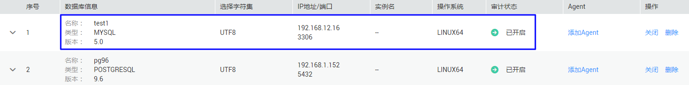
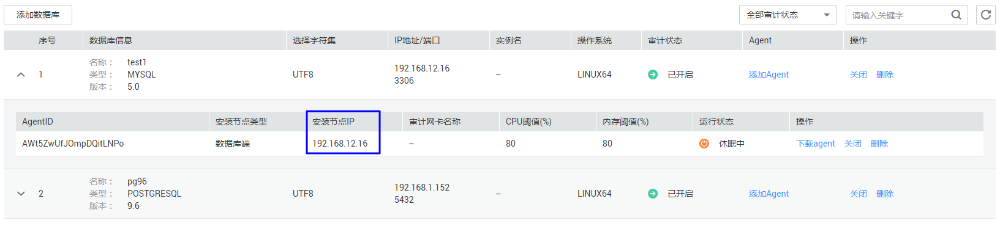
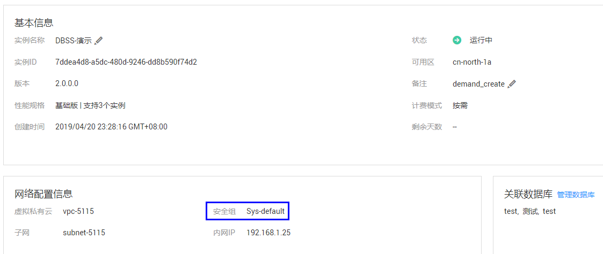
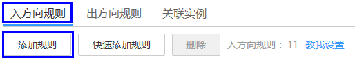
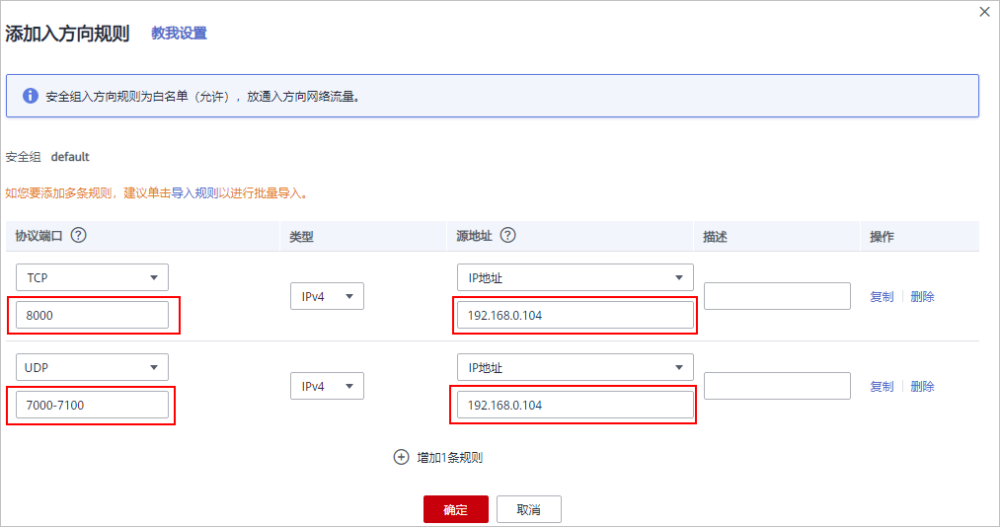

# Agent与数据库安全审计实例之间通信异常<a name="ZH-CN_TOPIC_0170339096"></a>

安装Agent后，如果验证发现Agent与数据库安全审计实例之间通信异常，请参照本章节进行处理。

## 故障现象<a name="section4597163713358"></a>

在数据库端或应用端安装Agent后，在数据库上输入SQL语句，SQL语句列表中未显示该SQL语句。

## 可能原因<a name="section12392122314367"></a>

-   待审计的数据库信息有误
-   待审计的数据库未开启审计功能
-   数据库安全审计实例未配置安全组规则
-   待审计的数据库的安装节点Agent程序没有运行

## 处理步骤<a name="section20158847143620"></a>

1.  [登录管理控制台](https://console.huaweicloud.com/)。
2.  进入数据库列表入口，如[图1](#zh-cn_topic_0145057233_zh-cn_topic_0208809337_zh-cn_topic_0144723368_fig4155162273613)所示。

    **图 1**  进入数据库列表入口<a name="zh-cn_topic_0145057233_zh-cn_topic_0208809337_zh-cn_topic_0144723368_fig4155162273613"></a>  
    

3.  检查添加的数据库信息以及审计状态。
    1.  检查待审计的数据库信息，如[图2](#fig7508621183912)所示。

        **图 2**  查看待审计的数据库信息<a name="fig7508621183912"></a>  
        

        -   如果数据库信息正确，请执行[3.b](#li114631455710)。
        -   如果数据库信息错误，请先单击“删除“，删除该数据库，再单击“添加数据库“，重新添加数据库。
            -   如果问题已解决，结束操作。
            -   如果问题仍存在，请执行[3.b](#li114631455710)。

    2.  <a name="li114631455710"></a>检查待审计的数据库的审计状态，如[图3](#fig161662322010)所示。

        **图 3**  查看待审计的数据库信息<a name="fig161662322010"></a>  
        

        -   如果“审计状态“为“已开启“，请执行[4](#li7260329133014)。
        -   如果“审计状态“为“已关闭“，请单击“开启“，开启数据库审计。
            -   如果问题已解决，结束操作。
            -   如果问题仍存在，请执行[4](#li7260329133014)。


4.  <a name="li7260329133014"></a>单击数据库左侧的展开Agent的详细信息，并记录“安装节点IP“，如[图4](#fig1282851116336)所示。

    **图 4**  记录安装节点IP信息<a name="fig1282851116336"></a>  
    

5.  检查数据库安全审计实例的入方向安全组规则。
    1.  在左侧导航树中，选择“数据库安全审计  \>  实例列表“，进入实例列表界面。
    2.  单击需要处理的实例名称，进入实例概览页面。
    3.  <a name="li1961010544220"></a>在“网络配置信息“区域，记录数据库安全审计实例的“安全组“（例如Sys-default），如[图5](#fig173356549518)所示。

        **图 5**  获取数据库安全审计实例所在的安全组<a name="fig173356549518"></a>  
        

    4.  单击管理控制台上方的“服务列表“，选择“网络  \>  虚拟私有云 VPC“，进入虚拟私有云列表界面。
    5.  在左侧导航树中，选择“访问控制  \>  安全组“，进入安全组列表界面。
    6.  在列表右上方的搜索框中输入[5.c](#li1961010544220)中记录的安全组“Sys-default“后，单击或按“Enter“，列表显示“Sys-default“安全组信息。
    7.  单击“Sys-default“，进入“入方向规则“页面。
    8.  检查“Sys-default“安全组的入方向规则。

        请检查该安全组的入方向规则是否已为[4](#li7260329133014)中的安装节点IP配置了TCP协议（端口为8000）和UDP协议（端口为7000-7100）规则。

        -   如果该安全组已配置入方向规则，请执行[7](#li1880461312916)。
        -   如果该安全组未配置入方向规则，请执行[6](#li13589148131415)。

6.  <a name="li13589148131415"></a>添加数据库安全审计实例安全组的入方向规则。
    1.  单击“添加规则“，如[图6](#fig1300102219912)所示。

        **图 6**  添加规则<a name="fig1300102219912"></a>  
        

    2.  在“添加入方向规则“对话框中，为[4](#li7260329133014)中安装节点IP添加TCP协议（端口为8000）和UDP协议（端口为7000-7100）规则，如[图7](#fig1130116226910)所示。

        **图 7** “添加入方向规则“对话框<a name="fig1130116226910"></a>  
        

    3.  单击“确定“。
        -   如果问题已解决，结束操作。
        -   如果问题仍存在，请执行[7](#li1880461312916)。

7.  <a name="li1880461312916"></a>检查安装节点的Agent程序运行状态。
    -   Linux操作系统
        1.  使用跨平台远程访问工具（例如PuTTY）以**root**用户通过SSH方式，登录Agent的安装节点。
        2.  执行以下命令，查看Agent程序的运行状态。

            **service** **audit\_agent status**

            -   如果界面回显以下信息，说明Agent程序运行正常，请执行[8](#li2733444154714)。

                ```
                audit agent is running.
                ```

            -   如果界面无回显信息，说明Agent程序运行异常，请执行以下命令，重新启动Agent后，再执行[8](#li2733444154714)。

                **service** **audit\_agent** **restart**


    -   Windows操作系统
        1.  打开任务管理器。
        2.  查看“dbss\_audit\_agent“进程运行状态。
            -   如果进程正在运行，请执行[8](#li2733444154714)。
            -   如果进程停止，请进入Agent安装文件的目录，双击“start.bat“执行文件，开启审计进程后，再执行[8](#li2733444154714)。


8.  <a name="li2733444154714"></a>在数据库中输入一条SQL语句后，在SQL语句列表页面搜索执行的语句。
    -   如果可以搜索到输入的SQL语句信息，说明问题已解决。
    -   如果不能搜索到输入的SQL语句信息，说明问题仍存在，请联系技术支持。


