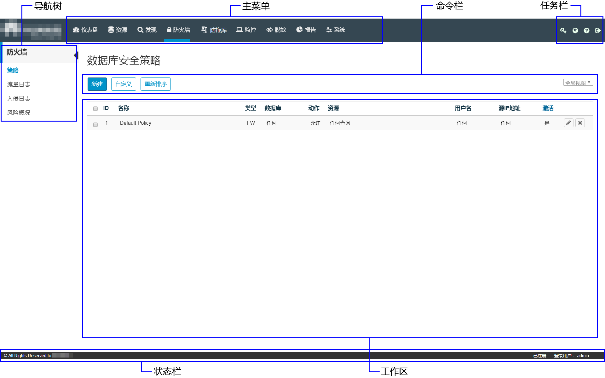

# HexaTier界面介绍

HexaTier控制台的主界面：

**图 1**  主界面图  

**表 1**  主界面功能介绍

<table><thead align="left"><tr id="zh-cn_topic_0180960079_r2110bfb4b63842d18981932b4c82162b"><th class="cellrowborder" valign="top" width="20.3%" id="mcps1.2.3.1.1">
功能区域

</th>
<th class="cellrowborder" valign="top" width="79.7%" id="mcps1.2.3.1.2">
说明

</th>
</tr>
</thead>
<tbody><tr id="zh-cn_topic_0180960079_r588de67779cf4e6aa47998ccd68533a3"><td class="cellrowborder" valign="top" width="20.3%" headers="mcps1.2.3.1.1 ">
主菜单

</td>
<td class="cellrowborder" valign="top" width="79.7%" headers="mcps1.2.3.1.2 ">
通过单击主菜单的功能选项来进行相应操作：

<ul id="zh-cn_topic_0180960079_uc09ee6d227d94a7ba9fe6ab5a52666a0"><li><strong id="zh-cn_topic_0180960079_a2feb56aeaa8949e9a07bb40c0430747a">仪表盘</strong>：显示系统各个区域的概览。详细信息请参见<a href="仪表盘介绍.md#ZH-CN_TOPIC_0111166476">仪表盘介绍</a>。</li><li><strong id="zh-cn_topic_0180960079_a71580973f7cd42238d1328f630e41668">资源</strong>：配置和修改活动目录、受保护的数据库、对象定义和查询模式。</li><li><strong id="zh-cn_topic_0180960079_ac8c3032377ab4c7db82a42ba0f6089e9">发现</strong>：在数据库环境中自动定位和分类敏感数据。一旦识别到了敏感数据，就可以快速创建脱敏、监控规则和防火墙规则。详细信息请参见<a href="敏感数据发现策略简介.md#ZH-CN_TOPIC_0111166439">配置敏感数据发现策略</a>。</li><li><strong id="zh-cn_topic_0180960079_zh-cn_topic_0076429835_b413023419222">防火墙</strong>：管理数据库防火墙和风险策略（入侵检测或防御）。详细信息请参见<a href="数据库安全策略简介.md#ZH-CN_TOPIC_0111166347">配置数据库安全策略</a>。</li><li><strong id="zh-cn_topic_0180960079_b1247151952716">防拖库</strong>：管理数据库防拖库策略，并查看防拖库日志。详细信息请参见<a href="数据库防拖库策略简介.md#ZH-CN_TOPIC_0142535566">配置数据库防拖库策略</a>。</li><li><strong id="zh-cn_topic_0180960079_a79d10383895448e78edf70a0aae56e5a">监控</strong>：管理数据库活动监控策略，并查看监控日志。详细信息请参见<a href="数据库活动监控策略简介.md#ZH-CN_TOPIC_0111166432">配置数据库活动监控策略</a>。</li><li><strong id="zh-cn_topic_0180960079_a0b06c3b1af6f44469fce6d35e1d92371">脱敏</strong>：管理数据脱敏策略，并查看数据脱敏事件。详细信息请参见<a href="动态数据脱敏策略简介.md#ZH-CN_TOPIC_0111166471">配置动态数据脱敏策略</a>。</li><li><strong id="zh-cn_topic_0180960079_af2ccf05b20294c6e8df5635ab4e56010">报告</strong>：定义、生成、查看和导出报告，包括数据库活动的统计信息。详细信息请参见<a href="报告简介.md#ZH-CN_TOPIC_0111166533">定制和生成报告</a>。</li><li><strong id="zh-cn_topic_0180960079_a9ff720b5c09a4065ae0546bfe189d9a0">系统</strong>：进行系统配置和维护选项设置。只有拥有管理员权限的用户可以访问“系统”菜单。</li></ul>
</td>
</tr>
<tr id="zh-cn_topic_0180960079_ra51b0c3838ba41b48d34183e5851032f"><td class="cellrowborder" valign="top" width="20.3%" headers="mcps1.2.3.1.1 ">
命令栏

</td>
<td class="cellrowborder" valign="top" width="79.7%" headers="mcps1.2.3.1.2 ">
用户可以为所选功能创建新的项目或对象，通过筛选来创建自定义视图，并可以在策略视图中重排规则。

</td>
</tr>
<tr id="zh-cn_topic_0180960079_r4735adb9759e463c8747c2ca66b6b316"><td class="cellrowborder" valign="top" width="20.3%" headers="mcps1.2.3.1.1 ">
任务栏

</td>
<td class="cellrowborder" valign="top" width="79.7%" headers="mcps1.2.3.1.2 ">
用户可以从HexaTier的任何页面执行以下任务：

<ul id="zh-cn_topic_0180960079_u44e7df7106984c3294d111054f563435"><li>单击（修改密码），用户可以修改当前登录控制台用户的登录密码。</li><li>单击（默认语言），用户可以更改HexaTier控制台语言为中文或English。</li><li>单击（帮助），用户可以查看对应页面的帮助信息。</li><li>单击（退出），注销当前登录。</li></ul>
</td>
</tr>
<tr id="zh-cn_topic_0180960079_rf121e47a40564291b63c8ea9fb02a768"><td class="cellrowborder" valign="top" width="20.3%" headers="mcps1.2.3.1.1 ">
导航树

</td>
<td class="cellrowborder" valign="top" width="79.7%" headers="mcps1.2.3.1.2 ">
可根据用户在主菜单上选择的功能访问附加菜单。例如，如果在主菜单选择了“脱敏”选项，则导航树将显示与数据脱敏功能相关的功能。

单击可以隐藏导航树。

</td>
</tr>
<tr id="zh-cn_topic_0180960079_r9644440eec87402a9c87928edc29570a"><td class="cellrowborder" valign="top" width="20.3%" headers="mcps1.2.3.1.1 ">
工作区

</td>
<td class="cellrowborder" valign="top" width="79.7%" headers="mcps1.2.3.1.2 ">
该区域中显示的信息可用于执行不同的任务，或查看日志等信息。

</td>
</tr>
<tr id="zh-cn_topic_0180960079_r63491a261a2d456f967e412867eaefd3"><td class="cellrowborder" valign="top" width="20.3%" headers="mcps1.2.3.1.1 ">
状态栏

</td>
<td class="cellrowborder" valign="top" width="79.7%" headers="mcps1.2.3.1.2 ">
显示当前登录用户的用户名。

</td>
</tr>
</tbody>
</table>

