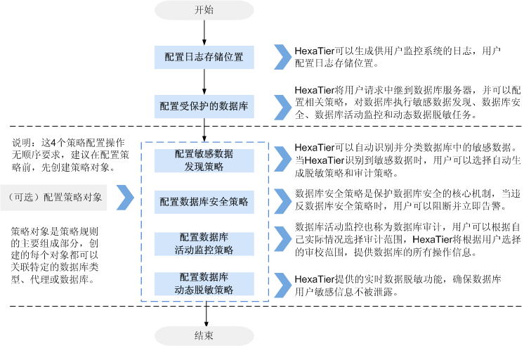

# HexaTier配置流程

登录HexaTier后，需要在HexaTier上对DBSS实例进行安全防护配置操作，才可以对接华为云上的数据库，对数据库提供防护和审计功能。

HexaTier关键的配置操作说明及流程如[图1](#fig18350802165225)所示。

**图 1**  配置流程  

> **说明：**   
>关于配置策略对象的详细操作，请参见[配置策略对象](策略对象简介.md)。  

