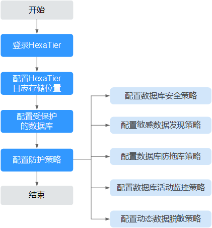

# HexaTier配置流程

登录HexaTier后，需要在HexaTier上对DBSS实例进行安全防护配置操作，才可以对接华为云上的数据库，对数据库提供防护和审计功能。

HexaTier的配置流程如[图1](#fig18350802165225)所示，流程说明如[表1](#table443217583618)所示。

**图 1**  HexaTier配置流程  

**表 1**  HexaTier配置流程说明

<table><thead align="left"><tr id="row143210517368"><th class="cellrowborder" valign="top" width="6.360636063606361%" id="mcps1.2.4.1.1">
序号

</th>
<th class="cellrowborder" valign="top" width="26.162616261626166%" id="mcps1.2.4.1.2">
配置操作

</th>
<th class="cellrowborder" valign="top" width="67.47674767476747%" id="mcps1.2.4.1.3">
说明

</th>
</tr>
</thead>
<tbody><tr id="row1943217515366"><td class="cellrowborder" valign="top" width="6.360636063606361%" headers="mcps1.2.4.1.1 ">
1

</td>
<td class="cellrowborder" valign="top" width="26.162616261626166%" headers="mcps1.2.4.1.2 ">
<a href="登录HexaTier.md">登录HexaTier</a>

</td>
<td class="cellrowborder" valign="top" width="67.47674767476747%" headers="mcps1.2.4.1.3 ">
登录HexaTier后，对DBSS实例进行配置管理，实现数据库的安全防护。

</td>
</tr>
<tr id="row14423186183810"><td class="cellrowborder" valign="top" width="6.360636063606361%" headers="mcps1.2.4.1.1 ">
2

</td>
<td class="cellrowborder" valign="top" width="26.162616261626166%" headers="mcps1.2.4.1.2 ">
<a href="配置HexaTier日志存储位置.md">配置HexaTier日志存储位置</a>

</td>
<td class="cellrowborder" valign="top" width="67.47674767476747%" headers="mcps1.2.4.1.3 ">
配置日志存储位置之后，可以启用监控功能和查看日志记录功能。

</td>
</tr>
<tr id="row695902133817"><td class="cellrowborder" valign="top" width="6.360636063606361%" headers="mcps1.2.4.1.1 ">
3

</td>
<td class="cellrowborder" valign="top" width="26.162616261626166%" headers="mcps1.2.4.1.2 ">
<a href="配置受保护的数据库.md">配置受保护的数据库</a>

</td>
<td class="cellrowborder" valign="top" width="67.47674767476747%" headers="mcps1.2.4.1.3 ">
配置连接受保护的数据库实例后，用户可以通过HexaTier控制台进行相关配置，启用敏感数据发现、防拖库、数据库防火墙、数据库活动监控和动态数据脱敏等功能。

</td>
</tr>
<tr id="row1539171014387"><td class="cellrowborder" rowspan="5" valign="top" width="6.360636063606361%" headers="mcps1.2.4.1.1 ">
4

</td>
<td class="cellrowborder" valign="top" width="26.162616261626166%" headers="mcps1.2.4.1.2 ">
<a href="数据库安全策略简介.md">配置数据库安全策略</a>

</td>
<td class="cellrowborder" valign="top" width="67.47674767476747%" headers="mcps1.2.4.1.3 ">
数据库安全策略是保护数据库安全的核心机制，当违反数据库安全策略时，用户可以阻断并立即告警。

</td>
</tr>
<tr id="row11501104718186"><td class="cellrowborder" valign="top" headers="mcps1.2.4.1.1 ">
<a href="敏感数据发现策略简介.md">配置敏感数据发现策略</a>

</td>
<td class="cellrowborder" valign="top" headers="mcps1.2.4.1.2 ">
可以自动识别并分类数据库中的敏感数据。当HexaTier识别到敏感数据时，用户可以选择自动生成脱敏策略和审计策略。

</td>
</tr>
<tr id="row24472431914"><td class="cellrowborder" valign="top" headers="mcps1.2.4.1.1 ">
<a href="数据库防拖库策略简介.md">配置数据库防拖库策略</a>

</td>
<td class="cellrowborder" valign="top" headers="mcps1.2.4.1.2 ">
可以对未授权用户、IP地址和应用在数据库特定表中的数据操作进行检测，避免数据泄露。

</td>
</tr>
<tr id="row149741016181920"><td class="cellrowborder" valign="top" headers="mcps1.2.4.1.1 ">
<a href="数据库活动监控策略简介.md">配置数据库活动监控策略</a>

</td>
<td class="cellrowborder" valign="top" headers="mcps1.2.4.1.2 ">
数据库活动监控也称为数据库审计，用户可以根据自己实际情况选择审计范围，HexaTier将根据用户选择的审校范围，提供数据库的所有操作信息。

</td>
</tr>
<tr id="row912122761910"><td class="cellrowborder" valign="top" headers="mcps1.2.4.1.1 ">
<a href="动态数据脱敏策略简介.md">配置动态数据脱敏策略</a>

</td>
<td class="cellrowborder" valign="top" headers="mcps1.2.4.1.2 ">
HexaTier提供的实时数据脱敏功能，确保数据库用户敏感信息不被泄露。

</td>
</tr>
</tbody>
</table>

