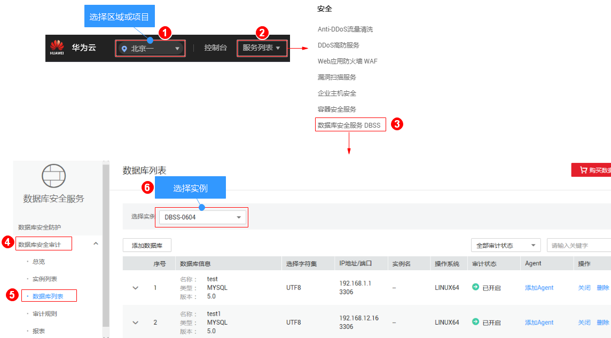
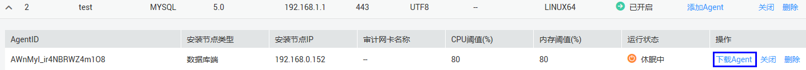

# 下载Agent

Agent添加完成后，您还需要下载Agent，并根据Agent的添加方式在数据库端或应用端安装Agent，将添加的数据库连接到数据库安全审计实例，才能使用数据库安全审计功能。

> **说明：** 
>若您将添加的Agent删除，在重新添加Agent后，请重新下载Agent。

## 前提条件

-   已成功购买数据库安全审计实例，且实例的状态为“运行中“。
-   数据库已成功添加Agent。

## 操作步骤

如果您需要在多个节点上安装Agent，您只需要将一个Agent安装包下载到本地后，就可以安装Agent。

1.  [登录管理控制台](https://console.huaweicloud.com/?locale=zh-cn)。
2.  进入数据库列表入口，如[图1](#zh-cn_topic_0144723368_fig4155162273613)所示。

    **图 1**  进入数据库列表入口  
    

3.  单击数据库左侧的展开Agent的详细信息，在Agent所在行的“操作“列，单击“下载agent“，如[图2](#fig1470611221310)所示。将Agent安装包下载到本地。

    **图 2**  下载Agent  
    

    请根据安装Agent节点的操作系统类型，选择下载相应的Agent安装包。

    -   Linux操作系统

        在“操作系统“为“LINUX64“的数据库中下载Agent安装包

    -   Windows操作系统

        在“操作系统“为“WINDOWS64“的数据库中下载Agent安装包

