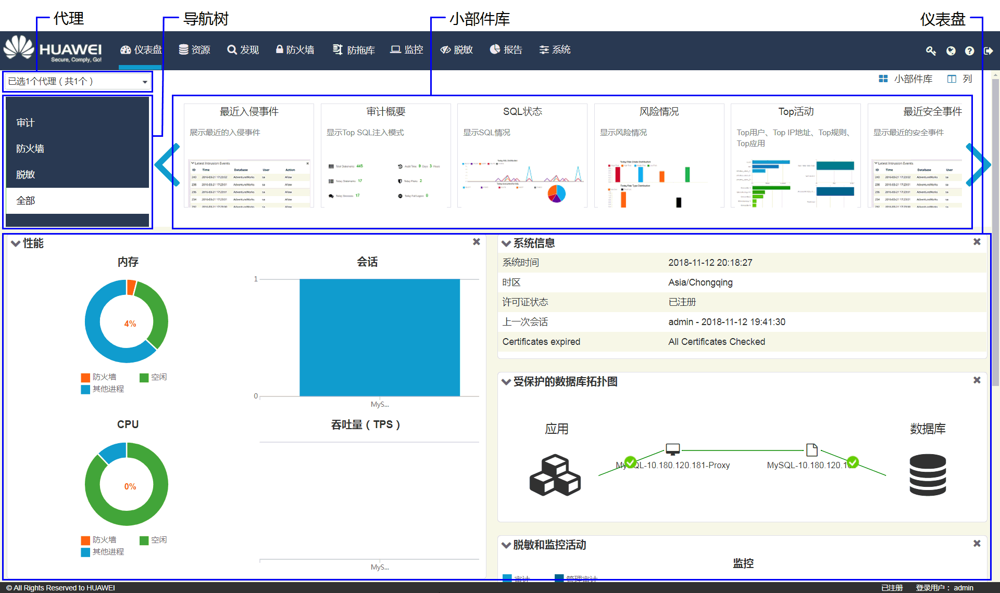
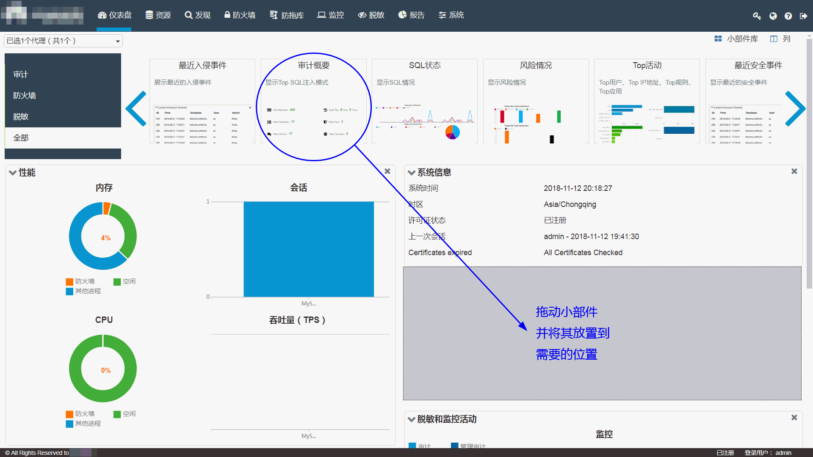

# 仪表盘介绍

## 仪表盘界面

**图 1**  仪表盘界面  

## 小部件说明

**表 1**  小部件说明

<table><thead align="left"><tr id="zh-cn_topic_0110574904_r3b3a48914e4447d68160d87b95536d91"><th class="cellrowborder" valign="top" width="30%" id="mcps1.2.3.1.1">
小部件名称

</th>
<th class="cellrowborder" valign="top" width="70%" id="mcps1.2.3.1.2">
说明

</th>
</tr>
</thead>
<tbody><tr id="zh-cn_topic_0110574904_rdfa1d016abef41119da3336a927637a0"><td class="cellrowborder" valign="top" width="30%" headers="mcps1.2.3.1.1 ">
系统信息

</td>
<td class="cellrowborder" valign="top" width="70%" headers="mcps1.2.3.1.2 ">
显示HexaTier系统相关信息，包括：

<ul id="zh-cn_topic_0110574904_u0c775188d6b54c54af789977e197ff4f"><li>系统时间</li><li>时区</li><li>许可证状态</li><li>上一次会话</li><li>证书检查</li></ul>
</td>
</tr>
<tr id="zh-cn_topic_0110574904_r7f0d968684c94816a171e421b4b7c83f"><td class="cellrowborder" valign="top" width="30%" headers="mcps1.2.3.1.1 ">
最近入侵事件

</td>
<td class="cellrowborder" valign="top" width="70%" headers="mcps1.2.3.1.2 ">
显示最近的入侵攻击列表。

单击事件，显示该入侵事件日志。

</td>
</tr>
<tr id="zh-cn_topic_0110574904_r3e06e8de545b4664abe429bd25e61f2c"><td class="cellrowborder" valign="top" width="30%" headers="mcps1.2.3.1.1 ">
安全活动

</td>
<td class="cellrowborder" valign="top" width="70%" headers="mcps1.2.3.1.2 ">
显示实时及最新历史记录：<ul id="zh-cn_topic_0110574904_u1b7b4d2332884549b68efcb0606e050b"><li>防火墙：允许和阻止的安全事件</li><li>SQL注入</li></ul>

</td>
</tr>
<tr id="zh-cn_topic_0110574904_row128401546192818"><td class="cellrowborder" valign="top" width="30%" headers="mcps1.2.3.1.1 ">
脱敏和监控活动

</td>
<td class="cellrowborder" valign="top" width="70%" headers="mcps1.2.3.1.2 ">
显示实时及最新历史记录：

<ul id="zh-cn_topic_0110574904_ul349615583289"><li>监控：审计和管理审计的监控事件</li><li>脱敏：脱敏事件</li></ul>
</td>
</tr>
<tr id="zh-cn_topic_0110574904_r7e812c55042444978ce57eab3dc0d63b"><td class="cellrowborder" valign="top" width="30%" headers="mcps1.2.3.1.1 ">
Top活动

</td>
<td class="cellrowborder" valign="top" width="70%" headers="mcps1.2.3.1.2 ">
以条形图显示Top活动信息：<ul id="zh-cn_topic_0110574904_ud0c3845887f04909b38c3ef539094b0e"><li>Top用户</li><li>Top IP地址</li><li>Top规则</li><li>Top应用</li></ul>

</td>
</tr>
<tr id="zh-cn_topic_0110574904_rc850b81251e240f9b16f40704abc2fb7"><td class="cellrowborder" valign="top" width="30%" headers="mcps1.2.3.1.1 ">
性能

</td>
<td class="cellrowborder" valign="top" width="70%" headers="mcps1.2.3.1.2 ">
显示以下内容的实时摘要信息：<ul id="zh-cn_topic_0110574904_ua16d600badcd4fb6a5ccd4b96ca9268d"><li>内存：HexaTier进程占操作系统内存百分比</li><li>CPU：HexaTier进程占CPU使用率百分比</li><li>会话：公开会话次数</li><li>吞吐量（TPS）：事务每秒吞吐量</li></ul>

</td>
</tr>
<tr id="zh-cn_topic_0110574904_r17219a1a35224b0daaa7d5619b50a87f"><td class="cellrowborder" valign="top" width="30%" headers="mcps1.2.3.1.1 ">
最近安全事件

</td>
<td class="cellrowborder" valign="top" width="70%" headers="mcps1.2.3.1.2 ">
显示最近的安全流量事件列表。

单击事件，显示该安全事件流量日志。

</td>
</tr>
<tr id="zh-cn_topic_0110574904_rcd225c4c14084afb9d43ee13b665c6cc"><td class="cellrowborder" valign="top" width="30%" headers="mcps1.2.3.1.1 ">
Top SQL注入模式

</td>
<td class="cellrowborder" valign="top" width="70%" headers="mcps1.2.3.1.2 ">
显示检测到的Top SQL注入模式的列表。

单击事件，显示SQL注入模式的详细信息。

</td>
</tr>
<tr id="zh-cn_topic_0110574904_rd10d412cb8cd4885bb388f05884aa158"><td class="cellrowborder" valign="top" width="30%" headers="mcps1.2.3.1.1 ">
受保护的数据库拓扑图

</td>
<td class="cellrowborder" valign="top" width="70%" headers="mcps1.2.3.1.2 ">
显示以下内容之间的拓扑：

<ul id="zh-cn_topic_0110574904_u96c7146f704d42c289fe4ac59bd73560"><li>应用</li><li>代理</li><li>实例</li><li>数据库</li></ul>
</td>
</tr>
<tr id="zh-cn_topic_0110574904_r5d0fb26222364c0c857f2e5905c5a870"><td class="cellrowborder" valign="top" width="30%" headers="mcps1.2.3.1.1 ">
最近脱敏事件

</td>
<td class="cellrowborder" valign="top" width="70%" headers="mcps1.2.3.1.2 ">
显示最近的数据脱敏事件列表。

单击事件，显示该脱敏事件日志。

</td>
</tr>
<tr id="zh-cn_topic_0110574904_r4e0835f6f0eb4778b20d788a294a5a9e"><td class="cellrowborder" valign="top" width="30%" headers="mcps1.2.3.1.1 ">
高可用状态

</td>
<td class="cellrowborder" valign="top" width="70%" headers="mcps1.2.3.1.2 ">
显示HexaTier高可用状态的摘要。

</td>
</tr>
<tr id="zh-cn_topic_0110574904_row17842183151111"><td class="cellrowborder" valign="top" width="30%" headers="mcps1.2.3.1.1 ">
审计概要

</td>
<td class="cellrowborder" valign="top" width="70%" headers="mcps1.2.3.1.2 ">
展示审计概要信息，包括：

<ul id="zh-cn_topic_0110574904_ul880611419486"><li>总条目：审计日志总条目数</li><li>审计时间：持续审计时间</li><li>24小时条目：审计到的24小时内日志条目数</li><li>24小时风险：审计到的24小时内风险条目数</li><li>24小时会话：24小时内会话数</li><li>24小时错误登录：24小时内错误登录数</li></ul>
</td>
</tr>
<tr id="zh-cn_topic_0110574904_row14141132151113"><td class="cellrowborder" valign="top" width="30%" headers="mcps1.2.3.1.1 ">
风险情况

</td>
<td class="cellrowborder" valign="top" width="70%" headers="mcps1.2.3.1.2 ">
以柱状图展示24小时内风险SQL语句的分布情况，包括：

<ul id="zh-cn_topic_0110574904_ul1125911268505"><li>24小时风险等级分布</li><li>24小时风险类别分布<ul id="zh-cn_topic_0110574904_ul117002914519"><li>注入：检测到的SQL注入数量</li><li>黑名单：依据用户配置的防火墙策略阻止的SQL数量</li></ul>
</li></ul>
</td>
</tr>
<tr id="zh-cn_topic_0110574904_row1824816325119"><td class="cellrowborder" valign="top" width="30%" headers="mcps1.2.3.1.1 ">
SQL状态

</td>
<td class="cellrowborder" valign="top" width="70%" headers="mcps1.2.3.1.2 ">
显示最近24小时的实时SQL统计信息。

</td>
</tr>
</tbody>
</table>

## 配置仪表盘

1.  在HexaTier主菜单上，单击“仪表盘“。
2.  单击“小部件库“，显示仪表盘上隐藏的小部件。
3.  在导航树上，选择需要的小部件类别，包括：
    -   审计
    -   防火墙
    -   脱敏
    -   全部

4.  将小部件拖动到需要放置的位置。

    **图 2**  配置仪表盘图  
    

> **说明：**   
>-   再次单击“小部件库“可以关闭小部件选择窗口。  
>-   通过单击小部件右上角的可以移除小部件。  
>-   自由拖拽小部件到不同位置，可以改变仪表盘上小部件显示顺序。  
>-   单击仪表盘右上角的“列“，可以配置仪表盘展示的列数。  

