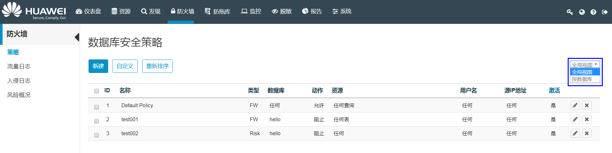

# 全局和数据库视图间的切换

用户可根据需要切换视图，以全局模式查看安全规则，或以数据库为粒度查看其内的安全规则。

## 操作场景

该任务指导用户在安全策略中切换视图，视图说明如下表：

**表 1**  视图说明

<table><thead align="left"><tr id="zh-cn_topic_0110574898_r387cd02132ec4ab59873c287658b2225"><th class="cellrowborder" valign="top" width="16%" id="mcps1.2.3.1.1">
视图名称

</th>
<th class="cellrowborder" valign="top" width="84%" id="mcps1.2.3.1.2">
说明

</th>
</tr>
</thead>
<tbody><tr id="zh-cn_topic_0110574898_r655e3391e1a146c4ae2a6215a336d759"><td class="cellrowborder" valign="top" width="16%" headers="mcps1.2.3.1.1 ">
全局视图

</td>
<td class="cellrowborder" valign="top" width="84%" headers="mcps1.2.3.1.2 ">
允许查看所有数据库安全规则，并更改规则的应用顺序（请参见<a href="重新排序数据库安全规则.md#ZH-CN_TOPIC_0111166552">重新排序数据库安全规则</a>）。

</td>
</tr>
<tr id="zh-cn_topic_0110574898_rc7f121dab5a54c42bebbe32c2df62583"><td class="cellrowborder" valign="top" width="16%" headers="mcps1.2.3.1.1 ">
按数据库

</td>
<td class="cellrowborder" valign="top" width="84%" headers="mcps1.2.3.1.2 ">
在此视图下，用户可以轻松定位影响指定数据库的安全规则，尤其是定义了多个规则时。

</td>
</tr>
</tbody>
</table>

## 操作步骤

1.  在HexaTier主菜单上，单击“防火墙“。
2.  在命令栏上，视图下拉框中选择“全局视图“或“按数据库“。

    工作区按照用户所选择的视图进行显示。

    

