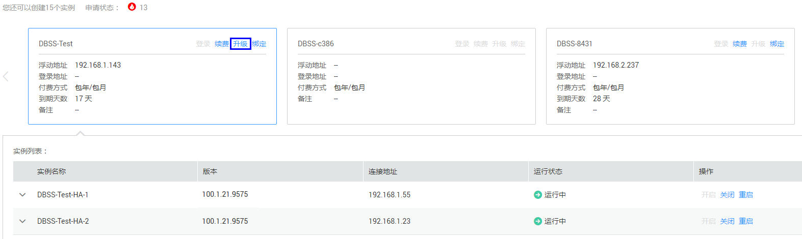

# 升级服务版本

用户在购买DBSS实例后，可以在线将DBSS实例升级到最新服务版本。本章节介绍升级服务版本的操作。

## 前提条件

-   已获取管理控制台的登录帐号与密码。
-   已成功购买DBSS实例，且2个实例的“运行状态“都为“运行中“。

## 注意事项

> **注意：**   
>升级期间将触发主备节点切换，服务将暂时中断。  

## 升级版本

1.  登录管理控制台。
2.  单击页面上方的“服务列表“，选择“安全“  \>  “数据库安全服务 DBSS“，进入数据库安全服务界面。
3.  在需要升级服务版本的DBSS实例页面框中，单击“升级“，如[图1](#fig565015594377)所示。

    **图 1**  升级数据库安全服务版本  
    

4.  在弹出的对话框中，单击“确定“。

    升级完成后，主备实例的服务版本将升级至最新版本。

