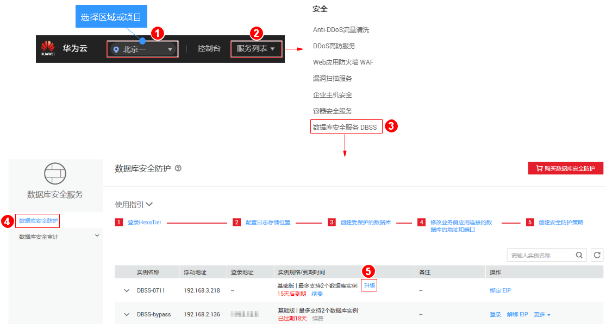

# 升级服务版本

用户在购买数据库安全防护实例后，当数据库安全防护不是最新版本时，您可以在线将实例升级到最新服务版本。

## 前提条件

已成功购买数据库安全防护实例，且2个实例的“运行状态“都为“运行中“。

## 注意事项

> **须知：** 
>升级期间将触发主备节点切换，服务将暂时中断。

## 升级版本

1.  [登录管理控制台](https://console.huaweicloud.com/?locale=zh-cn)。
2.  进入数据库安全防护版本升级入口，如[图1](#fig4989100164918)所示。

    **图 1**  进入数据库安全防护版本升级入口  
    

    > **说明：** 
    >当服务为最新版本时，实例所在行的“实例规格/到期时间“列将不会显示“升级“按钮。

3.  在弹出的提示框中，单击“确定“。

    升级完成后，主备实例的服务版本将升级至最新版本。

