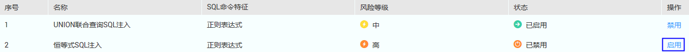
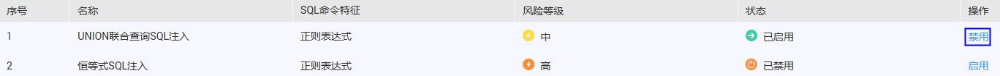

# 启用或禁用SQL注入检测

数据库端或应用端成功安装Agent后，您可以设置SQL注入检测规则，包括启用或禁用SQL注入检测。

> **注意：**   
>一条审计数据只能命中SQL注入检测中的一个规则。  

## 前提条件

-   已获取管理控制台的登录账号与密码。
-   已成功购买数据库安全审计实例，且实例的状态为“运行中“。
-   SQL注入检测的状态为“已禁用“时，可以启用SQL注入检测。
-   SQL注入检测的状态为“已启用“时，可以禁用SQL注入检测。

## 启用SQL注入检测

1.  登录管理控制台。
2.  单击管理控制台左上角的，选择区域或项目。
3.  单击管理控制台上方的“服务列表“，选择“安全  \>  数据库安全服务 DBSS“，进入数据库安全防护实例列表界面。
4.  在左侧导航树中，选择“数据库安全服务  \>  数据库安全审计“，进入数据库安全审计实例列表界面。
5.  在数据库安全审计实例列表中，单击需要启用SQL注入检测的实例名称，如[图1](#fig99553501795)所示。

    **图 1**  数据库安全审计实例列表  
    

6.  在“实例详情“界面，选择“规则  \>  SQL注入“，进入SQL注入检测列表页面。
7.  在需要启用的SQL注入检测规则所在行的“操作“列，单击“启用“，如[图2](#fig148017166466)所示。

    **图 2**  启用SQL注入检测  
    

    启用SQL注入检测成功，该SQL注入检测规则的状态为“已启用“。

## 禁用SQL注入检测

禁用SQL注入检测规则后，该审计规则在审计中将不生效。

1.  登录管理控制台。
2.  单击管理控制台左上角的，选择区域或项目。
3.  单击管理控制台上方的“服务列表“，选择“安全  \>  数据库安全服务 DBSS“，进入数据库安全防护实例列表界面。
4.  在左侧导航树中，选择“数据库安全服务  \>  数据库安全审计“，进入数据库安全审计实例列表界面。
5.  在数据库安全审计实例列表中，单击需要禁用SQL注入检测的实例名称，如[图1](#fig99553501795)所示。

    **图 3**  数据库安全审计实例列表  
    

6.  在“实例详情“界面，选择“规则  \>  SQL注入“，进入SQL注入检测列表页面。
7.  在需要禁用的SQL注入检测规则所在行的“操作“列，单击“禁用“，如[图4](#fig71914515113)所示。

    **图 4**  禁用SQL注入检测  
    

8.  在弹出的对话框中，单击“确定“。

    禁用SQL注入检测成功，该SQL注入检测规则的状态为“已禁用“。

