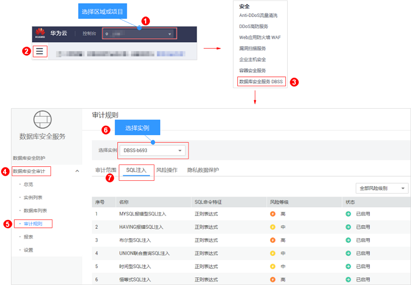
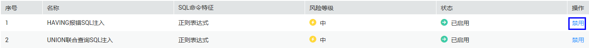
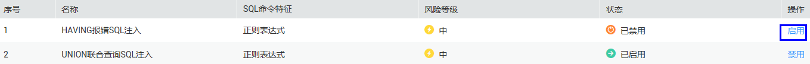

# 启用或禁用SQL注入检测

数据库安全审计的SQL注入检测默认开启，您可以禁用或启用SQL注入的检测规则。

> **须知：**   
>一条审计数据只能命中SQL注入检测中的一个规则。  

## 前提条件

-   已成功购买数据库安全审计实例，且实例的状态为“运行中“。
-   SQL注入检测的状态为“已禁用“时，可以启用SQL注入检测。
-   SQL注入检测的状态为“已启用“时，可以禁用SQL注入检测。

## 禁用SQL注入检测

SQL注入检测默认开启，您可以根据使用需要禁用SQL注入检查规则。禁用SQL注入检测规则后，该审计规则在审计中将不生效。

1.  [登录管理控制台](https://console.huaweicloud.com/?locale=zh-cn)。
2.  进入SQL注入列表入口，如[图1](#fig61991836131419)所示。

    **图 1**  进入SQL注入列表入口  
    

3.  在SQL注入检测规则所在行的“操作“列，单击“禁用“，如[图2](#fig148017166466)所示。

    **图 2**  禁用SQL注入检测规则  
    

    禁用SQL注入检测成功，该SQL注入检测规则的状态为“已禁用“。

## 后续处理

禁用SQL注入检测规则后，如果您需要启动该规则，请在SQL注入检测规则所在行的“操作“列，单击“启用“，如[图3](#fig185497132517)所示，启用该规则。

**图 3**  启用SQL注入检测规则  

启用SQL注入检测成功，该SQL注入检测规则的状态为“已启用“。

