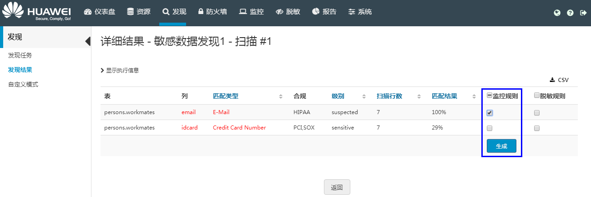
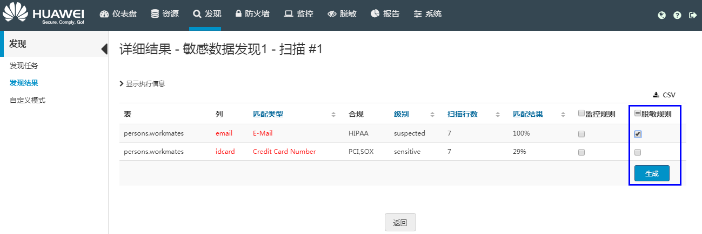

# 基于发现结果生成规则

基于发现结果，可生成监控规则和脱敏规则。用户可在监控策略列表或者脱敏策略列表中管理生成的策略。

## 操作步骤

1.  在HexaTier主菜单上，单击“发现“。
2.  在导航树上，选择“发现结果“。
3.  如果工作区中的“敏感字段“列显示“发现“，则单击“查看“列中“详情“。

    “详细结果“窗口显示不合规的所有表列。

4.  为发现的敏感列创建监控规则：
    1.  勾选该行监控规则列的复选框。
    2.  单击“生成“。

        将为选定的列自动生成监控规则。用户可以在监控策略列表中编辑自动生成的监控策略，请参见[创建或编辑活动监控规则](创建或编辑活动监控规则.md#ZH-CN_TOPIC_0111166467)。

        

5.  为发现的敏感列创建脱敏规则：
    1.  勾选该行脱敏规则列的复选框。
    2.  单击“生成“。
    3.  在弹出窗口中单击“确定“。

        将为选定的列自动生成脱敏规则。用户可以在脱敏策略列表中编辑自动生成的脱敏策略，请参见[创建或编辑数据脱敏规则](创建或编辑数据脱敏规则.md#ZH-CN_TOPIC_0111166389)。

        

## 删除自动生成的规则

-   删除自动生成的监控规则：
    1.  在HexaTier主菜单上，单击“监控“。
    2.  在命令栏上，选择“删除所有自动生成的规则“。
    3.  在弹出窗口，单击“确定“。

-   删除自动生成的脱敏规则：
    1.  在HexaTier主菜单上，单击“脱敏“。
    2.  在命令栏上，选择“删除所有自动生成的规则“。
    3.  在弹出窗口，单击“确定“。

> **说明：**   
>只有当用户通过发现任务自动生成了相应的监控规则或脱敏规则，命令栏中才会显示“删除所有自动生成的规则“按钮。  

