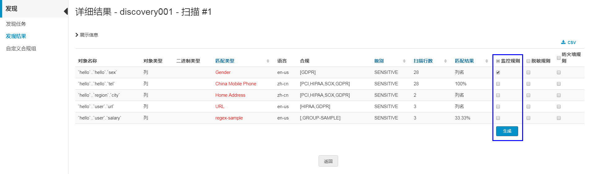
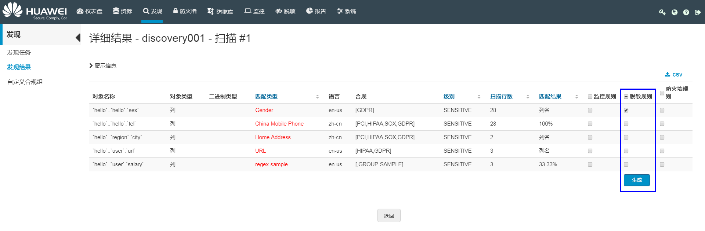
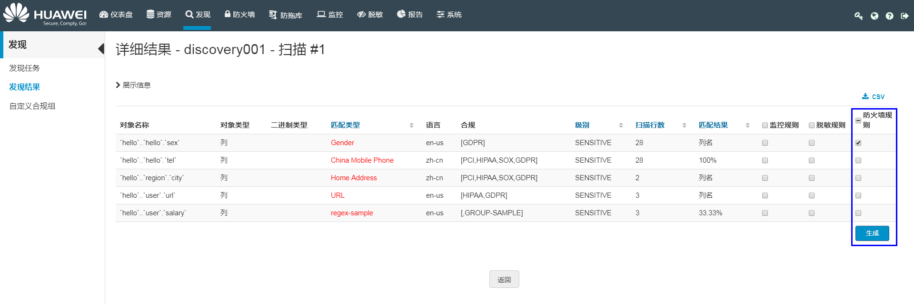
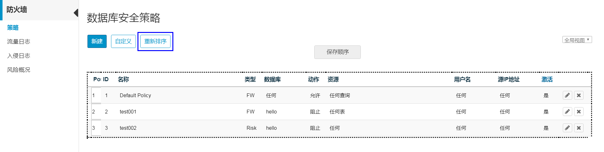

# 基于发现结果生成规则

基于发现结果，可生成监控规则、脱敏规则和防火墙规则。用户可在监控策略列表、脱敏策略列表或者防火墙策略列表中管理生成的策略。

> **说明：**   
>-   基于发现结果生成防火墙规则时，HexaTier只支持以表（即选择发现结果的所属表）为粒度生成规则。  
>-   基于发现结果生成的防火墙规则，HexaTier默认其优先级最低，如需要更改规则的优先级，请参见[重新排序数据库安全规则](#section132171703216)。  

## 前提条件

只有在配置日志存储位置后，系统才支持查看发现结果，发现结果只能保存在远程日志中。

## 查看发现结果

基于发现任务检测到的敏感数据，可生成发现结果和GDPR报告。用户可以根据发现结果生成监控策略、脱敏策略和防火墙策略，根据GDPR报告查看敏感数据统计分析详细信息。

1.  在HexaTier主菜单上，单击“发现“。
2.  在导航树上，选择“发现结果“。
3.  如果工作区中的“敏感字段“列显示“发现“，则单击“查看“列中“详情“。

    “详细结果“窗口显示不合规列，并提供以下信息：

    **表 1**  发现结果信息

    
    <table><thead align="left"><tr id="zh-cn_topic_0180960142_row5921510256"><th class="cellrowborder" valign="top" width="17.48%" id="mcps1.2.3.1.1">
信息名称

    </th>
    <th class="cellrowborder" valign="top" width="82.52000000000001%" id="mcps1.2.3.1.2">
说明

    </th>
    </tr>
    </thead>
    <tbody><tr id="zh-cn_topic_0180960142_row71111572517"><td class="cellrowborder" valign="top" width="17.48%" headers="mcps1.2.3.1.1 ">
对象名称

    </td>
    <td class="cellrowborder" valign="top" width="82.52000000000001%" headers="mcps1.2.3.1.2 ">
发现的敏感数据对象。

    </td>
    </tr>
    <tr id="zh-cn_topic_0180960142_row171341518252"><td class="cellrowborder" valign="top" width="17.48%" headers="mcps1.2.3.1.1 ">
对象类型

    </td>
    <td class="cellrowborder" valign="top" width="82.52000000000001%" headers="mcps1.2.3.1.2 ">
发现的敏感数据所属对象类型。

    </td>
    </tr>
    <tr id="zh-cn_topic_0180960142_row10152150252"><td class="cellrowborder" valign="top" width="17.48%" headers="mcps1.2.3.1.1 ">
二级制类型

    </td>
    <td class="cellrowborder" valign="top" width="82.52000000000001%" headers="mcps1.2.3.1.2 ">
发现的敏感数据所属二进制类型。

    </td>
    </tr>
    <tr id="zh-cn_topic_0180960142_row18161215112510"><td class="cellrowborder" valign="top" width="17.48%" headers="mcps1.2.3.1.1 ">
匹配类型

    </td>
    <td class="cellrowborder" valign="top" width="82.52000000000001%" headers="mcps1.2.3.1.2 ">
包含的合规性数据类型。

    </td>
    </tr>
    <tr id="zh-cn_topic_0180960142_row1018915142520"><td class="cellrowborder" valign="top" width="17.48%" headers="mcps1.2.3.1.1 ">
语言

    </td>
    <td class="cellrowborder" valign="top" width="82.52000000000001%" headers="mcps1.2.3.1.2 ">
发现该敏感信息的语言模式：

    <ul id="zh-cn_topic_0180960142_ul621615152511"><li>en-us：适用于待发现数据库信息为英文地域数据信息</li><li>zh-cn：适用于待发现数据库信息为中国地域数据信息</li></ul>
    </td>
    </tr>
    <tr id="zh-cn_topic_0180960142_row202316152253"><td class="cellrowborder" valign="top" width="17.48%" headers="mcps1.2.3.1.1 ">
合规

    </td>
    <td class="cellrowborder" valign="top" width="82.52000000000001%" headers="mcps1.2.3.1.2 ">
显示触发的合规性组。

    </td>
    </tr>
    <tr id="zh-cn_topic_0180960142_row1824191522520"><td class="cellrowborder" valign="top" width="17.48%" headers="mcps1.2.3.1.1 ">
级别

    </td>
    <td class="cellrowborder" valign="top" width="82.52000000000001%" headers="mcps1.2.3.1.2 ">
不合规级别：

    <ul id="zh-cn_topic_0180960142_ul1026191502511"><li>sensitive：检测到不合规的敏感数据。</li><li>suspected：怀疑数据不合规，但未验证。</li></ul>
    </td>
    </tr>
    <tr id="zh-cn_topic_0180960142_row1928171552512"><td class="cellrowborder" valign="top" width="17.48%" headers="mcps1.2.3.1.1 ">
扫描行数

    </td>
    <td class="cellrowborder" valign="top" width="82.52000000000001%" headers="mcps1.2.3.1.2 ">
在发现任务中扫描的表行数。

    </td>
    </tr>
    <tr id="zh-cn_topic_0180960142_row193012156254"><td class="cellrowborder" valign="top" width="17.48%" headers="mcps1.2.3.1.1 ">
匹配结果

    </td>
    <td class="cellrowborder" valign="top" width="82.52000000000001%" headers="mcps1.2.3.1.2 ">
不合规数据的匹配结果，包括：

    <ul id="zh-cn_topic_0180960142_ul1331131515254"><li>列名：表示列名敏感或疑似敏感。</li><li>百分比：表示列中敏感数据或疑似敏感数据的百分比。</li></ul>
    </td>
    </tr>
    <tr id="zh-cn_topic_0180960142_row133161542513"><td class="cellrowborder" valign="top" width="17.48%" headers="mcps1.2.3.1.1 ">
监控规则

    </td>
    <td class="cellrowborder" valign="top" width="82.52000000000001%" headers="mcps1.2.3.1.2 ">
用户可以基于该发现结果生成监控规则。

    </td>
    </tr>
    <tr id="zh-cn_topic_0180960142_row53417159259"><td class="cellrowborder" valign="top" width="17.48%" headers="mcps1.2.3.1.1 ">
脱敏规则

    </td>
    <td class="cellrowborder" valign="top" width="82.52000000000001%" headers="mcps1.2.3.1.2 ">
用户可以基于该发现结果生成脱敏规则。

    </td>
    </tr>
    <tr id="zh-cn_topic_0180960142_row936151572513"><td class="cellrowborder" valign="top" width="17.48%" headers="mcps1.2.3.1.1 ">
防火墙规则

    </td>
    <td class="cellrowborder" valign="top" width="82.52000000000001%" headers="mcps1.2.3.1.2 ">
用户可以基于该发现结果生成防火墙规则。

    </td>
    </tr>
    </tbody>
    </table>

4.  如果工作区中的“敏感字段“列显示“发现“，则单击“查看“列中“查看GDPR报告“。

    可以查看该报告的详细信息，报告主要包含受保护数据库扫描状态、PII（Personally Identifiable Information，个人可识别信息）分布、敏感数据发现结果分类和限制/隐私数据-规则覆盖等信息。

    -   受保护数据库扫描状态：可以查看受保护数据库名称、扫描作业状态和最近一次扫描日期。
    -   敏感数据发现结果分类：可以查看当前数据库扫描任务相关的限制、隐私和公共数据统计信息，并以分布表及占比图进行展示。
    -   PII分布：可以查看当前数据库扫描任务相关的个人可识别信息统计数据，并以分布表及占比图进行展示。
    -   受限制的规则范围：可以查看当前限制和隐私数据被HexaTier规则（防火墙、脱敏和审计）覆盖的统计信息，并以分布表及占比图进行展示。

## 基于发现结果生成规则

1.  在HexaTier主菜单上，单击“发现“。
2.  在导航树上，选择“发现结果“。
3.  如果工作区中的“敏感字段“列显示“发现“，则单击“查看“列中“详情“。

    “详细结果“窗口显示不合规的所有表列。

4.  为发现的敏感列创建监控规则：
    1.  勾选该行监控规则列的复选框。
    2.  单击“生成“。

        将为选定的列自动生成监控规则。用户可以在监控策略列表中编辑自动生成的监控策略，请参见[创建或编辑活动监控规则](创建或编辑活动监控规则.md)。

        **图 1**  生成监控策略  
        

5.  为发现的敏感列创建脱敏规则：
    1.  勾选该行脱敏规则列的复选框。
    2.  单击“生成“。
    3.  在弹出窗口中单击“确定“。

        将为选定的列自动生成脱敏规则。用户可以在脱敏策略列表中编辑自动生成的脱敏策略，请参见[创建或编辑数据脱敏规则](创建或编辑数据脱敏规则.md)。

        **图 2**  生成脱敏策略  
        

6.  为发现的敏感列创建防火墙规则：
    1.  勾选该行防火墙规则列的复选框。
    2.  单击“生成“。
    3.  在弹出窗口中单击“确定“。

        将为选定的列自动生成防火墙规则。用户可以在防火墙策略列表中编辑自动生成的防火墙策略，请参见[配置数据库防火墙策略](配置数据库防火墙策略.md)。

        **图 3**  生成防火墙策略  
        

## 重新排序数据库安全规则

通过对安全策略进行重新排序，以更改应用安全策略规则的顺序。策略在列表中所处的位置越高，其优先级越高。

只有当安全策略界面为“全局视图“时，才能对其使用重新排序功能。

1.  在HexaTier主菜单上，单击“防火墙“。
2.  在视图下拉框中，选择“全局视图“。
3.  在命令栏，单击“重新排序“。

    **图 4**  安全规则排序  
    

4.  在工作区中，将规则拖到策略列表中所需的位置（向上或向下）。
5.  单击“保存顺序“来完成修改。

