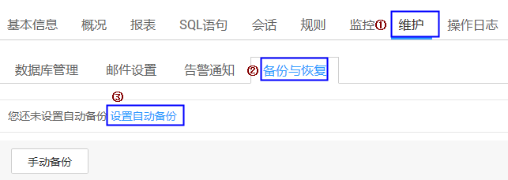
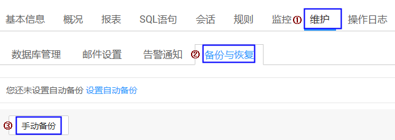

# 备份和恢复数据库审计日志

您可以根据需要备份数据库审计日志，或恢复备份的数据库审计日志。

## 前提条件

-   已获取管理控制台的登录账号与密码。
-   已成功购买数据库安全审计实例，且实例的状态为“运行中“。
-   已成功添加并安装Agent，且已为数据库添加审计范围和配置审计规则。

## 注意事项

执行备份后，审计日志将备份到对象存储服务上，系统自动为您创建桶，桶将按用量收费。

## 自动备份数据库审计日志

1.  登录管理控制台。
2.  单击管理控制台左上角的，选择区域或项目。
3.  单击管理控制台上方的“服务列表“，选择“安全  \>  数据库安全服务 DBSS“，进入数据库安全防护实例列表界面。
4.  在左侧导航树中，选择“数据库安全服务  \>  数据库安全审计“，进入数据库安全审计实例列表界面。
5.  在数据库安全审计实例列表中，单击需要自动备份审计日志的实例名称，如[图1](#fig99553501795)所示。

    **图 1**  数据库安全审计实例列表  
    

6.  进入自动备份页面，操作步骤如[图2](#fig1872724485817)所示。

    **图 2**  进入自动备份页面  
    

7.  在弹出的对话框中，设置自动备份参数，如[图3](#fig32511658103)所示，相关参数说明如[表1](#table29461252153613)所示。

    **图 3** “设置自动备份“对话框  
    

    **表 1**  自动备份参数说明

    
    <table><thead align="left"><tr id="row7948205203612"><th class="cellrowborder" valign="top" width="21%" id="mcps1.2.4.1.1">
参数名称

    </th>
    <th class="cellrowborder" valign="top" width="61%" id="mcps1.2.4.1.2">
说明

    </th>
    <th class="cellrowborder" valign="top" width="18%" id="mcps1.2.4.1.3">
取值样例

    </th>
    </tr>
    </thead>
    <tbody><tr id="row1495265210362"><td class="cellrowborder" valign="top" width="21%" headers="mcps1.2.4.1.1 ">
自动备份

    </td>
    <td class="cellrowborder" valign="top" width="61%" headers="mcps1.2.4.1.2 ">
开启或关闭自动备份。

    <ul id="ul934875119443"><li>：开启</li><li>：关闭</li></ul>
    </td>
    <td class="cellrowborder" valign="top" width="18%" headers="mcps1.2.4.1.3 ">

    </td>
    </tr>
    <tr id="row995917529362"><td class="cellrowborder" valign="top" width="21%" headers="mcps1.2.4.1.1 ">
备份周期

    </td>
    <td class="cellrowborder" valign="top" width="61%" headers="mcps1.2.4.1.2 ">
选择自动备份的周期，可以选择：

    <ul id="ul11951164818432"><li>每天</li><li>每周</li><li>每月</li></ul>
    </td>
    <td class="cellrowborder" valign="top" width="18%" headers="mcps1.2.4.1.3 ">
每天

    </td>
    </tr>
    <tr id="row3960852133616"><td class="cellrowborder" valign="top" width="21%" headers="mcps1.2.4.1.1 ">
开始时间

    </td>
    <td class="cellrowborder" valign="top" width="61%" headers="mcps1.2.4.1.2 ">
单击，选择开始备份的时间。

    </td>
    <td class="cellrowborder" valign="top" width="18%" headers="mcps1.2.4.1.3 ">
2018/12/12 19:59:31

    </td>
    </tr>
    <tr id="row19470200440"><td class="cellrowborder" valign="top" width="21%" headers="mcps1.2.4.1.1 ">
Access Key ID(AK)

    </td>
    <td class="cellrowborder" valign="top" width="61%" headers="mcps1.2.4.1.2 ">
输入访问密钥的AK。

    </td>
    <td class="cellrowborder" valign="top" width="18%" headers="mcps1.2.4.1.3 ">
-

    </td>
    </tr>
    <tr id="row1743917410440"><td class="cellrowborder" valign="top" width="21%" headers="mcps1.2.4.1.1 ">
Secret Access Key(SK)

    </td>
    <td class="cellrowborder" valign="top" width="61%" headers="mcps1.2.4.1.2 ">
输入访问密钥的SK。

    </td>
    <td class="cellrowborder" valign="top" width="18%" headers="mcps1.2.4.1.3 ">
-

    </td>
    </tr>
    </tbody>
    </table>

8.  单击“确定“。

## 手动备份数据库审计日志

1.  登录管理控制台。
2.  单击管理控制台左上角的，选择区域或项目。
3.  单击管理控制台上方的“服务列表“，选择“安全  \>  数据库安全服务 DBSS“，进入数据库安全防护实例列表界面。
4.  在左侧导航树中，选择“数据库安全服务  \>  数据库安全审计“，进入数据库安全审计实例列表界面。
5.  在数据库安全审计实例列表中，单击需要手动备份审计日志的实例名称，如[图4](#fig68865494161)所示。

    **图 4**  数据库安全审计实例列表  
    

6.  进入手动备份页面，操作步骤如[图5](#fig489284912166)所示。

    **图 5**  进入手动备份页面  
    

7.  在弹出的对话框中，设置手动备份参数，如[图6](#fig190115499169)所示，相关参数说明如[表2](#table5903149131616)所示。

    **图 6** “手动备份“对话框  
    

    **表 2**  手动备份参数说明

    
    <table><thead align="left"><tr id="row390824981611"><th class="cellrowborder" valign="top" width="21%" id="mcps1.2.4.1.1">
参数名称

    </th>
    <th class="cellrowborder" valign="top" width="61%" id="mcps1.2.4.1.2">
说明

    </th>
    <th class="cellrowborder" valign="top" width="18%" id="mcps1.2.4.1.3">
取值样例

    </th>
    </tr>
    </thead>
    <tbody><tr id="row169221949181612"><td class="cellrowborder" valign="top" width="21%" headers="mcps1.2.4.1.1 ">
备份范围

    </td>
    <td class="cellrowborder" valign="top" width="61%" headers="mcps1.2.4.1.2 ">
选择手动备份的范围，可以选择：

    <ul id="ul1392544918162"><li>最近24小时日志</li><li>最近7天日志</li><li>最近30天日志</li><li>全部日志</li></ul>
    </td>
    <td class="cellrowborder" valign="top" width="18%" headers="mcps1.2.4.1.3 ">
最近24小时日志

    </td>
    </tr>
    <tr id="row7932149151616"><td class="cellrowborder" valign="top" width="21%" headers="mcps1.2.4.1.1 ">
Access Key ID(AK)

    </td>
    <td class="cellrowborder" valign="top" width="61%" headers="mcps1.2.4.1.2 ">
输入访问密钥的AK。

    </td>
    <td class="cellrowborder" valign="top" width="18%" headers="mcps1.2.4.1.3 ">
-

    </td>
    </tr>
    <tr id="row209364492167"><td class="cellrowborder" valign="top" width="21%" headers="mcps1.2.4.1.1 ">
Secret Access Key(SK)

    </td>
    <td class="cellrowborder" valign="top" width="61%" headers="mcps1.2.4.1.2 ">
输入访问密钥的SK。

    </td>
    <td class="cellrowborder" valign="top" width="18%" headers="mcps1.2.4.1.3 ">
-

    </td>
    </tr>
    </tbody>
    </table>

8.  单击“确定“。

## 恢复数据库审计日志

数据库审计日志备份成功后，您可以根据需要恢复数据库的审计日志。

1.  登录管理控制台。
2.  单击管理控制台左上角的，选择区域或项目。
3.  单击管理控制台上方的“服务列表“，选择“安全  \>  数据库安全服务 DBSS“，进入数据库安全防护实例列表界面。
4.  在左侧导航树中，选择“数据库安全服务  \>  数据库安全审计“，进入数据库安全审计实例列表界面。
5.  在数据库安全审计实例列表中，单击需要恢复审计日志的实例名称，如[图7](#fig3860153411611)所示。

    **图 7**  数据库安全审计实例列表  
    

6.  在“实例详情“界面，选择“维护  \>  备份与恢复“，进入备份日志列表页面。
7.  在需要恢复数据库审计的备份日志所在的“操作“列，单击“恢复日志“，如[图8](#fig249072014143)所示。

    **图 8**  恢复日志  
    

8.  在弹出的对话框中，单击“确定“。

