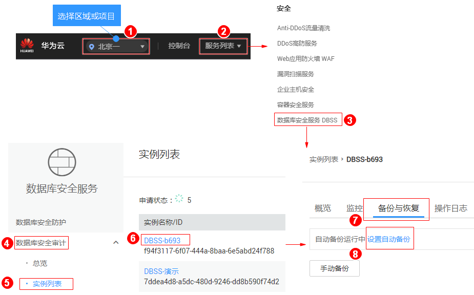
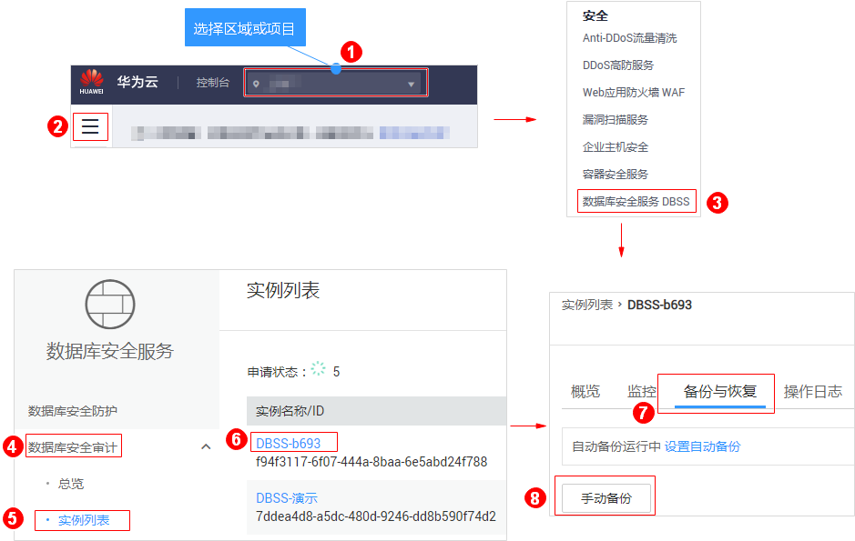
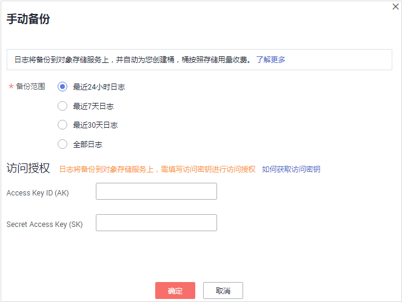
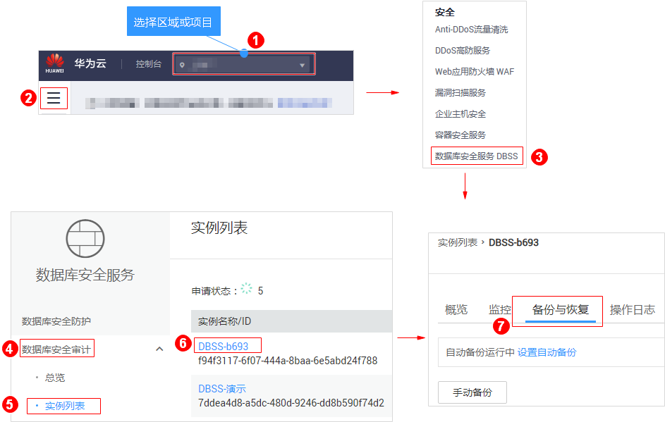
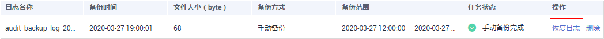

# 备份和恢复数据库审计日志

数据库安全审计支持将数据库的审计日志备份到OBS桶，实现高可用容灾。您可以根据需要备份或恢复数据库审计日志。

## 前提条件

-   已成功购买数据库安全审计实例，且实例的状态为“运行中“。
-   已成功添加数据库并开启审计功能。
-   已成功添加并安装Agent。

## 注意事项

-   执行备份后，审计日志将备份到对象存储服务上，系统自动为您创建桶，桶将按用量收费。有关对象存储服务的计费详情，请参见[价格详情](https://www.huaweicloud.com/pricing.html?tab=detail#/obs)。
-   有关审计日志的保存说明，请参见[数据库安全审计的审计数据可以保存多久？](https://support.huaweicloud.com/dbss_faq/dbss_01_0225.html)。

## 自动备份数据库审计日志

1.  [登录管理控制台](https://console.huaweicloud.com/)。
2.  进入自动备份入口，如[图1](#fig61991836131419)所示。

    **图 1**  进入自动备份入口  
    

3.  在弹出的对话框中，设置自动备份参数，如[图2](#fig559320113012)所示，相关参数说明如[表1](#table18602206309)所示。

    **图 2** “设置自动备份“对话框  
    

    **表 1**  自动备份参数说明

    
    <table><thead align="left"><tr id="row66082019309"><th class="cellrowborder" valign="top" width="21%" id="mcps1.2.4.1.1">
参数名称

    </th>
    <th class="cellrowborder" valign="top" width="61%" id="mcps1.2.4.1.2">
说明

    </th>
    <th class="cellrowborder" valign="top" width="18%" id="mcps1.2.4.1.3">
取值样例

    </th>
    </tr>
    </thead>
    <tbody><tr id="row1260620173019"><td class="cellrowborder" valign="top" width="21%" headers="mcps1.2.4.1.1 ">
自动备份

    </td>
    <td class="cellrowborder" valign="top" width="61%" headers="mcps1.2.4.1.2 ">
开启或关闭自动备份。

    <ul id="ul96017208301"><li>：开启</li><li>：关闭</li></ul>
    </td>
    <td class="cellrowborder" valign="top" width="18%" headers="mcps1.2.4.1.3 ">

    </td>
    </tr>
    <tr id="row16601020103014"><td class="cellrowborder" valign="top" width="21%" headers="mcps1.2.4.1.1 ">
备份周期

    </td>
    <td class="cellrowborder" valign="top" width="61%" headers="mcps1.2.4.1.2 ">
选择自动备份的周期，可以选择：

    <ul id="ul1660142053017"><li>每天</li><li>每周</li><li>每月</li></ul>
    </td>
    <td class="cellrowborder" valign="top" width="18%" headers="mcps1.2.4.1.3 ">
每天

    </td>
    </tr>
    <tr id="row1661192012301"><td class="cellrowborder" valign="top" width="21%" headers="mcps1.2.4.1.1 ">
开始时间

    </td>
    <td class="cellrowborder" valign="top" width="61%" headers="mcps1.2.4.1.2 ">
单击，选择开始备份的时间。

    </td>
    <td class="cellrowborder" valign="top" width="18%" headers="mcps1.2.4.1.3 ">
2019/06/11 15:10:50

    </td>
    </tr>
    <tr id="row196114205301"><td class="cellrowborder" valign="top" width="21%" headers="mcps1.2.4.1.1 ">
预计下次备份时间

    </td>
    <td class="cellrowborder" valign="top" width="61%" headers="mcps1.2.4.1.2 ">
预计下次自动备份开始时间。

    </td>
    <td class="cellrowborder" valign="top" width="18%" headers="mcps1.2.4.1.3 ">
2019/06/12 15:10:50

    </td>
    </tr>
    </tbody>
    </table>

4.  单击“确定“。

## 手动备份数据库审计日志

1.  [登录管理控制台](https://console.huaweicloud.com/)。
2.  进入手动备份入口，如[图3](#fig53167236710)所示。

    **图 3**  进入手动备份入口  
    

3.  在弹出的对话框中，选择“备份范围“（“最近24小时日志“、“最近7天日志“、“最近30天日志“或“全部日志“），如[图4](#fig14575161415425)所示。

    **图 4** “手动备份“对话框  
    

4.  单击“确定“。

## 恢复数据库审计日志

数据库审计日志备份成功后，您可以根据需要恢复数据库的审计日志。

> **须知：**   
>日志数据恢复风险较大，在恢复日志数据前，请您确认备份的日志数据的准确性或完整性。  

1.  [登录管理控制台](https://console.huaweicloud.com/)。
2.  进入备份日志列表入口，如[图5](#fig10560192191214)所示。

    **图 5**  进入备份日志列表入口  
    

3.  在需要恢复数据库审计的备份日志所在的“操作“列，单击“恢复日志“，如[图6](#fig249072014143)所示。

    **图 6**  恢复日志  
    

4.  在弹出的提示框中，单击“确定“。

