# 安装Agent（Windows操作系统）

Agent添加完成后，您还需要下载Agent，并根据Agent的添加方式在数据库端或应用端安装Agent，将添加的数据库连接到数据库安全审计实例，才能使用数据库安全审计功能。

## 前提条件

-   已成功购买数据库安全审计实例，且实例的状态为“运行中“。
-   数据库已成功添加Agent。
-   已获取Windows操作系统Agent安装包。
-   安装Agent节点的运行系统满足Windows系统版本要求。有关Windows系统版本的要求，请参见[Agent可以安装在哪些Windows操作系统上？](https://support.huaweicloud.com/dbss_faq/dbss_01_0318.html)。

## 常见安装场景

请您根据数据库的类型以及部署场景，在数据库端或应用端安装Agent。数据库常见的部署场景说明如下：

-   ECS/BMS自建数据库的常见部署场景如[图1](#zh-cn_topic_0174227115_fig0617131314411)和[图2](#zh-cn_topic_0174227115_fig1131385013914)所示。

    **图 1**  一个应用端连接多个ECS/BMS自建数据库  
    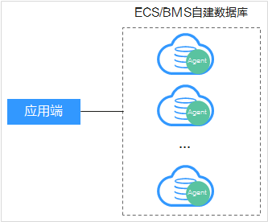

    **图 2**  多个应用端连接同一个ECS/BMS自建数据库  
    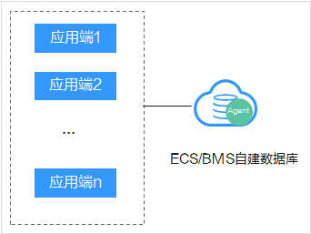

-   RDS关系型数据库的常见部署场景如[图3](#zh-cn_topic_0174227115_fig76418538416)和[图4](#zh-cn_topic_0174227115_fig766123541110)所示。

    **图 3**  一个应用端连接多个RDS  
    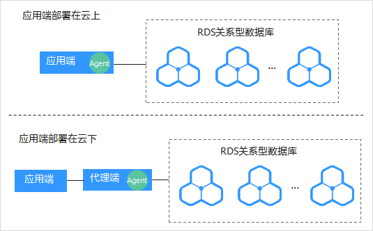

    **图 4**  多个应用端连接同一个RDS  
    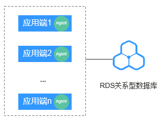

安装Agent节点的详细说明如[表1](#zh-cn_topic_0174227115_zh-cn_topic_0110856029_table4295843716304)所示。

> **须知：**   
>当您的应用和数据库（ECS/BMS自建数据库）都部署在同一个节点上时，Agent需在数据库端添加。  

**表 1**  安装Agent场景说明

<table><thead align="left"><tr id="zh-cn_topic_0174227115_zh-cn_topic_0110856029_row4338993216304"><th class="cellrowborder" valign="top" width="16.91%" id="mcps1.2.5.1.1">
使用场景

</th>
<th class="cellrowborder" valign="top" width="15.61%" id="mcps1.2.5.1.2">
Agent安装节点

</th>
<th class="cellrowborder" valign="top" width="29.21%" id="mcps1.2.5.1.3">
审计功能说明

</th>
<th class="cellrowborder" valign="top" width="38.269999999999996%" id="mcps1.2.5.1.4">
注意事项

</th>
</tr>
</thead>
<tbody><tr id="zh-cn_topic_0174227115_zh-cn_topic_0110856029_row3896937416304"><td class="cellrowborder" valign="top" width="16.91%" headers="mcps1.2.5.1.1 ">
ECS/BMS自建数据库

</td>
<td class="cellrowborder" valign="top" width="15.61%" headers="mcps1.2.5.1.2 ">
数据库端

</td>
<td class="cellrowborder" valign="top" width="29.21%" headers="mcps1.2.5.1.3 ">
可以审计所有访问该数据库的应用端的所有访问记录。

</td>
<td class="cellrowborder" valign="top" width="38.269999999999996%" headers="mcps1.2.5.1.4 "><ul id="zh-cn_topic_0174227115_ul1434325082513"><li>在数据库端安装Agent。</li><li>当某个应用端连接多个ECS/BMS自建数据库时，需要在所有连接该应用端的数据库端安装Agent。</li></ul>
</td>
</tr>
<tr id="zh-cn_topic_0174227115_zh-cn_topic_0110856029_row1319658616304"><td class="cellrowborder" valign="top" width="16.91%" headers="mcps1.2.5.1.1 ">
RDS关系型数据库

</td>
<td class="cellrowborder" valign="top" width="15.61%" headers="mcps1.2.5.1.2 ">
应用端（应用端部署在云上）

</td>
<td class="cellrowborder" valign="top" width="29.21%" headers="mcps1.2.5.1.3 ">
可以审计该应用端与其连接的所有数据库的访问记录。

</td>
<td class="cellrowborder" valign="top" width="38.269999999999996%" headers="mcps1.2.5.1.4 "><ul id="zh-cn_topic_0174227115_ul832714025916"><li>在应用端安装Agent。</li><li>当多个应用端连接同一个RDS时，所有连接该RDS的应用端都需要安装Agent。</li></ul>
</td>
</tr>
<tr id="zh-cn_topic_0174227115_row673153818506"><td class="cellrowborder" valign="top" width="16.91%" headers="mcps1.2.5.1.1 ">
RDS关系型数据库

</td>
<td class="cellrowborder" valign="top" width="15.61%" headers="mcps1.2.5.1.2 ">
代理端（应用端部署在云下）

</td>
<td class="cellrowborder" valign="top" width="29.21%" headers="mcps1.2.5.1.3 ">
只能审计代理端与后端数据库之间的访问记录，无法审计应用端与后端数据库的访问记录。

</td>
<td class="cellrowborder" valign="top" width="38.269999999999996%" headers="mcps1.2.5.1.4 ">
在代理端安装Agent。

</td>
</tr>
</tbody>
</table>

## 安装Agent

1.  在Windows主机安装“Npcap“软件。
    -   如果该Windows主机已安装“Npcap“，请执行[2](#li536717914201)。
    -   如果该Windows主机未安装“Npcap“，请执行以下步骤：
        1.  请前往[https://nmap.org/npcap/](https://nmap.org/npcap/)下载Npcap最新软件安装包。
        2.  将下载好的npcap-_xxxx_.exe软件安装包上传至需要安装agent的虚拟机。
        3.  双击npcap软件安装包。
        4.  在弹出的对话框中，单击“I Agree“，如[图5](#fig114541164118)所示。

            **图 5**  同意安装“Npcap“  
            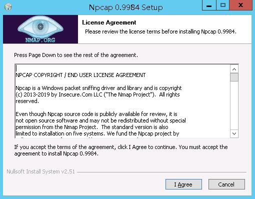

        5.  在弹出的对话框中，单击“Install“，如[图6](#fig124541516111114)所示。

            **图 6**  安装“Npcap“  
            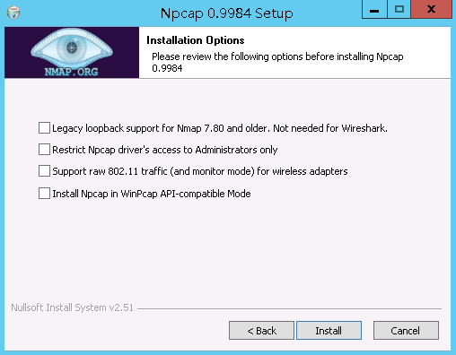

        6.  在弹出的对话框中，单击“Next“。

            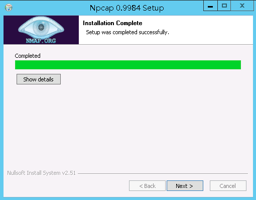

        7.  单击“Finish“，完成安装。

            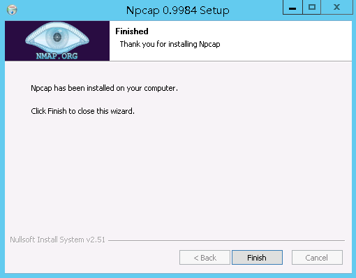

2.  以“Administrator“用户登录到Windows主机。
3.  将下载的Agent安装包“xxx.zip“复制到该主机任意一个目录下。
4.  进入Agent安装包所在目录，并解压缩安装包。
5.  进入解压后的文件夹，双击“install.bat“执行文件。
6.  安装成功，界面如[图7](#fig1160640132710)所示，按任意键结束安装。

    **图 7**  Agent安装成功  
    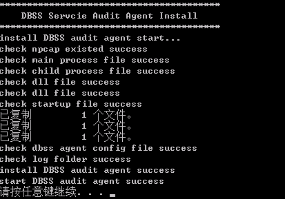

7.  安装完成后，在Windows任务管理器中查看“dbss\_audit\_agent“进程。

    如果进程不存在，说明Agent安装失败，请尝试重新安装Agent。

## 效果验证

1.  Agent安装成功后，在数据库上执行一条SQL语句（例如“select \* from mysql.user limit 1“）。
2.  [登录管理控制台](https://console.huaweicloud.com/?locale=zh-cn)。
3.  验证Agent与数据库安全审计实例的网络通信正常。
    1.  进入SQL语句列表入口，如[图8](#zh-cn_topic_0174227115_fig1489915095118)所示。

        **图 8**  进入SQL语句列表入口  
        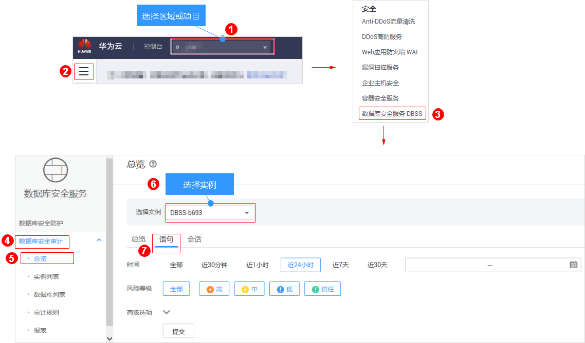

    2.  在“时间“所在行右侧，单击，选择开始时间和结束时间，单击“提交“，SQL语句列表将显示[1](#zh-cn_topic_0174227115_li0294761612)中输入的SQL语句，如[图9](#zh-cn_topic_0174227115_fig8994029155516)所示。

        **图 9**  查看SQL语句  
        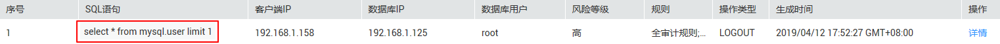

        -   如果SQL语句列表中显示输入的SQL语句，说明Agent与数据库安全审计实例之间网络通信正常。
        -   如果SQL语句列表中未显示输入的SQL语句，说明Agent与数据库安全审计实例之间网络通信异常，请参照[如何处理Agent与数据库安全审计实例之间通信异常？](https://support.huaweicloud.com/dbss_faq/dbss_01_0246.html)处理。

## 后续处理

数据库安全审计默认提供一条“全审计规则“的审计范围，可以对成功连接数据库安全审计实例的所有数据库进行安全审计。Agent安装完成后，您可以查看被添加的数据库的审计结果。详细操作，请参见[查看审计结果](查看审计总览信息.md)。

## 相关操作

-   有关添加Agent的详细操作，请参见[步骤二：添加Agent](步骤二-添加Agent.md)。
-   数据库开启SSL时，将不能使用数据库安全审计功能。如果您需要使用数据库安全审计功能，请关闭数据库的SSL。关闭数据库SSL的详细操作，请参见[如何关闭数据库SSL？](https://support.huaweicloud.com/dbss_faq/dbss_01_0283.html)。
-   有关卸载Agent的详细操作，请参见[卸载Agent](卸载Agent.md)。

