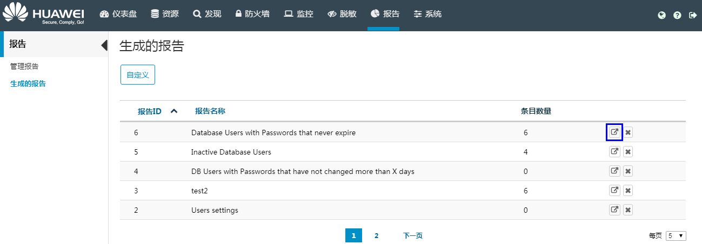

# 导出报告

用户可以导出已生成的报告。

## 前提条件

用户已配置日志存储位置，请参见[配置日志存储位置](配置日志存储位置.md#ZH-CN_TOPIC_0111166360)。

若要查看导出的PDF报告，用户需要已安装PDF阅读器。

## 操作步骤

1.  在HexaTier主菜单上，单击“报告“。
2.  在导航树中，选择“生成的报告“。
3.  在工作区中，找到需要导出的已生成报告，然后单击该行的（导出）。

    

