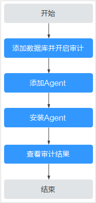

# 快速使用流程

购买数据库安全审计实例后，您需要将待审计的数据库添加到数据库安全审计实例中，并在数据库对应的数据库端或应用端安装Agent。当待审计的数据库连接到数据库安全审计实例后，数据库安全审计才能对待审计的数据库进行审计。

## 背景信息

数据库安全审计支持对华为云上的ECS/BMS自建数据库和RDS关系型数据库进行审计。

> **须知：** 
>-   数据库安全审计不支持跨区域（Region）使用。待审计的数据库必须和购买的数据库安全审计实例在同一区域。
>-   数据库开启SSL时，将不能使用数据库安全审计功能。如果您需要使用数据库安全审计功能，请关闭数据库的SSL。关闭数据库SSL的详细操作，请参见[如何关闭数据库SSL？](https://support.huaweicloud.com/dbss_faq/dbss_01_0283.html)。
>-   有关审计数据的保存说明，请参见[数据库安全审计的审计数据可以保存多久？](https://support.huaweicloud.com/dbss_faq/dbss_01_0225.html)。

## 快速配置流程

购买数据库安全审计后，您可以参照[图1](#fig120888149)所示的配置流程，快速使用数据库安全审计。操作步骤的详细说明如[表1](#table443217583618)所示。

**图 1**  快速使用数据库安全审计流程图  

**表 1**  快速使用数据库安全审计操作步骤

<table><thead align="left"><tr id="row143210517368"><th class="cellrowborder" valign="top" width="6.360636063606361%" id="mcps1.2.4.1.1">
步骤

</th>
<th class="cellrowborder" valign="top" width="26.162616261626166%" id="mcps1.2.4.1.2">
配置操作

</th>
<th class="cellrowborder" valign="top" width="67.47674767476747%" id="mcps1.2.4.1.3">
说明

</th>
</tr>
</thead>
<tbody><tr id="row1943217515366"><td class="cellrowborder" valign="top" width="6.360636063606361%" headers="mcps1.2.4.1.1 ">
1

</td>
<td class="cellrowborder" valign="top" width="26.162616261626166%" headers="mcps1.2.4.1.2 ">
<a href="步骤一-添加数据库并开启审计.md">步骤一：添加数据库并开启审计</a>

</td>
<td class="cellrowborder" valign="top" width="67.47674767476747%" headers="mcps1.2.4.1.3 ">
购买数据库安全审计后，您需要先将待审计的数据库添加到数据库安全审计实例并开启该数据库的审计功能。

</td>
</tr>
<tr id="row14423186183810"><td class="cellrowborder" valign="top" width="6.360636063606361%" headers="mcps1.2.4.1.1 ">
2

</td>
<td class="cellrowborder" valign="top" width="26.162616261626166%" headers="mcps1.2.4.1.2 ">
<a href="步骤二-添加Agent.md">步骤二：添加Agent</a>

</td>
<td class="cellrowborder" valign="top" width="67.47674767476747%" headers="mcps1.2.4.1.3 ">
添加的数据库开启审计功能后，您需要为添加的数据库选择Agent的添加方式。

数据库安全审计支持对华为云上的ECS/BMS自建数据库和RDS关系型数据库进行审计，请根据您在华为云上实际部署的数据库选择Agent添加方式。

</td>
</tr>
<tr id="row2083153011513"><td class="cellrowborder" valign="top" width="6.360636063606361%" headers="mcps1.2.4.1.1 ">
3

</td>
<td class="cellrowborder" valign="top" width="26.162616261626166%" headers="mcps1.2.4.1.2 ">
<a href="安装Agent（Linux操作系统）.md">安装Agent（Linux操作系统）</a>

</td>
<td class="cellrowborder" valign="top" width="67.47674767476747%" headers="mcps1.2.4.1.3 ">
添加Agent后，您需要下载Agent，并根据Agent的添加方式在数据库端或应用端安装Agent，将添加的数据库连接到数据库安全审计实例，才能使用数据库安全审计功能。

</td>
</tr>
<tr id="row695902133817"><td class="cellrowborder" valign="top" width="6.360636063606361%" headers="mcps1.2.4.1.1 ">
4

</td>
<td class="cellrowborder" valign="top" width="26.162616261626166%" headers="mcps1.2.4.1.2 ">
<a href="查看审计总览信息.md">查看审计结果</a>

</td>
<td class="cellrowborder" valign="top" width="67.47674767476747%" headers="mcps1.2.4.1.3 ">
数据库安全审计默认提供一条“全审计规则”的审计范围，可以对连接数据库安全审计实例的所有数据库进行审计。安装Agent后，您可以在数据库安全审计界面查看被添加的数据库的审计结果。

 须知： 

您可以根据业务需求设置数据库审计规则。有关配置审计规则的详细操作，请参见<a href="添加审计范围.md">配置审计规则</a>。

</td>
</tr>
</tbody>
</table>

## 相关操作

-   如何选择Agent添加方式以及安装Agent的节点的详细介绍，请参见[如何选择数据库安全审计的Agent安装节点？](https://support.huaweicloud.com/dbss_faq/dbss_01_0282.html)。
-   如果审计功能无法正常使用，请参照[无法使用数据库安全审计](https://support.huaweicloud.com/dbss_faq/dbss_01_0235.html)章节进行处理。

## 效果验证

当您将添加的数据库连接到数据库安全审计实例后，数据库安全审计将记录被添加的数据库的操作行为。您可以在数据库安全审计界面查看被添加的数据库的审计结果。

