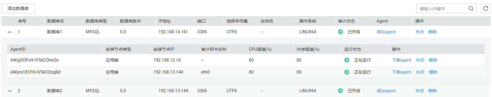
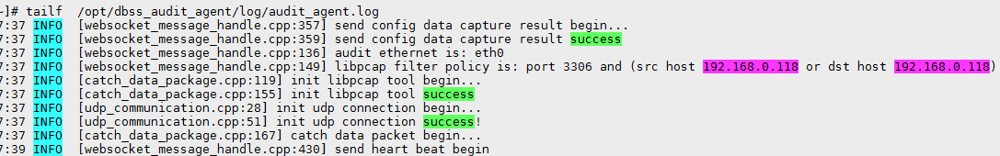
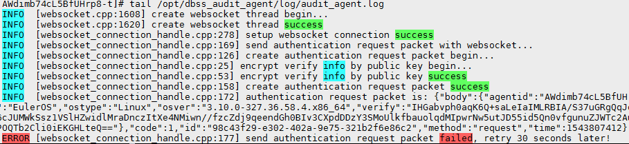

# 数据库安全审计功能无法正常使用<a name="ZH-CN_TOPIC_0143651392"></a>

本章节介绍数据库安全审计无法正常使用的处理方法。

## 故障现象<a name="section4597163713358"></a>

触发数据库流量后，在SQL语句列表页面进行语句搜索，不能搜索到相关的审计信息。

## 可能原因<a name="section12392122314367"></a>

-   添加数据库的信息有误
-   待审计的数据库未开启审计功能
-   数据库不在审计范围内
-   Agent程序没有运行
-   Agent与审计服务器通信异常

## 处理步骤<a name="section20158847143620"></a>

1.  登录管理控制台。
2.  单击管理控制台左上角的，选择区域或项目。
3.  单击管理控制台上方的“服务列表“，选择“安全  \>  数据库安全服务 DBSS“，进入数据库安全防护实例列表界面。
4.  在左侧导航树中，选择“数据库安全服务  \>  数据库安全审计“，进入数据库安全审计实例列表界面。
5.  在数据库安全审计实例列表中，单击无法使用审计功能的数据库所在的实例名称，如[图1](#fig614863518248)所示。

    **图 1**  数据库安全审计实例列表<a name="fig614863518248"></a>  
    

6.  检查数据库信息是否正确以及数据库的审计是否已开启。
    1.  在“实例详情“界面，选择“维护  \>  数据库管理“，进入数据库列表页面，如[图2](#fig18191942155913)所示。

        **图 2**  查看数据库信息<a name="fig18191942155913"></a>  
        

    2.  检查数据库信息是否正确。
        -   如果数据库信息正确，请执行[6.c](#li15451941216)。
        -   如果数据库信息错误，请先单击“删除“，删除该数据库，再单击“添加数据库“，重新添加该数据库。
            -   如果问题已解决，结束操作。
            -   如果问题仍存在，请执行[6.c](#li15451941216)。


    3.  <a name="li15451941216"></a>检查数据库的审计是否已开启。
        -   如果“审计状态“为“已开启“，请执行[7](#li207461824135718)。
        -   如果“审计状态“为“已关闭“，请单击“开启“，开启数据库审计。
            -   如果问题已解决，结束操作。
            -   如果问题仍存在，请执行[7](#li207461824135718)。


7.  <a name="li207461824135718"></a>检查审计范围中对应数据库是否已启用。

    在“实例详情“界面，选择“规则  \>  审计范围“，进入审计范围列表页面，如[图3](#fig17324536122612)所示。

    **图 3**  查看审计范围信息<a name="fig17324536122612"></a>  
    

    -   如果“状态“为“已启用“，请执行[8](#li56931138113110)。
    -   如果“状态“为“已禁用“，请单击“启用“，启用数据库对应的审计范围规则。
        -   如果问题已解决，结束操作。
        -   如果问题仍存在，请执行[8](#li56931138113110)。


8.  <a name="li56931138113110"></a>检查数据库的Agent程序是否正常运行。
    1.  使用跨平台远程访问工具（例如PuTTY）以**root**用户通过SSH方式，登录数据库。
    2.  执行以下命令，查看Agent程序的运行状态。

        **ps** **-ef|grep** **audit\_agent**

        -   如果界面回显以下信息，说明Agent程序运行正常，请执行[9](#li18109152112438)。

            ```
            /opt/dbss_audit_agent/bin/audit_agent
            ```

        -   如果界面无回显信息，说明Agent程序运行异常，请运行Agent程序。
            -   如果问题已解决，结束操作。
            -   如果问题仍存在，请执行[9](#li18109152112438)。


9.  <a name="li18109152112438"></a>执行以下命令，查看Agent与审计服务器的通信状态。

    **tailf** **/opt/dbss\_audit\_agent/log/audit\_agent.log**

    -   如果界面回显类似以下信息，说明Agent与审计服务器通信正常。

        **图 4**  通信正常<a name="fig116001237155515"></a>  
        

    -   如果界面回显类似以下信息，说明Agent与审计服务器通信异常，请联系技术支持。

        **图 5**  通信异常<a name="fig8492132411531"></a>  
        


