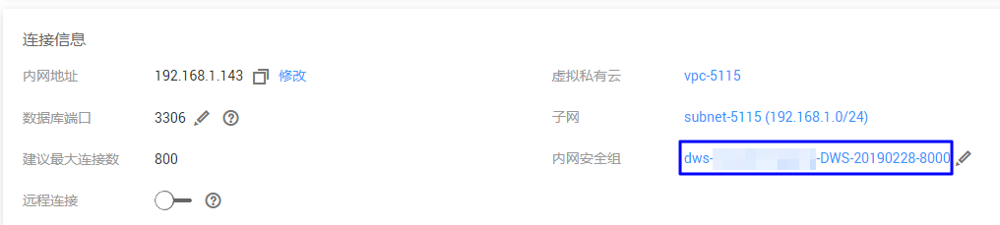
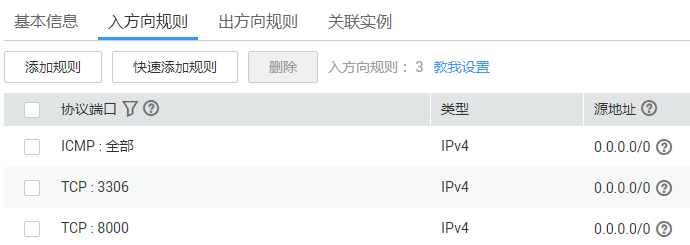
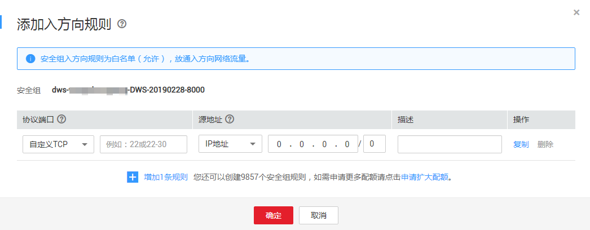

# 数据库安全防护无法连接防护数据库

## 故障现象

用户无法通过数据库安全防护连接防护的数据库。

## 可能原因

-   业务侧的安全组规则未放通
-   业务侧服务器防火墙配置限制了端口
-   业务侧服务器网络路由丢失

## 处理步骤

以无法连接RDS数据库为例，请参照以下操作步骤排查处理。

1.  检查无法连接的RDS数据库的安全组规则信息。
    1.  登录管理控制台。
    2.  在左侧导航树中，单击，选择“数据库  \>  云数据库 RDS“，进入关系型数据库列表界面。
    3.  单击实例名称，进入实例基本信息界面。
    4.  在“连接信息“区域框中，单击“内网安全组“，如[图1](#fig9469162203513)所示，进入安全组基本信息页面。

        **图 1**  进入安全组规则页面  
        

    5.  选择“入方向规则“页签，查看入方向规则信息，如[图2](#fig1443325713422)所示。

        **图 2**  查看入方向规则  
        

        -   如果安全组已放通入方向规则：请执行[2](#li16836152112010)。
        -   如果安全组未放通入方向规则：请执行[1.f](#li2272035174313)。

    6.  单击“添加规则“，在“添加入方向规则“对话框中设置安全组信息，单击“确定“。

        **图 3**  添加入方向规则  
        

        重新通过DBSS重新连接RDS数据库。

        -   如果DBSS可以连接RDS数据库：结束操作。
        -   如果DBSS不能连接RDS数据库：请执行[2](#li16836152112010)。

2.  检查服务器防火墙配置规则是否限制了数据库端口。
    1.  查看防火墙配置规则。
        -   如果未限制：请执行[3](#li863164218585)。
        -   如果已限制：请执行[2.b](#li18392488221)。

    2.  设置防火墙规则。
    3.  重新连接数据库。
        -   如果DBSS可以连接RDS数据库：结束操作。
        -   如果DBSS不能连接RDS数据库：请执行[3](#li863164218585)。

3.  检查服务器网络路由是否丢失。
    -   如果服务器网络路由正常：请执行[4](#li03311142161815)。
    -   如果服务器网络路由丢失：配置路由信息后，请执行[4](#li03311142161815)。

4.  通过DBSS重新连接RDS数据库。

    如果仍然不能连接RDS数据库，请联系技术支持。

