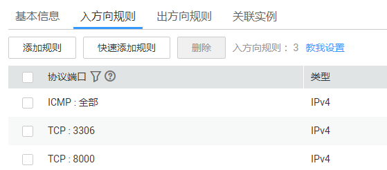

# 无法访问数据库安全防护界面

## 故障现象

登录管理控制台后，进入数据库安全服务管理界面时，无法访问数据库安全防护界面。

## 可能原因

-   防护实例正在进行主备倒换
-   业务侧安全组端口配置有误
-   部署DBSS的服务器网络异常

## 处理步骤

1.  等待约20秒后，重新访问防护界面。

    当防护节点故障或流量过载时，将触发数据库安全防护实例进行主备倒换。主备倒换期间，您将不能访问数据库安全防护界面（时长约20秒）。

    -   如果可以访问：请继续使用数据库安全防护功能。
    -   如果不能访问：请执行[2](#li94942321507)。

2.  检查业务侧安全组端口配置信息。
    1.  登录管理控制台。
    2.  在左侧导航树中，单击，选择“网络  \>  虚拟私有云 VPC“，进入虚拟私有云列表界面。
    3.  在左侧导航树中，选择“访问控制  \>  安全组“，进入安全组列表界面。
    4.  在业务侧配置的安全组所在行的“安全组规则“列，单击安全组规则数量，查看安全组入方向和出方向规则端口信息，如[图1](#fig161095634911)所示。

        **图 1**  查看安全组规则  
        

        -   如果安全组端口配置正确：请执行[3](#li36485215509)。
        -   如果安全组端口配置错误：请执行[2.e](#li56341234105310)。

    5.  单击“修改“，修改安全组规则信息。
    6.  修改安全组规则后，重新访问数据库安全防护界面。
        -   如果可以访问：请继续使用数据库安全防护功能。
        -   如果不能访问：请执行[3](#li36485215509)。

3.  检查部署DBSS的服务器网络连接状态。
    -   如果网络连接正常：请执行[4](#li1258512485514)。
    -   如果网络连接异常：修复网络连接后，请执行[4](#li1258512485514)。

4.  重新访问数据库安全防护界面。

    如果仍然不能访问数据库安全防护界面，请联系技术支持。

