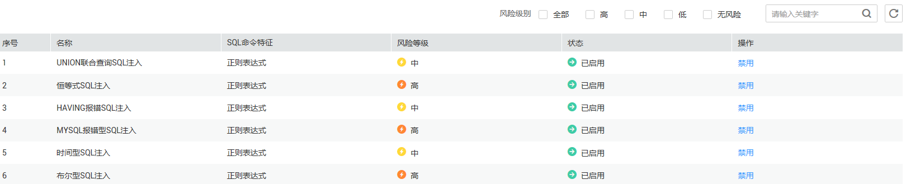

# 查看SQL注入检测信息

本章节介绍如何查看数据库安全审计的SQL注入检测信息。

## 前提条件

-   已获取管理控制台的登录账号与密码。
-   已成功购买数据库安全审计实例，且实例的状态为“运行中“。
-   已开启数据库审计，并在数据库端或应用端成功安装Agent。
-   已成功设置审计规则。

## 操作步骤

1.  登录管理控制台。
2.  单击管理控制台左上角的，选择区域或项目。
3.  单击管理控制台上方的“服务列表“，选择“安全  \>  数据库安全服务 DBSS“，进入数据库安全防护实例列表界面。
4.  在左侧导航树中，选择“数据库安全服务  \>  数据库安全审计“，进入数据库安全审计实例列表界面。
5.  在数据库安全审计实例列表中，单击需要查看SQL注入检测信息的实例名称，如[图1](#fig7878158164919)所示。

    **图 1**  数据库安全审计实例列表  
    

6.  在“实例详情“界面，选择“规则  \>  SQL注入“，进入SQL注入检测列表页面。
7.  查看SQL注入检测信息，如[图2](#fig71914515113)所示，相关参数如[表1](#table964761214306)所示。

    **图 2**  查看SQL注入检测信息  
    

    > **说明：**   
    >-   选择SQL注入检测的风险级别，列表将显示该级别的SQL注入检测信息。  
    >-   输入SQL注入检测的关键字，单击或按“Enter“，可以搜索指定的SQL注入检测信息。  

    **表 1**  SQL注入检测信息参数说明

    
    <table><thead align="left"><tr id="row1365581213011"><th class="cellrowborder" valign="top" width="25.629999999999995%" id="mcps1.2.3.1.1">
参数名称

    </th>
    <th class="cellrowborder" valign="top" width="74.37%" id="mcps1.2.3.1.2">
说明

    </th>
    </tr>
    </thead>
    <tbody><tr id="row1528102263112"><td class="cellrowborder" valign="top" width="25.629999999999995%" headers="mcps1.2.3.1.1 ">
序号

    </td>
    <td class="cellrowborder" valign="top" width="74.37%" headers="mcps1.2.3.1.2 ">
SQL注入检测的编号。

    </td>
    </tr>
    <tr id="row7664312163018"><td class="cellrowborder" valign="top" width="25.629999999999995%" headers="mcps1.2.3.1.1 ">
名称

    </td>
    <td class="cellrowborder" valign="top" width="74.37%" headers="mcps1.2.3.1.2 ">
SQL注入检测的名称。

    </td>
    </tr>
    <tr id="row18114121410321"><td class="cellrowborder" valign="top" width="25.629999999999995%" headers="mcps1.2.3.1.1 ">
SQL命令特征

    </td>
    <td class="cellrowborder" valign="top" width="74.37%" headers="mcps1.2.3.1.2 ">
SQL注入检测的命令特征。

    </td>
    </tr>
    <tr id="row17352133015322"><td class="cellrowborder" valign="top" width="25.629999999999995%" headers="mcps1.2.3.1.1 ">
风险等级

    </td>
    <td class="cellrowborder" valign="top" width="74.37%" headers="mcps1.2.3.1.2 ">
SQL注入检测的风险等级，包括：

    <ul id="ul10411345155412"><li>高</li><li>中</li><li>低</li><li>无风险</li></ul>
    </td>
    </tr>
    <tr id="row19685121213016"><td class="cellrowborder" valign="top" width="25.629999999999995%" headers="mcps1.2.3.1.1 ">
状态

    </td>
    <td class="cellrowborder" valign="top" width="74.37%" headers="mcps1.2.3.1.2 ">
SQL注入检测的状态，包括：

    <ul id="ul118072149340"><li>已启用</li><li>已禁用</li></ul>
    </td>
    </tr>
    </tbody>
    </table>

