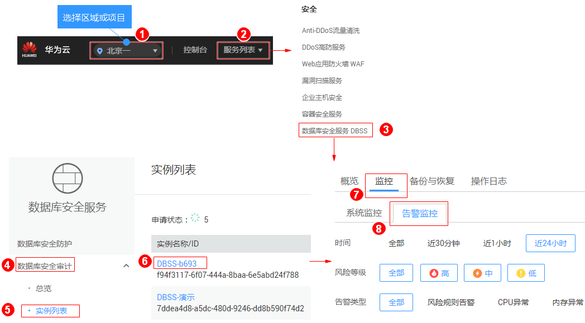
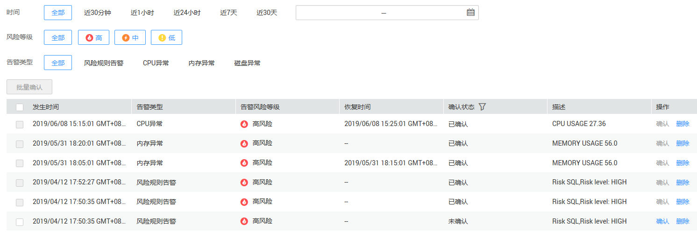

# 查看告警信息

本章节介绍如何查看数据库安全审计的告警信息，以及当处理告警后如何确认告警。

## 前提条件

-   已成功购买数据库安全审计实例，且实例的状态为“运行中“。
-   已成功添加数据库并开启审计功能。
-   已成功添加并安装Agent。
-   已设置告警通知。

## 操作步骤

1.  [登录管理控制台](https://console.huaweicloud.com/?locale=zh-cn)。
2.  进入告警监控入口，如[图1](#fig61991836131419)所示。

    **图 1**  进入告警监控入口  
    

3.  查看告警信息，如[图2](#fig2691832172511)所示，相关参数说明如[表1](#table1025994517211)所示。

    **图 2**  查看告警信息  
    

    **表 1**  告警信息参数说明

    
    <table><thead align="left"><tr id="row1626074517217"><th class="cellrowborder" valign="top" width="17%" id="mcps1.2.3.1.1">
参数名称

    </th>
    <th class="cellrowborder" valign="top" width="83%" id="mcps1.2.3.1.2">
说明

    </th>
    </tr>
    </thead>
    <tbody><tr id="row18260134511215"><td class="cellrowborder" valign="top" width="17%" headers="mcps1.2.3.1.1 ">
发生时间

    </td>
    <td class="cellrowborder" valign="top" width="83%" headers="mcps1.2.3.1.2 ">
告警发生的时间。

    </td>
    </tr>
    <tr id="row326014459212"><td class="cellrowborder" valign="top" width="17%" headers="mcps1.2.3.1.1 ">
告警类型

    </td>
    <td class="cellrowborder" valign="top" width="83%" headers="mcps1.2.3.1.2 ">
告警的类型，包括：

    <ul id="ul1639319401191"><li>风险规则告警</li><li>CPU异常</li><li>内存异常</li><li>磁盘异常</li><li>审计容量不足</li><li>日志备份OBS失败</li></ul>
    </td>
    </tr>
    <tr id="row11260124513215"><td class="cellrowborder" valign="top" width="17%" headers="mcps1.2.3.1.1 ">
告警风险等级

    </td>
    <td class="cellrowborder" valign="top" width="83%" headers="mcps1.2.3.1.2 ">
告警的风险等级，包括：

    <ul id="ul108156241253"><li>高风险</li><li>中风险</li><li>低风险</li></ul>
    </td>
    </tr>
    <tr id="row17586193614411"><td class="cellrowborder" valign="top" width="17%" headers="mcps1.2.3.1.1 ">
恢复时间

    </td>
    <td class="cellrowborder" valign="top" width="83%" headers="mcps1.2.3.1.2 ">
恢复告警的时间。

    </td>
    </tr>
    <tr id="row1666214161896"><td class="cellrowborder" valign="top" width="17%" headers="mcps1.2.3.1.1 ">
确认状态

    </td>
    <td class="cellrowborder" valign="top" width="83%" headers="mcps1.2.3.1.2 ">
告警的确认状态。单击，可以筛选“未确认”或“已确认”状态的告警信息。

    </td>
    </tr>
    <tr id="row1839683313910"><td class="cellrowborder" valign="top" width="17%" headers="mcps1.2.3.1.1 ">
描述

    </td>
    <td class="cellrowborder" valign="top" width="83%" headers="mcps1.2.3.1.2 ">
告警的相关描述信息。

    </td>
    </tr>
    </tbody>
    </table>

    您可以按照以下方法，查询指定的告警信息。

    -   选择“时间“（“全部“、“近30分钟“、“近1小时“、“近24小时“、“近7天“或“近30天“），或单击，选择开始时间和结束时间，单击“确认“，列表显示该时间段的告警信息。
    -   选择“风险等级“（“全部“、“高“、“中“或“低“），列表显示该级别的告警信息。
    -   选择“告警类型“，列表显示该类型的告警信息。

## 后续处理

如果某条告警信息已经处理完成，您可以在该告警所在行的“操作“类，单击“确认“，如[图3](#fig122598362555)所示，标识该告警已确认并处理。

**图 3**  确认告警信息  

> **说明：** 
>您可以选中待确认的多条告警，单击“批量确认“，同时确认多条告警信息。

