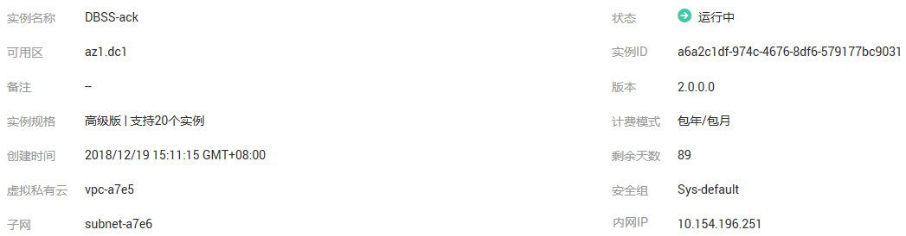

# 查看基本信息

通过查看数据库安全审计实例的基本信息，您可以查看实例的网络、版本等信息。

## 前提条件

-   已获取管理控制台的登录账号与密码。
-   已成功购买数据库安全审计实例，且实例的状态为“运行中“。

## 操作步骤

1.  登录管理控制台。
2.  单击管理控制台左上角的，选择区域或项目。
3.  单击管理控制台上方的“服务列表“，选择“安全  \>  数据库安全服务 DBSS“，进入数据库安全防护实例列表界面。
4.  在左侧导航树中，选择“数据库安全服务  \>  数据库安全审计“，进入数据库安全审计实例列表界面。
5.  在数据库安全审计实例列表中，单击需要查看基本信息的实例名称，如[图1](#fig99553501795)所示。

    **图 1**  数据库安全审计实例列表  
    

6.  在“实例详情“界面，单击“基本信息“。
7.  查看实例基本信息，如[图2](#fig21239645110)所示，相关参数说明如[表1](#table1025994517211)所示。

    **图 2**  查看基本信息  
    

    **表 1**  实例基本信息参数说明

    
    <table><thead align="left"><tr id="row1626074517217"><th class="cellrowborder" valign="top" width="17%" id="mcps1.2.3.1.1">
参数名称

    </th>
    <th class="cellrowborder" valign="top" width="83%" id="mcps1.2.3.1.2">
说明

    </th>
    </tr>
    </thead>
    <tbody><tr id="row18260134511215"><td class="cellrowborder" valign="top" width="17%" headers="mcps1.2.3.1.1 ">
实例名称

    </td>
    <td class="cellrowborder" valign="top" width="83%" headers="mcps1.2.3.1.2 ">
实例的名称。

    </td>
    </tr>
    <tr id="row1123741010299"><td class="cellrowborder" valign="top" width="17%" headers="mcps1.2.3.1.1 ">
状态

    </td>
    <td class="cellrowborder" valign="top" width="83%" headers="mcps1.2.3.1.2 ">
实例当前的运行状态，包括：

    <ul id="ul41141117112913"><li>运行中</li><li>创建中</li><li>故障</li><li>已关闭</li><li>已冻结</li></ul>
    </td>
    </tr>
    <tr id="row162931627122912"><td class="cellrowborder" valign="top" width="17%" headers="mcps1.2.3.1.1 ">
可用区

    </td>
    <td class="cellrowborder" valign="top" width="83%" headers="mcps1.2.3.1.2 ">
实例所在的可用区。

    </td>
    </tr>
    <tr id="row680118365318"><td class="cellrowborder" valign="top" width="17%" headers="mcps1.2.3.1.1 ">
实例ID

    </td>
    <td class="cellrowborder" valign="top" width="83%" headers="mcps1.2.3.1.2 ">
实例的ID，由系统自动生成。

    </td>
    </tr>
    <tr id="row11540958122918"><td class="cellrowborder" valign="top" width="17%" headers="mcps1.2.3.1.1 ">
备注

    </td>
    <td class="cellrowborder" valign="top" width="83%" headers="mcps1.2.3.1.2 ">
实例的备注信息。

    </td>
    </tr>
    <tr id="row13225181317305"><td class="cellrowborder" valign="top" width="17%" headers="mcps1.2.3.1.1 ">
版本

    </td>
    <td class="cellrowborder" valign="top" width="83%" headers="mcps1.2.3.1.2 ">
当前实例的版本。

    </td>
    </tr>
    <tr id="row326014459212"><td class="cellrowborder" valign="top" width="17%" headers="mcps1.2.3.1.1 ">
实例规格

    </td>
    <td class="cellrowborder" valign="top" width="83%" headers="mcps1.2.3.1.2 ">
实例的规格。

    </td>
    </tr>
    <tr id="row17586193614411"><td class="cellrowborder" valign="top" width="17%" headers="mcps1.2.3.1.1 ">
计费模式

    </td>
    <td class="cellrowborder" valign="top" width="83%" headers="mcps1.2.3.1.2 ">
实例的计费模式。

    </td>
    </tr>
    <tr id="row13210139183015"><td class="cellrowborder" valign="top" width="17%" headers="mcps1.2.3.1.1 ">
创建时间

    </td>
    <td class="cellrowborder" valign="top" width="83%" headers="mcps1.2.3.1.2 ">
实例创建的时间。

    </td>
    </tr>
    <tr id="row1442841011318"><td class="cellrowborder" valign="top" width="17%" headers="mcps1.2.3.1.1 ">
剩余天数

    </td>
    <td class="cellrowborder" valign="top" width="83%" headers="mcps1.2.3.1.2 ">
实例可以使用的剩余天数。

    </td>
    </tr>
    <tr id="row124521853143114"><td class="cellrowborder" valign="top" width="17%" headers="mcps1.2.3.1.1 ">
虚拟私有云

    </td>
    <td class="cellrowborder" valign="top" width="83%" headers="mcps1.2.3.1.2 ">
实例所在的虚拟私有云。

    </td>
    </tr>
    <tr id="row1012620108323"><td class="cellrowborder" valign="top" width="17%" headers="mcps1.2.3.1.1 ">
安全组

    </td>
    <td class="cellrowborder" valign="top" width="83%" headers="mcps1.2.3.1.2 ">
实例所在的安全组。

    </td>
    </tr>
    <tr id="row37791289329"><td class="cellrowborder" valign="top" width="17%" headers="mcps1.2.3.1.1 ">
子网

    </td>
    <td class="cellrowborder" valign="top" width="83%" headers="mcps1.2.3.1.2 ">
实例所在的子网。

    </td>
    </tr>
    <tr id="row1950213133219"><td class="cellrowborder" valign="top" width="17%" headers="mcps1.2.3.1.1 ">
内网IP

    </td>
    <td class="cellrowborder" valign="top" width="83%" headers="mcps1.2.3.1.2 ">
实例的IP地址。

    </td>
    </tr>
    </tbody>
    </table>

