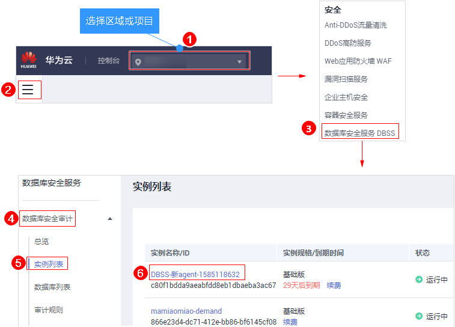
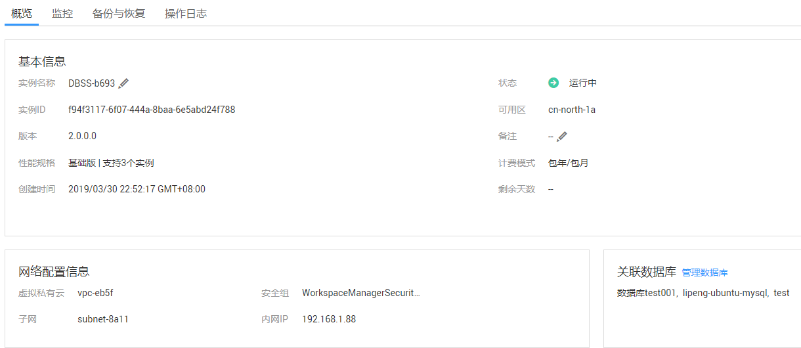

# 查看实例概览信息

通过查看数据库安全审计实例的概览信息，您可以查看实例的基本信息、网络配置信息和关联数据库信息。

## 前提条件

已成功购买数据库安全审计实例，且实例的状态为“运行中“。

## 操作步骤

1.  [登录管理控制台](https://console.huaweicloud.com/)。
2.  进入实例概览入口，如[图1](#fig10560192191214)所示。

    **图 1**  进入实例概览入口  
    

3.  查看实例的“基本信息“、“网络配置信息“和“关联数据库“，如[图2](#fig1428710201627)所示，相关参数说明如[表1](#table14411073418)所示。

    **图 2**  查看实例概览信息  
    

    **表 1**  实例概览信息参数说明

    
    <table><thead align="left"><tr id="row34121718410"><th class="cellrowborder" valign="top" width="13.94%" id="mcps1.2.4.1.1">
类别

    </th>
    <th class="cellrowborder" valign="top" width="21.11%" id="mcps1.2.4.1.2">
参数名称

    </th>
    <th class="cellrowborder" valign="top" width="64.95%" id="mcps1.2.4.1.3">
说明

    </th>
    </tr>
    </thead>
    <tbody><tr id="row14412187544"><td class="cellrowborder" rowspan="10" valign="top" width="13.94%" headers="mcps1.2.4.1.1 ">
基本信息

    </td>
    <td class="cellrowborder" valign="top" width="21.11%" headers="mcps1.2.4.1.2 ">
实例名称

    </td>
    <td class="cellrowborder" valign="top" width="64.95%" headers="mcps1.2.4.1.3 ">
实例的名称。单击名称后的，可以修改实例名称。

    </td>
    </tr>
    <tr id="row10413771344"><td class="cellrowborder" valign="top" headers="mcps1.2.4.1.1 ">
状态

    </td>
    <td class="cellrowborder" valign="top" headers="mcps1.2.4.1.2 ">
实例当前的运行状态，包括：

    <ul id="ul44136710415"><li>运行中</li><li>创建中</li><li>故障</li><li>已关闭</li><li>已冻结</li><li>创建失败</li></ul>
    </td>
    </tr>
    <tr id="row14370128162"><td class="cellrowborder" valign="top" headers="mcps1.2.4.1.1 ">
实例ID

    </td>
    <td class="cellrowborder" valign="top" headers="mcps1.2.4.1.2 ">
实例的ID，由系统自动生成。

    </td>
    </tr>
    <tr id="row74131171248"><td class="cellrowborder" valign="top" headers="mcps1.2.4.1.1 ">
可用区

    </td>
    <td class="cellrowborder" valign="top" headers="mcps1.2.4.1.2 ">
实例所在的可用区。

    </td>
    </tr>
    <tr id="row24133713419"><td class="cellrowborder" valign="top" headers="mcps1.2.4.1.1 ">
版本

    </td>
    <td class="cellrowborder" valign="top" headers="mcps1.2.4.1.2 ">
当前实例的版本。

    </td>
    </tr>
    <tr id="row154135714413"><td class="cellrowborder" valign="top" headers="mcps1.2.4.1.1 ">
备注

    </td>
    <td class="cellrowborder" valign="top" headers="mcps1.2.4.1.2 ">
实例的备注信息。单击备注后的，可以修改备注信息。

    </td>
    </tr>
    <tr id="row2414117842"><td class="cellrowborder" valign="top" headers="mcps1.2.4.1.1 ">
实例规格

    </td>
    <td class="cellrowborder" valign="top" headers="mcps1.2.4.1.2 ">
实例的规格。

    </td>
    </tr>
    <tr id="row64141771244"><td class="cellrowborder" valign="top" headers="mcps1.2.4.1.1 ">
计费模式

    </td>
    <td class="cellrowborder" valign="top" headers="mcps1.2.4.1.2 ">
实例的计费模式。

    </td>
    </tr>
    <tr id="row16414107645"><td class="cellrowborder" valign="top" headers="mcps1.2.4.1.1 ">
创建时间

    </td>
    <td class="cellrowborder" valign="top" headers="mcps1.2.4.1.2 ">
实例创建的时间。

    </td>
    </tr>
    <tr id="row74141871446"><td class="cellrowborder" valign="top" headers="mcps1.2.4.1.1 ">
剩余天数

    </td>
    <td class="cellrowborder" valign="top" headers="mcps1.2.4.1.2 ">
实例可以使用的剩余天数。

    </td>
    </tr>
    <tr id="row1241411718417"><td class="cellrowborder" rowspan="4" valign="top" width="13.94%" headers="mcps1.2.4.1.1 ">
网络配置信息

    </td>
    <td class="cellrowborder" valign="top" width="21.11%" headers="mcps1.2.4.1.2 ">
虚拟私有云

    </td>
    <td class="cellrowborder" valign="top" width="64.95%" headers="mcps1.2.4.1.3 ">
实例所在的虚拟私有云。

    </td>
    </tr>
    <tr id="row13414277418"><td class="cellrowborder" valign="top" headers="mcps1.2.4.1.1 ">
安全组

    </td>
    <td class="cellrowborder" valign="top" headers="mcps1.2.4.1.2 ">
实例所在的安全组。

    </td>
    </tr>
    <tr id="row164151876410"><td class="cellrowborder" valign="top" headers="mcps1.2.4.1.1 ">
子网

    </td>
    <td class="cellrowborder" valign="top" headers="mcps1.2.4.1.2 ">
实例所在的子网。

    </td>
    </tr>
    <tr id="row17415771441"><td class="cellrowborder" valign="top" headers="mcps1.2.4.1.1 ">
内网IP

    </td>
    <td class="cellrowborder" valign="top" headers="mcps1.2.4.1.2 ">
实例的IP地址。

    </td>
    </tr>
    <tr id="row1013904414819"><td class="cellrowborder" valign="top" width="13.94%" headers="mcps1.2.4.1.1 ">
关联数据库

    </td>
    <td class="cellrowborder" valign="top" width="21.11%" headers="mcps1.2.4.1.2 ">
-

    </td>
    <td class="cellrowborder" valign="top" width="64.95%" headers="mcps1.2.4.1.3 ">
实例已关联的数据库信息。

    
单击“管理数据库”，跳转到数据库列表页面。有关添加数据库的详细操作，请参见<a href="步骤一-添加数据库并开启审计.md">步骤一：添加数据库并开启审计</a>。

    </td>
    </tr>
    </tbody>
    </table>

