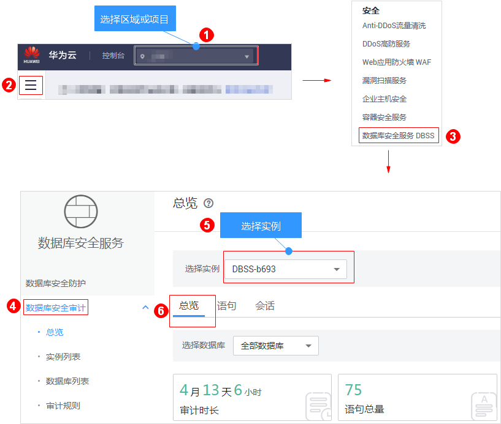
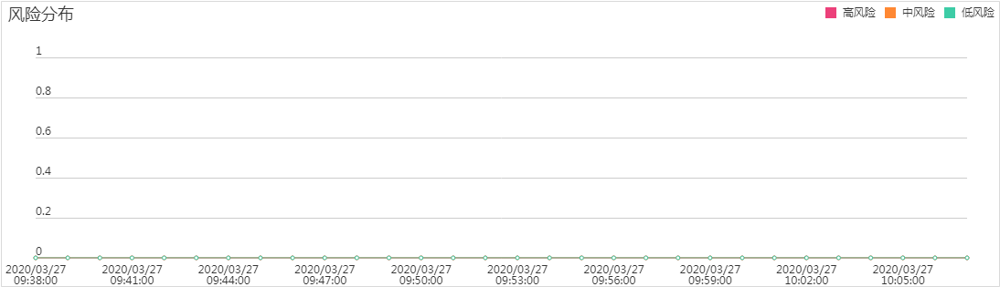
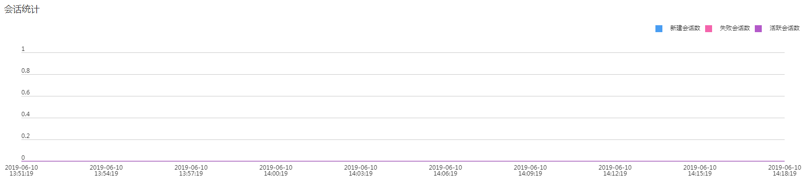
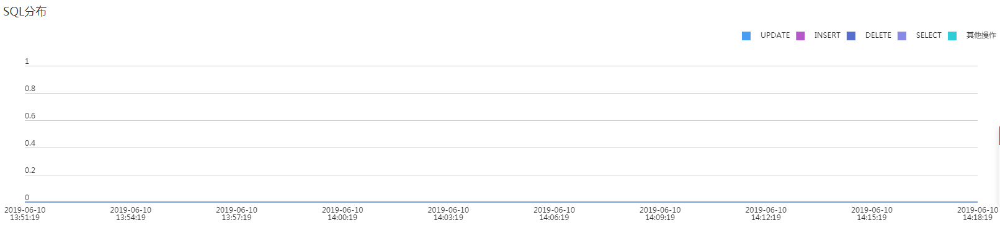

# 查看审计总览信息

添加的数据库连接到数据库安全审计实例后，您可以查看数据库的审计总览信息，包括数据库的总体审计情况、风险分布、会话统计以及SQL分布情况。

## 前提条件

-   已成功购买数据库安全审计实例，且实例的状态为“运行中“。
-   已成功添加数据库并开启审计功能。
-   已成功添加并安装Agent。

## 操作步骤

1.  [登录管理控制台](https://console.huaweicloud.com/?locale=zh-cn)。
2.  进入总览页面入口，如[图1](#fig1517671993110)所示。

    **图 1**  进入总览页面入口  
    

3.  查看数据库的总体审计情况，以及数据库的风险分布、会话统计和SQL分布信息，如[图2](#fig077713432352)、[图3](#fig11444449413)、[图4](#fig188672335467)和[图5](#fig842781211482)所示。

    -   在“选择数据库“下拉列表框中，选择“全部数据库“或指定的数据库，可以查看实例中所有的数据库或指定的某个数据库的总览信息。
    -   选择审计的时间（“近30分钟“、“近1小时“、“近24小时“、“近7天“或“近30天“）；或者单击，选择开始时间和结束时间，查看指定的时间段的总览信息。

    **图 2**  查看审计概况  
    

    **图 3**  风险分布  
    

    **图 4**  会话统计  
    

    **图 5**  SQL分布  
    

## 相关操作

-   数据库开启SSL时，将不能使用数据库安全审计功能。如果您需要使用数据库安全审计功能，请关闭数据库的SSL。关闭数据库SSL的详细操作，请参见[如何关闭数据库SSL？](https://support.huaweicloud.com/dbss_faq/dbss_01_0283.html)。
-   如果审计功能无法正常使用，请参照[无法使用数据库安全审计](https://support.huaweicloud.com/dbss_faq/dbss_01_0235.html)章节进行处理。
-   您可以配置数据库的审计规则，详细操作请参见[配置审计规则](添加审计范围.md)。

