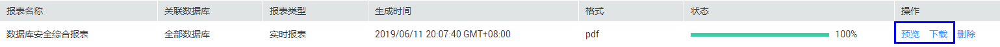

# 查看审计报表

数据库安全审计默认提供一条“全审计规则“的审计范围，可以对成功连接数据库安全审计的所有数据库进行审计。添加的数据库连接到数据库安全审计实例后，您可以立即生成审计报表，并在线预览或下载审计报表。

## 前提条件

-   已成功购买数据库安全审计实例，且实例的状态为“运行中“。
-   已成功添加数据库并开启审计功能。
-   已成功添加并安装Agent。

## 立即生成审计报表

1.  [登录管理控制台](https://console.huaweicloud.com/?locale=zh-cn)。
2.  进入报表管理入口，如[图1](#fig61991836131419)所示。

    **图 1**  进入报表管理入口  
    

3.  在需要生成报表的模板所在行的“操作“列，单击“立即生成报表“，如[图2](#fig1155923804811)所示。

    **图 2**  报表模板列表  
    

4.  在弹出的对话框中，单击，设置报表的开始时间和结束时间，选择生成报表的数据库，如[图3](#fig69946404516)所示。

    **图 3** “立即生成报表“对话框  
    

5.  单击“确定“。

    系统跳转到“报表结果“页面，您可以查看报表的生成进度。报表生成后，您可以预览或下载报表。

## 预览或下载审计报表

预览或下载审计报表前，请确认报表的“状态“为“100%“。

> **须知：** 
>如果您需要在线预览报表，请使用Google Chrome或Mozilla FireFox浏览器。

1.  [登录管理控制台](https://console.huaweicloud.com/?locale=zh-cn)。
2.  进入报表结果入口，如[图4](#fig177955528129)所示。

    **图 4**  进入报表结果入口  
    

3.  在需要预览或下载的报表所在行的“操作“列，单击“预览“或“下载“，如[图5](#fig161171357132716)所示，在线预览报表结果，或下载并查看报表。

    **图 5**  预览或下载报表  
    

## 设置报表的执行任务

1.  [登录管理控制台](https://console.huaweicloud.com/?locale=zh-cn)。
2.  进入报表管理入口，如[图6](#dbss_01_0248_fig61991836131419)所示。

    **图 6**  进入报表管理入口  
    

3.  在需要立即生成报表的模板所在行的“操作“列，单击“设置任务“，如[图7](#fig1251973419538)所示。

    **图 7**  设置任务  
    

4.  在弹出的对话框中，设置计划任务参数，如[图8](#fig12523143415310)所示，相关参数说明如[表1](#table29461252153613)所示。

    **图 8** “计划任务“对话框  
    

    **表 1**  计划任务参数说明

    
    <table><thead align="left"><tr id="row7948205203612"><th class="cellrowborder" valign="top" width="21%" id="mcps1.2.4.1.1">
参数名称

    </th>
    <th class="cellrowborder" valign="top" width="61%" id="mcps1.2.4.1.2">
说明

    </th>
    <th class="cellrowborder" valign="top" width="18%" id="mcps1.2.4.1.3">
取值样例

    </th>
    </tr>
    </thead>
    <tbody><tr id="row1495265210362"><td class="cellrowborder" valign="top" width="21%" headers="mcps1.2.4.1.1 ">
启动任务

    </td>
    <td class="cellrowborder" valign="top" width="61%" headers="mcps1.2.4.1.2 ">
开启或关闭计划任务。

    <ul id="ul934875119443"><li>：开启</li><li>：关闭</li></ul>
    </td>
    <td class="cellrowborder" valign="top" width="18%" headers="mcps1.2.4.1.3 ">

    

    </td>
    </tr>
    <tr id="row1819566164418"><td class="cellrowborder" valign="top" width="21%" headers="mcps1.2.4.1.1 ">
消息通知

    </td>
    <td class="cellrowborder" valign="top" width="61%" headers="mcps1.2.4.1.2 ">
开启或关闭消息通知。

    
消息通知触发的消息由消息通知服务发送，消息通知服务为收费服务，价格详情请参见<a href="https://www.huaweicloud.com/pricing.html?tab=detail#/smn" target="_blank" rel="noopener noreferrer">SMN价格详情</a>。

    <ul id="ul12203758105318"><li>：开启</li><li>：关闭</li></ul>
    </td>
    <td class="cellrowborder" valign="top" width="18%" headers="mcps1.2.4.1.3 ">

    </td>
    </tr>
    <tr id="row382510306447"><td class="cellrowborder" valign="top" width="21%" headers="mcps1.2.4.1.1 ">
消息通知主题

    </td>
    <td class="cellrowborder" valign="top" width="61%" headers="mcps1.2.4.1.2 "><ul id="ul945025484416"><li>通过下拉框选择已有的主题，或者单击“查看消息通知主题”创建新的主题，具体操作请参见<a href="https://support.huaweicloud.com/usermanual-smn/zh-cn_topic_0043961401.html" target="_blank" rel="noopener noreferrer">创建主题</a>。</li><li>每个消息通知主题可添加多个订阅，并可选择多种订阅终端（例如短信、邮件等），详细订阅说明请参见<a href="https://support.huaweicloud.com/usermanual-smn/smn_ug_0008.html" target="_blank" rel="noopener noreferrer">添加订阅</a>。
 说明： 

在选择主题前，请确保您主题中订阅状态为“已确认”，即当前订阅终端可用，否则可能不能收到告警通知。

    

    </li></ul>
    
更多关于主题和订阅的信息，请参见《消息通知服务用户指南》。

    </td>
    <td class="cellrowborder" valign="top" width="18%" headers="mcps1.2.4.1.3 ">
-

    </td>
    </tr>
    <tr id="row995917529362"><td class="cellrowborder" valign="top" width="21%" headers="mcps1.2.4.1.1 ">
报表类型

    </td>
    <td class="cellrowborder" valign="top" width="61%" headers="mcps1.2.4.1.2 ">
选择生成的报表类型，可以选择：

    <ul id="ul11951164818432"><li>日报</li><li>周报</li><li>月报</li></ul>
    </td>
    <td class="cellrowborder" valign="top" width="18%" headers="mcps1.2.4.1.3 ">
周报

    </td>
    </tr>
    <tr id="row124355156593"><td class="cellrowborder" valign="top" width="21%" headers="mcps1.2.4.1.1 ">
执行方式

    </td>
    <td class="cellrowborder" valign="top" width="61%" headers="mcps1.2.4.1.2 ">
选择报表执行的方式，可以选择：

    <ul id="ul147411493595"><li>执行一次</li><li>周期执行</li></ul>
    </td>
    <td class="cellrowborder" valign="top" width="18%" headers="mcps1.2.4.1.3 ">
周期执行

    </td>
    </tr>
    <tr id="row3960852133616"><td class="cellrowborder" valign="top" width="21%" headers="mcps1.2.4.1.1 ">
执行时间

    </td>
    <td class="cellrowborder" valign="top" width="61%" headers="mcps1.2.4.1.2 ">
选择报表执行的时间点。

    </td>
    <td class="cellrowborder" valign="top" width="18%" headers="mcps1.2.4.1.3 ">
10点

    </td>
    </tr>
    <tr id="row19470200440"><td class="cellrowborder" valign="top" width="21%" headers="mcps1.2.4.1.1 ">
格式

    </td>
    <td class="cellrowborder" valign="top" width="61%" headers="mcps1.2.4.1.2 ">
当前支持PDF格式。

    </td>
    <td class="cellrowborder" valign="top" width="18%" headers="mcps1.2.4.1.3 ">
PDF

    </td>
    </tr>
    <tr id="row1743917410440"><td class="cellrowborder" valign="top" width="21%" headers="mcps1.2.4.1.1 ">
数据库

    </td>
    <td class="cellrowborder" valign="top" width="61%" headers="mcps1.2.4.1.2 ">
选择执行报表任务的数据库。

    </td>
    <td class="cellrowborder" valign="top" width="18%" headers="mcps1.2.4.1.3 ">
-

    </td>
    </tr>
    </tbody>
    </table>

5.  单击“确定“。

## 相关操作

[为什么不能在线预览数据库安全审计报表？](https://support.huaweicloud.com/dbss_faq/dbss_01_0289.html)

