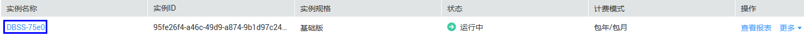
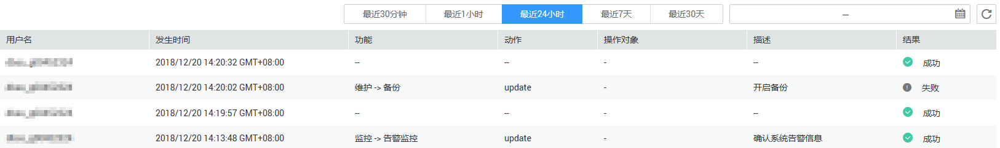

# 查看操作日志

本章节介绍如何查看数据库安全审计的操作日志信息。

## 前提条件

-   已获取管理控制台的登录账号与密码。
-   已成功购买数据库安全审计实例，且实例的状态为“运行中“。

## 操作步骤

1.  登录管理控制台。
2.  单击管理控制台左上角的，选择区域或项目。
3.  单击页面上方的“服务列表“，选择“安全  \>  数据库安全服务 DBSS“。
4.  在左侧导航树中，选择“数据库安全服务  \>  数据库安全审计“，进入数据库安全审计实例列表界面。
5.  在数据库安全审计实例列表中，单击需要查看操作日志的实例名称，如[图1](#fig99553501795)所示。

    **图 1**  数据库安全审计实例列表  
    

6.  在“实例详情“界面，单击“操作日志“。
7.  查看操作日志，如[图2](#fig6278124313101)所示，相关参数说明如[表1](#table4295843716304)所示。

    **图 2**  查看操作日志  
    

    > **说明：**   
    >选择时间周期，单击，选择开始时间和结束时间，列表显示指定时间段的操作日志。  

    **表 1**  操作日志参数说明

    
    <table><thead align="left"><tr id="row4338993216304"><th class="cellrowborder" valign="top" width="25.669999999999998%" id="mcps1.2.3.1.1">
参数名称

    </th>
    <th class="cellrowborder" valign="top" width="74.33%" id="mcps1.2.3.1.2">
说明

    </th>
    </tr>
    </thead>
    <tbody><tr id="row8736194992614"><td class="cellrowborder" valign="top" width="25.669999999999998%" headers="mcps1.2.3.1.1 ">
用户名

    </td>
    <td class="cellrowborder" valign="top" width="74.33%" headers="mcps1.2.3.1.2 ">
执行操作的用户。

    </td>
    </tr>
    <tr id="row3896937416304"><td class="cellrowborder" valign="top" width="25.669999999999998%" headers="mcps1.2.3.1.1 ">
发生时间

    </td>
    <td class="cellrowborder" valign="top" width="74.33%" headers="mcps1.2.3.1.2 ">
执行操作的时间。

    </td>
    </tr>
    <tr id="row38169719100"><td class="cellrowborder" valign="top" width="25.669999999999998%" headers="mcps1.2.3.1.1 ">
功能

    </td>
    <td class="cellrowborder" valign="top" width="74.33%" headers="mcps1.2.3.1.2 ">
执行的功能操作。

    </td>
    </tr>
    <tr id="row121453182104"><td class="cellrowborder" valign="top" width="25.669999999999998%" headers="mcps1.2.3.1.1 ">
动作

    </td>
    <td class="cellrowborder" valign="top" width="74.33%" headers="mcps1.2.3.1.2 ">
执行功能操作的动作。

    </td>
    </tr>
    <tr id="row1675442617106"><td class="cellrowborder" valign="top" width="25.669999999999998%" headers="mcps1.2.3.1.1 ">
操作对象

    </td>
    <td class="cellrowborder" valign="top" width="74.33%" headers="mcps1.2.3.1.2 ">
执行操作的对象。

    </td>
    </tr>
    <tr id="row1332204111319"><td class="cellrowborder" valign="top" width="25.669999999999998%" headers="mcps1.2.3.1.1 ">
描述

    </td>
    <td class="cellrowborder" valign="top" width="74.33%" headers="mcps1.2.3.1.2 ">
执行操作的描述信息。

    </td>
    </tr>
    <tr id="row0860165713317"><td class="cellrowborder" valign="top" width="25.669999999999998%" headers="mcps1.2.3.1.1 ">
结果

    </td>
    <td class="cellrowborder" valign="top" width="74.33%" headers="mcps1.2.3.1.2 ">
执行操作的结果。

    </td>
    </tr>
    </tbody>
    </table>

