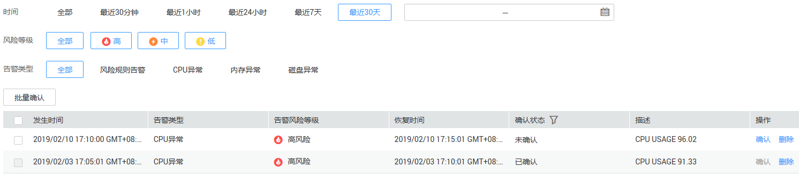

# 查看监控信息

本章节介绍如何查看数据库安全审计的系统监控和告警监控信息。

## 前提条件

-   已获取管理控制台的登录账号与密码。
-   已成功购买数据库安全审计实例，且实例的状态为“运行中“。
-   已开启数据库审计，并在数据库端或应用端成功安装Agent。
-   已成功设置审计规则。

## 查看系统监控

1.  登录管理控制台。
2.  单击管理控制台左上角的，选择区域或项目。
3.  单击管理控制台上方的“服务列表“，选择“安全  \>  数据库安全服务 DBSS“，进入数据库安全防护实例列表界面。
4.  在左侧导航树中，选择“数据库安全服务  \>  数据库安全审计“，进入数据库安全审计实例列表界面。
5.  在数据库安全审计实例列表中，单击需要查看系统监控的实例名称，如[图1](#fig99553501795)所示。

    **图 1**  数据库安全审计实例列表  
    

6.  在“实例详情“界面，选择“监控  \>  系统监控“，进入系统监控页面。
7.  查看系统监控信息，如[图2](#fig75451433958)所示。

    **图 2**  查看系统监控信息  
    

## 查看告警监控

1.  登录管理控制台。
2.  单击管理控制台左上角的，选择区域或项目。
3.  单击管理控制台上方的“服务列表“，选择“安全  \>  数据库安全服务 DBSS“，进入数据库安全防护实例列表界面。
4.  在左侧导航树中，选择“数据库安全服务  \>  数据库安全审计“，进入数据库安全审计实例列表界面。
5.  在数据库安全审计实例列表中，单击需要查看告警监控的实例名称，如[图3](#fig424412114619)所示。

    **图 3**  数据库安全审计实例列表  
    

6.  在“实例详情“界面，选择“监控  \>  告警监控“，进入告警监控页面。
7.  查看告警监控信息，如[图4](#fig1924910115619)所示。

    **图 4**  查看告警监控信息  
    

    您可以按照以下方法，查询指定的告警信息。

    -   选择“时间“，或单击，选择开始时间和结束时间，单击“提交“，列表显示该时间段的告警信息。
    -   选择“风险级别“，列表显示该级别的告警信息。
    -   选择告警类型，列表显示该类型的告警信息。

