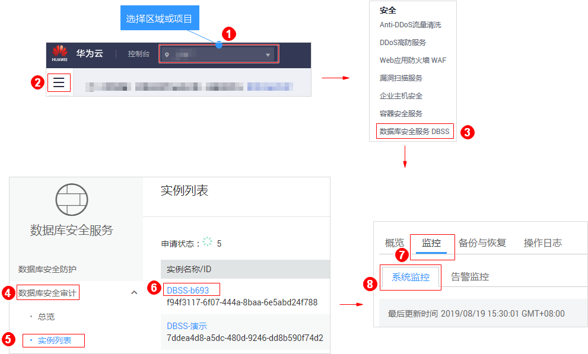
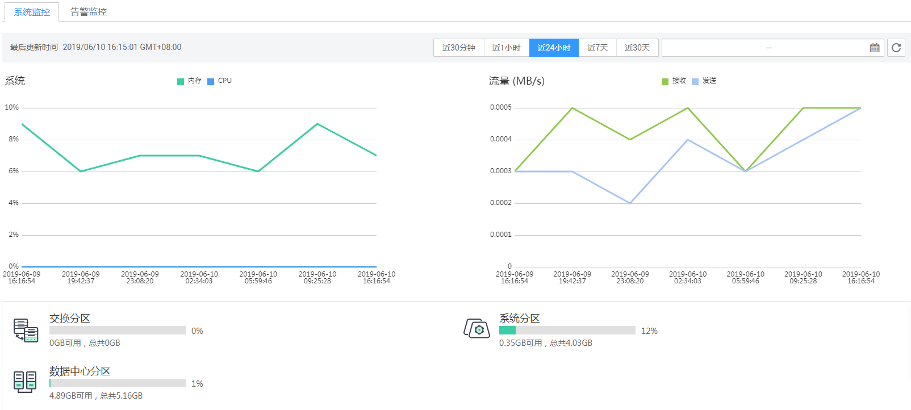

# 查看系统监控信息

通过查看数据库安全审计的系统监控信息，您可以了解系统资源和流量使用情况等信息。

## 前提条件

-   已成功购买数据库安全审计实例，且实例的状态为“运行中“。
-   已成功添加数据库并开启审计功能。
-   已成功添加并安装Agent。

## 操作步骤

1.  [登录管理控制台](https://console.huaweicloud.com/?locale=zh-cn)。
2.  进入系统监控入口，如[图1](#fig61991836131419)所示。

    **图 1**  进入系统监控入口  
    

3.  查看系统监控信息，如[图2](#fig75451433958)所示。

    选择审计的时间（“近30分钟“、“近1小时“、“近24小时“、“近7天“或“近30天“）；或者单击，选择开始时间和结束时间，查看指定的时间段的系统监控信息。

    **图 2**  查看系统监控信息  
    

