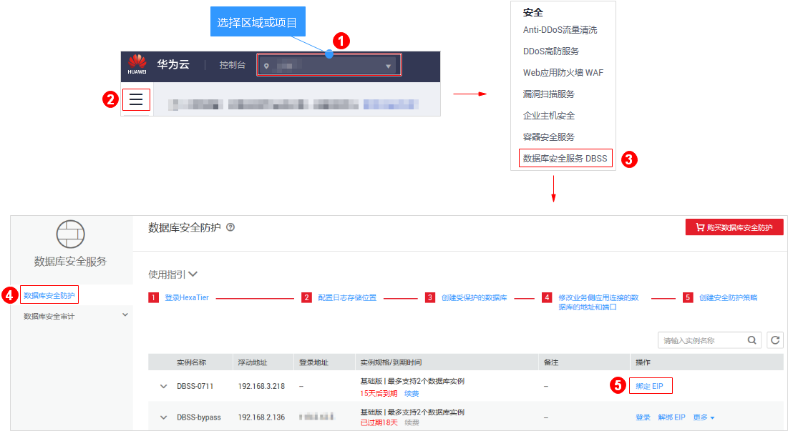
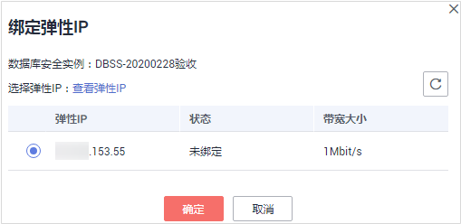
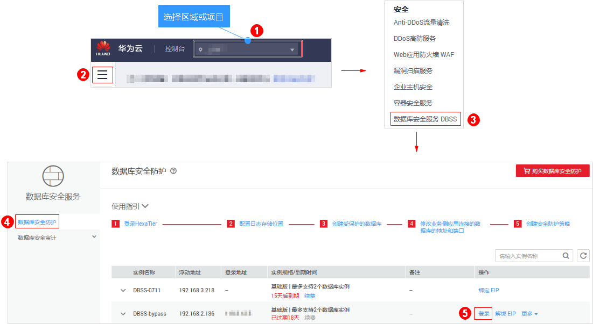
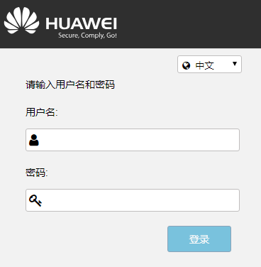
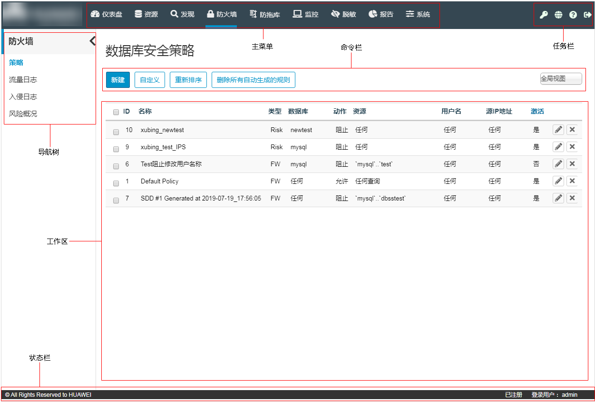

# 步骤一：登录数据库安全防护管理系统

用户需要登录数据库安全防护管理系统（以下简称HexaTier）对开启的实例进行配置，本章节介绍登录HexaTier的操作。

## 操作场景

用户需要登录HexaTier对开启的实例进行配置管理，实现对数据库的安全防护。登录HexaTier的方式说明如下：

-   实例绑定了弹性IP
    -   在数据库安全服务界面通过互联网登录到HexaTier。详细操作，请参见[在数据库安全防护界面通过互联网登录](#section59621770151056)。
    -   使用实例同一虚拟私有云中的弹性云服务器登录HexaTier。详细操作，请参见[使用同一虚拟私有云中的弹性云服务器登录](#section4560884124237)。

-   实例未绑定弹性IP

    只能使用实例同一虚拟私有云中的弹性云服务器登录HexaTier。详细操作，请参见[使用同一虚拟私有云中的弹性云服务器登录](#section4560884124237)。

## 前提条件

如果需要在数据库安全防护服务界面通过互联网登录，实例必须绑定了弹性IP，且实例的“状态“为“运行中“。

已获取登录HexaTier的密码。

> **说明：**   
>首次登录HexaTier，用户需要设置密码，请按照页面提示完成重置密码操作。  

HexaTier的浏览器满足[表1](#table31027251162210)要求。 

**表 1**  支持的浏览器版本

<table><thead align="left"><tr id="row19104616335"><th class="cellrowborder" valign="top" width="50%" id="mcps1.2.3.1.1">
浏览器

</th>
<th class="cellrowborder" valign="top" width="50%" id="mcps1.2.3.1.2">
版本

</th>
</tr>
</thead>
<tbody><tr id="row310565337"><td class="cellrowborder" valign="top" width="50%" headers="mcps1.2.3.1.1 ">
Google Chrome

</td>
<td class="cellrowborder" valign="top" width="50%" headers="mcps1.2.3.1.2 ">
-

</td>
</tr>
<tr id="row1910156193316"><td class="cellrowborder" valign="top" width="50%" headers="mcps1.2.3.1.1 ">
Mozilla FireFox

</td>
<td class="cellrowborder" valign="top" width="50%" headers="mcps1.2.3.1.2 ">
30.1及以上

</td>
</tr>
<tr id="row181018663319"><td class="cellrowborder" valign="top" width="50%" headers="mcps1.2.3.1.1 ">
Internet Explorer

</td>
<td class="cellrowborder" valign="top" width="50%" headers="mcps1.2.3.1.2 ">
11.0及以上

</td>
</tr>
</tbody>
</table>

## 绑定弹性IP

1.  [登录管理控制台](https://console.huaweicloud.com/?locale=zh-cn)。
2.  进入绑定弹性IP入口，如[图1](#zh-cn_topic_0111166372_fig4989100164918)所示。

    **图 1**  进入绑定弹性IP入口  
    

3.  在弹出的“绑定弹性IP“对话框中，选择待绑定的弹性IP，单击“确定“，如[图2](#fig1918195412442)所示。

    **图 2**  选择弹性IP  
    

## 在数据库安全防护界面通过互联网登录

1.  [登录管理控制台](https://console.huaweicloud.com/?locale=zh-cn)。
2.  进入登录HexaTier入口，如[图3](#fig27813497544)所示。

    **图 3**  进入登录HexaTier入口  
    

    > **说明：**   
    >-   首次登录HexaTier，需要重置密码，请您根据提示信息完成重置密码操作。  
    >-   密码重置后可能需要1-3分钟时间同步，请在3分钟后尝试用新密码登录。  

3.  输入HexaTier的登录用户名**admin**和密码，单击“登录“或按“Enter“，如[图4](#fig254142319571)所示，进入HexaTier。

    **图 4**  HexaTier登录界面  
    

## 使用同一虚拟私有云中的弹性云服务器登录

1.  在待管理的实例的同一个虚拟私有云下，查看虚拟私有云中是否存在弹性云服务器。
    -   是：执行[2](#l7ab55acbe3894374a66e9e390f362f36)。
    -   否：在该虚拟机私有云下创建弹性云服务器后，执行[2](#l7ab55acbe3894374a66e9e390f362f36)。

2.  使用满足如[表2](#t505be23c06ee4bbabed5ab52f8a9539a)要求的浏览器，输入以下地址后，按“Enter“，进入HexaTier的登录界面。

    https://_弹性云服务器的私有IP_:5000

    > **须知：**   
    >如果不能访问“5000“端口，则需要在安全组中添加TCP（Transmission Control Protocol）的“5000“端口访问权限。详细操作，请参见《虚拟私有云用户指南》。  

    **表 2**  支持的浏览器版本

    
    <table><thead align="left"><tr id="dbss_01_0022_row19104616335"><th class="cellrowborder" valign="top" width="50%" id="mcps1.2.3.1.1">
浏览器

    </th>
    <th class="cellrowborder" valign="top" width="50%" id="mcps1.2.3.1.2">
版本

    </th>
    </tr>
    </thead>
    <tbody><tr id="dbss_01_0022_row310565337"><td class="cellrowborder" valign="top" width="50%" headers="mcps1.2.3.1.1 ">
Google Chrome

    </td>
    <td class="cellrowborder" valign="top" width="50%" headers="mcps1.2.3.1.2 ">
-

    </td>
    </tr>
    <tr id="dbss_01_0022_row1910156193316"><td class="cellrowborder" valign="top" width="50%" headers="mcps1.2.3.1.1 ">
Mozilla FireFox

    </td>
    <td class="cellrowborder" valign="top" width="50%" headers="mcps1.2.3.1.2 ">
30.1及以上

    </td>
    </tr>
    <tr id="dbss_01_0022_row181018663319"><td class="cellrowborder" valign="top" width="50%" headers="mcps1.2.3.1.1 ">
Internet Explorer

    </td>
    <td class="cellrowborder" valign="top" width="50%" headers="mcps1.2.3.1.2 ">
11.0及以上

    </td>
    </tr>
    </tbody>
    </table>

3.  输入HexaTier的登录用户名**admin**和密码，单击“登录“或按“Enter“，如[图5](#dbss_01_0022_fig254142319571)所示，进入HexaTier。

    **图 5**  HexaTier登录界面  
    

## HexaTier主界面介绍

HexaTier控制台的主界面，如[图6](#fig2064028135210)所示。

**图 6**  HexaTier主界面图  

**表 3**  主界面功能介绍

<table><thead align="left"><tr id="r2110bfb4b63842d18981932b4c82162b"><th class="cellrowborder" valign="top" width="20.3%" id="mcps1.2.3.1.1">
功能区域

</th>
<th class="cellrowborder" valign="top" width="79.7%" id="mcps1.2.3.1.2">
说明

</th>
</tr>
</thead>
<tbody><tr id="r588de67779cf4e6aa47998ccd68533a3"><td class="cellrowborder" valign="top" width="20.3%" headers="mcps1.2.3.1.1 ">
主菜单

</td>
<td class="cellrowborder" valign="top" width="79.7%" headers="mcps1.2.3.1.2 ">
通过单击主菜单的功能选项来进行相应操作：

<ul id="uc09ee6d227d94a7ba9fe6ab5a52666a0"><li><strong id="a2feb56aeaa8949e9a07bb40c0430747a">仪表盘</strong>：显示系统各个区域的概览。</li><li><strong id="a71580973f7cd42238d1328f630e41668">资源</strong>：配置和修改活动目录、受保护的数据库、对象定义和查询模式。</li><li><strong id="ac8c3032377ab4c7db82a42ba0f6089e9">发现</strong>：在数据库环境中自动定位和分类敏感数据。一旦识别到了敏感数据，就可以快速创建脱敏、监控规则和防火墙规则。</li><li><strong id="zh-cn_topic_0076429835_b413023419222">防火墙</strong>：管理数据库防火墙和风险策略（入侵检测或防御）。</li><li><strong id="b1247151952716">防拖库</strong>：管理数据库防拖库策略，并查看防拖库日志。</li><li><strong id="a79d10383895448e78edf70a0aae56e5a">监控</strong>：管理数据库活动监控策略，并查看监控日志。</li><li><strong id="a0b06c3b1af6f44469fce6d35e1d92371">脱敏</strong>：管理数据脱敏策略，并查看数据脱敏事件。</li><li><strong id="af2ccf05b20294c6e8df5635ab4e56010">报告</strong>：定义、生成、查看和导出报告，包括数据库活动的统计信息。</li><li><strong id="a9ff720b5c09a4065ae0546bfe189d9a0">系统</strong>：进行系统配置和维护选项设置。只有拥有管理员权限的用户可以访问“系统”菜单。</li></ul>
</td>
</tr>
<tr id="ra51b0c3838ba41b48d34183e5851032f"><td class="cellrowborder" valign="top" width="20.3%" headers="mcps1.2.3.1.1 ">
命令栏

</td>
<td class="cellrowborder" valign="top" width="79.7%" headers="mcps1.2.3.1.2 ">
用户可以为所选功能创建新的项目或对象，通过筛选来创建自定义视图，并可以在策略视图中重排规则。

</td>
</tr>
<tr id="r4735adb9759e463c8747c2ca66b6b316"><td class="cellrowborder" valign="top" width="20.3%" headers="mcps1.2.3.1.1 ">
任务栏

</td>
<td class="cellrowborder" valign="top" width="79.7%" headers="mcps1.2.3.1.2 ">
用户可以从HexaTier的任何页面执行以下任务：

<ul id="u44e7df7106984c3294d111054f563435"><li>单击（修改密码），用户可以修改当前登录控制台用户的登录密码。</li><li>单击（默认语言），用户可以更改HexaTier控制台语言为中文或English。</li><li>单击（帮助），用户可以查看对应页面的帮助信息。</li><li>单击（退出），注销当前登录。</li></ul>
</td>
</tr>
<tr id="rf121e47a40564291b63c8ea9fb02a768"><td class="cellrowborder" valign="top" width="20.3%" headers="mcps1.2.3.1.1 ">
导航树

</td>
<td class="cellrowborder" valign="top" width="79.7%" headers="mcps1.2.3.1.2 ">
可根据用户在主菜单上选择的功能访问附加菜单。例如，如果在主菜单选择了“脱敏”选项，则导航树将显示与数据脱敏功能相关的功能。

单击可以隐藏导航树。

</td>
</tr>
<tr id="r9644440eec87402a9c87928edc29570a"><td class="cellrowborder" valign="top" width="20.3%" headers="mcps1.2.3.1.1 ">
工作区

</td>
<td class="cellrowborder" valign="top" width="79.7%" headers="mcps1.2.3.1.2 ">
该区域中显示的信息可用于执行不同的任务，或查看日志等信息。

</td>
</tr>
<tr id="r63491a261a2d456f967e412867eaefd3"><td class="cellrowborder" valign="top" width="20.3%" headers="mcps1.2.3.1.1 ">
状态栏

</td>
<td class="cellrowborder" valign="top" width="79.7%" headers="mcps1.2.3.1.2 ">
显示当前登录用户的用户名。

</td>
</tr>
</tbody>
</table>

