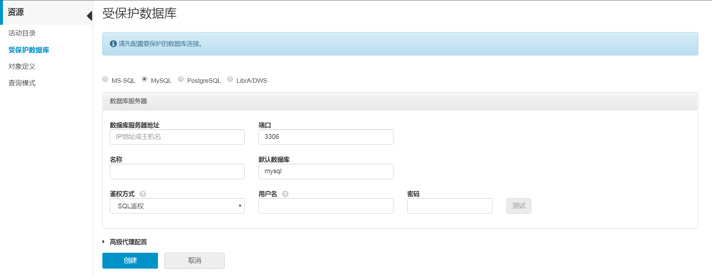
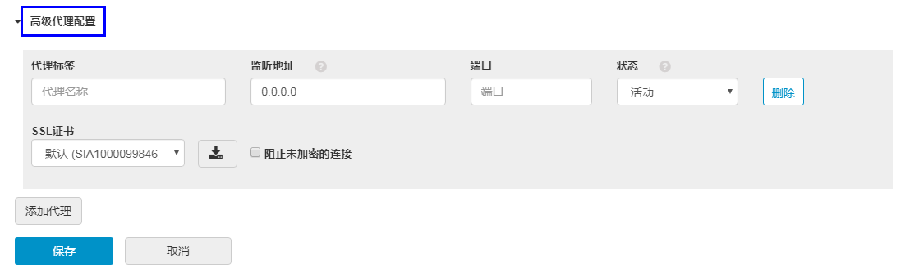

# 步骤三：添加防护的数据库

受保护的数据库指在HexaTier中配置连接并被保护的数据库实例。创建受保护数据库后，用户就可以通过HexaTier控制台进行相关配置，启用敏感数据发现、防拖库、数据库防火墙、数据库活动监控和动态数据脱敏等功能。

## 前提条件

-   确保数据库服务器上的SQL服务正在运行。
-   确保数据库服务器正常联网。

## 注意事项

创建受保护的数据库之后，用户需要更改应用连接的数据库IP地址和端口为HexaTier代理的IP地址和端口。

## 操作步骤

1.  在HexaTier主菜单上，单击“资源“。
2.  在导航树上，选择“受保护数据库“。
3.  执行下列操作之一：
    -   创建新的受保护数据库

        在命令栏上，单击“新建“，选择以下数据库类型：

        -   MS-SQL
        -   MySQL
        -   PostgreSQL
        -   LibrA/DWS

        > **说明：**   
        >-   对于使用MS-SQL的受保护数据库的Kerberos支持，用户必须首先配置活动目录。  
        >-   使用MS-SQL的受保护数据库仅在实例级别区分大小写。  
        >-   配置DDM为受保护的数据库，请参见[步骤三：添加防护的DDM](步骤三-添加防护的DDM.md)。  
        >-   LibrA是基于PostgreSQL数据库内核引擎研发的企业级MPP架构的分布式数据仓库。FusionInsight LibrA和DWS是基于LibrA内核研发的数据库产品。数据库类型“LibrA/DWS“：  
        >    -   LibrA：即FusionInsight LibrA，是私有云数据仓库产品。  
        >    -   DWS：DWS（Data Warehouse Service，数据仓库服务）是管理控制台数据仓库服务。  
        >    -   在HexaTier内部，统一使用LibrA作为数据库类型选项，即LibrA既代表FusionInsight LibrA，也代表DWS。  

    -   编辑已有受保护数据库

        找到要编辑的受保护数据库，然后单击该行末尾的（编辑）。

4.  根据需要设置参数：

    **图 1**  受保护数据库配置图  
    

    **表 1**  数据库参数

    
    <table><thead align="left"><tr id="zh-cn_topic_0180960136_row1832105515493"><th class="cellrowborder" valign="top" width="23.68%" id="mcps1.2.3.1.1">
参数名称

    </th>
    <th class="cellrowborder" valign="top" width="76.32%" id="mcps1.2.3.1.2">
说明

    </th>
    </tr>
    </thead>
    <tbody><tr id="zh-cn_topic_0180960136_row8843155564919"><td class="cellrowborder" valign="top" width="23.68%" headers="mcps1.2.3.1.1 ">
数据库服务器地址

    </td>
    <td class="cellrowborder" valign="top" width="76.32%" headers="mcps1.2.3.1.2 ">
数据库实例的主机名或IP地址。

    </td>
    </tr>
    <tr id="zh-cn_topic_0180960136_row198487551499"><td class="cellrowborder" valign="top" width="23.68%" headers="mcps1.2.3.1.1 ">
端口/实例名称

    </td>
    <td class="cellrowborder" valign="top" width="76.32%" headers="mcps1.2.3.1.2 ">
“数据库类型”选择“MS-SQL”时显示该参数。

    
用户数据库的连接端口或实例名称，用于连接到数据库，例如，用户创建的RDS SQL Server的端口为“8433”。

    </td>
    </tr>
    <tr id="zh-cn_topic_0180960136_row17858125519498"><td class="cellrowborder" valign="top" width="23.68%" headers="mcps1.2.3.1.1 ">
端口

    </td>
    <td class="cellrowborder" valign="top" width="76.32%" headers="mcps1.2.3.1.2 ">
“数据库类型”选择“MySQL”、“PostgreSQL”或“LibrA/DWS”时显示该参数。

    
端口为数据库的连接端口，例如，MySQL默认为“3306”端口，或者用户创建RDS MySQL数据库时，系统分配的端口（“8635”），用户可以根据情况自己配置。

    </td>
    </tr>
    <tr id="zh-cn_topic_0180960136_row686925511491"><td class="cellrowborder" valign="top" width="23.68%" headers="mcps1.2.3.1.1 ">
名称

    </td>
    <td class="cellrowborder" valign="top" width="76.32%" headers="mcps1.2.3.1.2 ">
连接的数据库实例的别名，HexaTier会自动生成名称，用户可以自定义该名称。

    </td>
    </tr>
    <tr id="zh-cn_topic_0180960136_row11875155174920"><td class="cellrowborder" valign="top" width="23.68%" headers="mcps1.2.3.1.1 ">
默认数据库

    </td>
    <td class="cellrowborder" valign="top" width="76.32%" headers="mcps1.2.3.1.2 ">
HexaTier将自动连接到数据库实例中的默认数据库，用户也可以更改默认数据库。

    <ul id="zh-cn_topic_0180960136_ul11881185544915"><li>MS-SQL默认数据库为“master”。</li><li>MySQL默认数据库为“mysql”。</li><li>PostgreSQL默认数据库为“postgres”。</li><li>LibrA/DWS默认数据库为“postgres”。</li></ul>
    </td>
    </tr>
    <tr id="zh-cn_topic_0180960136_row4898755134911"><td class="cellrowborder" valign="top" width="23.68%" headers="mcps1.2.3.1.1 ">
鉴权方式

    </td>
    <td class="cellrowborder" valign="top" width="76.32%" headers="mcps1.2.3.1.2 ">
通过登录帐户连接数据库，选择：

    <ul id="zh-cn_topic_0180960136_ul179041755104911"><li>SQL鉴权：通过SQL帐户连接。</li><li>Windows鉴权：通过Windows鉴权连接。</li></ul>
    
 说明： 

需要配置域集成之后，才会显示“Windows鉴权”选项，否则默认为“SQL鉴权”。配置域集成，请参见<a href="配置活动目录.md#section56485498126">配置域集成模式</a>。

    

    </td>
    </tr>
    <tr id="zh-cn_topic_0180960136_row1691311555498"><td class="cellrowborder" valign="top" width="23.68%" headers="mcps1.2.3.1.1 ">
用户名

    </td>
    <td class="cellrowborder" valign="top" width="76.32%" headers="mcps1.2.3.1.2 ">
用于登录到数据库的用户名。

    </td>
    </tr>
    <tr id="zh-cn_topic_0180960136_row17918455174920"><td class="cellrowborder" valign="top" width="23.68%" headers="mcps1.2.3.1.1 ">
密码

    </td>
    <td class="cellrowborder" valign="top" width="76.32%" headers="mcps1.2.3.1.2 ">
用于登录到数据库的密码。

    </td>
    </tr>
    </tbody>
    </table>

5.  （可选）设置代理，并配置其SSL安全。

    > **说明：**   
    >-   创建受保护数据库时，HexaTier会自动创建默认代理，用户也可以对其进行修改。  
    >-   代理可以被设置为旁路模式（不检查进出数据库的流量）：  
    >    -   手动设置旁路模式：更改代理的状态为“旁路“模式，参见[表2](#zh-cn_topic_0180960136_t2d9df6921eea4419b16136a77c1d9272)。  
    >    -   系统自动切换旁路模式：当HexaTier服务因为故障而不可用时，会自动切换为旁路模式。当故障修复后，需重启HexaTier服务，代理状态才会更改为“激活“。  

    1.  单击“高级代理配置“。

        **图 2**  高级代理配置图  
        

    2.  根据需要设置下表中的参数：

    **表 2**  高级代理配置参数

    
    <table><thead align="left"><tr id="zh-cn_topic_0180960136_rce3db8a3bf7a4d74be9cd0e632e73cb0"><th class="cellrowborder" valign="top" width="24.81%" id="mcps1.2.3.1.1">
参数名称

    </th>
    <th class="cellrowborder" valign="top" width="75.19%" id="mcps1.2.3.1.2">
说明

    </th>
    </tr>
    </thead>
    <tbody><tr id="zh-cn_topic_0180960136_r9dd6750f36de485cbe6db7e321a7e158"><td class="cellrowborder" valign="top" width="24.81%" headers="mcps1.2.3.1.1 ">
代理标签

    </td>
    <td class="cellrowborder" valign="top" width="75.19%" headers="mcps1.2.3.1.2 ">
代理的逻辑名称。用户可以自定义该名称。

    </td>
    </tr>
    <tr id="zh-cn_topic_0180960136_r2153b344093d49d1999f15583dc8740c"><td class="cellrowborder" valign="top" width="24.81%" headers="mcps1.2.3.1.1 ">
监听地址

    </td>
    <td class="cellrowborder" valign="top" width="75.19%" headers="mcps1.2.3.1.2 ">
指定用户想要代理监听的IP地址。

    
用户可以使用0.0.0.0来监听所有IP。

    </td>
    </tr>
    <tr id="zh-cn_topic_0180960136_r1148b97b47074aaa9907541a274aefdd"><td class="cellrowborder" valign="top" width="24.81%" headers="mcps1.2.3.1.1 ">
端口

    </td>
    <td class="cellrowborder" valign="top" width="75.19%" headers="mcps1.2.3.1.2 ">
端口为HexaTier的连接端口，建议与数据库端口相同，若相同端口已占用，用户可以配置除0~1023、5000和其他已占用端口之外的任一可用端口。

    </td>
    </tr>
    <tr id="zh-cn_topic_0180960136_rc725a11c584743f9bbac22059d1861b6"><td class="cellrowborder" valign="top" width="24.81%" headers="mcps1.2.3.1.1 ">
状态

    </td>
    <td class="cellrowborder" valign="top" width="75.19%" headers="mcps1.2.3.1.2 ">
选择下列选项之一：

    <ul id="zh-cn_topic_0180960136_u65e337196e454ad291b38e61735fa1bf"><li>激活：激活代理。</li><li>禁用：禁用代理。</li><li>旁路：流量将不经过检查直接转发给数据库（不安全）。</li></ul>
    </td>
    </tr>
    <tr id="zh-cn_topic_0180960136_r15b74c379a7f457c9df7277a889ba63a"><td class="cellrowborder" valign="top" width="24.81%" headers="mcps1.2.3.1.1 ">
鉴权代理

    </td>
    <td class="cellrowborder" valign="top" width="75.19%" headers="mcps1.2.3.1.2 ">
“鉴权代理”仅在配置了域集成时显示并可用。

    
此功能使HexaTier能够使用活动目录鉴别客户端的凭证，并使用不同的凭证连接到数据库，包括下列选项：

    <ul id="zh-cn_topic_0180960136_ub17f1158e28847aebd6066a6af7667fe"><li>同上：使用上述配置的Windows鉴权相同的用户名和密码。</li><li>SQL鉴权：允许用户指定自己的用户名和密码。</li></ul>
    
 说明： 
<ul id="zh-cn_topic_0180960136_u0d16cd061ad94f32bc21097273997eaa"><li>配置域集成，请参见<a href="配置活动目录.md#section56485498126">配置域集成模式</a>。</li><li>鉴权代理功能可用于所有支持的数据库。</li><li>提供的用户名和密码将决定派生代理权限。</li></ul>
    

    </td>
    </tr>
    <tr id="zh-cn_topic_0180960136_r302b76f087734dceb1a828d3e3471327"><td class="cellrowborder" valign="top" width="24.81%" headers="mcps1.2.3.1.1 ">
SSL证书

    </td>
    <td class="cellrowborder" valign="top" width="75.19%" headers="mcps1.2.3.1.2 ">
在列表中，选择证书。

    
 说明： 
<ul id="zh-cn_topic_0180960136_zh-cn_topic_0076429774_ul20472754403"><li>用户可以导入其他证书，更多信息，请参见<a href="配置SSL安全.md#section108081657248">上传入方向证书</a>。</li><li>如果客户端中尚未提供所需的SSL证书，请单击，向客户端导入证书。</li></ul>
    

    </td>
    </tr>
    <tr id="zh-cn_topic_0180960136_r659c115d9d1c4a46826b43997ae33af9"><td class="cellrowborder" valign="top" width="24.81%" headers="mcps1.2.3.1.1 ">
阻止未加密的连接

    </td>
    <td class="cellrowborder" valign="top" width="75.19%" headers="mcps1.2.3.1.2 ">
建议用户选中该复选框，要求所有通信都加密，并阻止未加密的连接。

    
若不选择，则该代理的所有通信均不加密，通信存在安全隐患。

    </td>
    </tr>
    </tbody>
    </table>

    > **说明：**   
    >-   如果要添加多个代理，请单击“添加代理“。  
    >-   用户可以修改入方向的最低SSL安全设置。有关更多信息，请参见[设置入方向SSL安全](配置SSL安全.md#section131019291349)。  

6.  （可选）单击“测试“，测试连接。

    > **说明：**   
    >使用测试连接是可选的，因为保存时会自动测试用户的连接和安全设置。  

7.  单击“创建“或“更新“。

    保存功能会测试SSL设置，如果设置有效，则会验证用户凭证，并显示下表的测试结果。   

    **表 3**  测试结果

    
    <table><thead align="left"><tr id="zh-cn_topic_0180960136_r947cb73634d24ed9b923abdcddf74dc9"><th class="cellrowborder" valign="top" width="20%" id="mcps1.2.6.1.1">
测试结果

    </th>
    <th class="cellrowborder" valign="top" width="20%" id="mcps1.2.6.1.2">
说明

    </th>
    <th class="cellrowborder" valign="top" width="20%" id="mcps1.2.6.1.3">
应对选项1

    </th>
    <th class="cellrowborder" valign="top" width="20%" id="mcps1.2.6.1.4">
应对选项2

    </th>
    <th class="cellrowborder" valign="top" width="20%" id="mcps1.2.6.1.5">
应对选项3

    </th>
    </tr>
    </thead>
    <tbody><tr id="zh-cn_topic_0180960136_r009dccec01944c8eb900f0d218f38728"><td class="cellrowborder" valign="top" width="20%" headers="mcps1.2.6.1.1 ">
成功

    </td>
    <td class="cellrowborder" valign="top" width="20%" headers="mcps1.2.6.1.2 ">
成功连接到受保护的数据库。

    </td>
    <td class="cellrowborder" valign="top" width="20%" headers="mcps1.2.6.1.3 ">
-

    </td>
    <td class="cellrowborder" valign="top" width="20%" headers="mcps1.2.6.1.4 ">
-

    </td>
    <td class="cellrowborder" valign="top" width="20%" headers="mcps1.2.6.1.5 ">
-

    </td>
    </tr>
    <tr id="zh-cn_topic_0180960136_r463a0a61d0bf4e2db47c4b257c1f20da"><td class="cellrowborder" valign="top" width="20%" headers="mcps1.2.6.1.1 ">
受保护数据库服务器不支持SSL

    </td>
    <td class="cellrowborder" valign="top" width="20%" headers="mcps1.2.6.1.2 ">
根据提供的参数无法建立SSL连接。

    </td>
    <td class="cellrowborder" valign="top" width="20%" headers="mcps1.2.6.1.3 ">
单击“仍然继续”使用未加密的通信。

    </td>
    <td class="cellrowborder" valign="top" width="20%" headers="mcps1.2.6.1.4 ">
单击“取消”，对数据库SSL设置进行故障处理，然后重试。

    </td>
    <td class="cellrowborder" valign="top" width="20%" headers="mcps1.2.6.1.5 ">
-

    </td>
    </tr>
    <tr id="zh-cn_topic_0180960136_rf5f655d9a1a14ecda73d03e588de597d"><td class="cellrowborder" valign="top" width="20%" headers="mcps1.2.6.1.1 ">
证书验证失败

    </td>
    <td class="cellrowborder" valign="top" width="20%" headers="mcps1.2.6.1.2 ">
无法验证服务器身份，其安全证书不受HexaTier信任。

    </td>
    <td class="cellrowborder" valign="top" width="20%" headers="mcps1.2.6.1.3 ">
上传新CA证书，然后重试。上传出方向证书的更多信息，请参见<a href="配置SSL安全.md">配置SSL安全</a>。

    </td>
    <td class="cellrowborder" valign="top" width="20%" headers="mcps1.2.6.1.4 ">
单击“仍然继续”将实例添加到例外表，通信将被加密。

    </td>
    <td class="cellrowborder" valign="top" width="20%" headers="mcps1.2.6.1.5 ">
-

    </td>
    </tr>
    <tr id="zh-cn_topic_0180960136_rb761ff0894a24ec3a65d261a47e2f922"><td class="cellrowborder" valign="top" width="20%" headers="mcps1.2.6.1.1 ">
服务器不符合最低加密级别要求

    </td>
    <td class="cellrowborder" valign="top" width="20%" headers="mcps1.2.6.1.2 ">
服务器不符合管理员设置的最低加密级别要求。

    </td>
    <td class="cellrowborder" valign="top" width="20%" headers="mcps1.2.6.1.3 ">
单击“取消”，升级数据库上的SSL版本，然后重试。

    </td>
    <td class="cellrowborder" valign="top" width="20%" headers="mcps1.2.6.1.4 ">
单击“仍然继续”将实例服务器添加到例外表。通信将被加密，但安全设置较低。

    </td>
    <td class="cellrowborder" valign="top" width="20%" headers="mcps1.2.6.1.5 ">
单击“取消”，降低出方向的SSL安全设置，然后重试。有关出方向安全设置的更多信息，请参见<a href="配置SSL安全.md">配置SSL安全</a>。

    
 说明： 

修改出方向SSL安全设置可能会影响修改后创建的受保护数据库。

    

    </td>
    </tr>
    </tbody>
    </table>

> **说明：**   
>-   单击受保护数据库列表行末尾的（数据库清单），可以显示关联的数据库。  
>-   单击受保护数据库列表行末尾的（被策略规则锁定），显示关联该受保护数据库的策略。  
>-   单击受保护数据库列表行末尾的（删除），可以删除该受保护的数据库。若删除按钮不可用，则需要删除所有关联的策略之后，才能删除受保护的数据库。  

