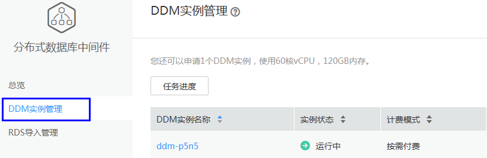
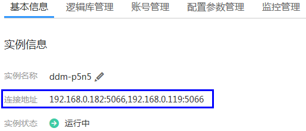
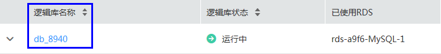

# 步骤三：（可选）添加防护的DDM

DDM即分布式数据库中间件（Distributed Database Middleware，简称DDM），专注于解决数据库分布式扩展问题，突破了传统数据库的容量和性能瓶颈，实现海量数据高并发访问。HexaTier支持以DDM作为受保护的数据库，并提供相应防护功能。

## 背景信息

DDM使用云数据库MySQL作为存储引擎，具备自动部署、分库分表、弹性伸缩、高可用等全生命周期运维管控能力。

## 操作步骤

1.  获取DDM实例信息。
    1.  登录管理控制台。
    2.  在服务列表，选择“数据库 \> 分布式数据库中间件DDM“。
    3.  在导航栏，单击“DDM实例管理“。

        **图 1**  DDM实例管理  
        

    4.  单击DDM实例名称，进入实例基本信息界面，获取实例连接地址。如下图所示：

        **图 2**  DDM实例基本信息  
        

        > **说明：**   
        >一个DDM实例可以有多个连接地址，用户需要针对DDM实例的多个连接地址分别配置受保护的数据库。  

    5.  单击“逻辑库管理“页签，获取逻辑库名称。

        **图 3**  DDM实例逻辑库列表  
        

    6.  单击“帐号管理“页签，创建拥有所有逻辑库可读权限的DDM帐号，并记录帐号。

        创建DDM帐号，请参见《分布式数据库中间件用户指南》。

2.  配置受保护的数据库。

    1.  登录HexaTier控制台。
    2.  在HexaTier主菜单上，单击“资源“。
    3.  在命令栏，单击“新建“。
    4.  “数据库类型“选择“MySQL“，并配置以下参数信息。

        **表 1**  数据库参数

        
        <table><thead align="left"><tr id="zh-cn_topic_0180960123_row108902534462"><th class="cellrowborder" valign="top" width="23.68%" id="mcps1.2.3.1.1">
参数名称

        </th>
        <th class="cellrowborder" valign="top" width="76.32%" id="mcps1.2.3.1.2">
说明

        </th>
        </tr>
        </thead>
        <tbody><tr id="zh-cn_topic_0180960123_row689014536469"><td class="cellrowborder" valign="top" width="23.68%" headers="mcps1.2.3.1.1 ">
数据库服务器地址

        </td>
        <td class="cellrowborder" valign="top" width="76.32%" headers="mcps1.2.3.1.2 ">
<a href="#zh-cn_topic_0180960123_li15771276415">步骤1.d</a>中记录的DDM连接地址中的IP地址。

        </td>
        </tr>
        <tr id="zh-cn_topic_0180960123_row12890653184613"><td class="cellrowborder" valign="top" width="23.68%" headers="mcps1.2.3.1.1 ">
端口

        </td>
        <td class="cellrowborder" valign="top" width="76.32%" headers="mcps1.2.3.1.2 ">
<a href="#zh-cn_topic_0180960123_li15771276415">步骤1.d</a>中记录的DDM连接地址中的端口号。

        </td>
        </tr>
        <tr id="zh-cn_topic_0180960123_row8890053124611"><td class="cellrowborder" valign="top" width="23.68%" headers="mcps1.2.3.1.1 ">
名称

        </td>
        <td class="cellrowborder" valign="top" width="76.32%" headers="mcps1.2.3.1.2 ">
连接的数据库实例的别名，HexaTier会自动生成名称，用户也可以自定义该名称。

        </td>
        </tr>
        <tr id="zh-cn_topic_0180960123_row38901253174614"><td class="cellrowborder" valign="top" width="23.68%" headers="mcps1.2.3.1.1 ">
默认数据库

        </td>
        <td class="cellrowborder" valign="top" width="76.32%" headers="mcps1.2.3.1.2 ">
<a href="#zh-cn_topic_0180960123_li02933341344">步骤1.e</a>中记录的逻辑库名称。

        </td>
        </tr>
        <tr id="zh-cn_topic_0180960123_row48901753104616"><td class="cellrowborder" valign="top" width="23.68%" headers="mcps1.2.3.1.1 ">
鉴权方式

        </td>
        <td class="cellrowborder" valign="top" width="76.32%" headers="mcps1.2.3.1.2 ">
默认为SQL鉴权。

        </td>
        </tr>
        <tr id="zh-cn_topic_0180960123_row9890205314612"><td class="cellrowborder" valign="top" width="23.68%" headers="mcps1.2.3.1.1 ">
用户名

        </td>
        <td class="cellrowborder" valign="top" width="76.32%" headers="mcps1.2.3.1.2 ">
<a href="#zh-cn_topic_0180960123_li41698615142">步骤1.f</a>中创建的DDM可读帐号。

        </td>
        </tr>
        <tr id="zh-cn_topic_0180960123_row6890115312465"><td class="cellrowborder" valign="top" width="23.68%" headers="mcps1.2.3.1.1 ">
密码

        </td>
        <td class="cellrowborder" valign="top" width="76.32%" headers="mcps1.2.3.1.2 ">
<a href="#zh-cn_topic_0180960123_li41698615142">步骤1.f</a>中创建的DDM可读帐号密码。

        </td>
        </tr>
        </tbody>
        </table>

        > **说明：**   
        >一个DDM实例可以有多个连接地址，用户需要针对DDM实例的多个连接地址分别配置受保护的数据库。  

    5.  配置高级代理配置。

        **表 2**  高级代理配置参数

        
        <table><thead align="left"><tr id="zh-cn_topic_0180960123_row19907155320466"><th class="cellrowborder" valign="top" width="24.81%" id="mcps1.2.3.1.1">
参数名称

        </th>
        <th class="cellrowborder" valign="top" width="75.19%" id="mcps1.2.3.1.2">
说明

        </th>
        </tr>
        </thead>
        <tbody><tr id="zh-cn_topic_0180960123_row119071553104612"><td class="cellrowborder" valign="top" width="24.81%" headers="mcps1.2.3.1.1 ">
代理标签

        </td>
        <td class="cellrowborder" valign="top" width="75.19%" headers="mcps1.2.3.1.2 ">
代理的逻辑名称。用户可以自定义该名称。

        </td>
        </tr>
        <tr id="zh-cn_topic_0180960123_row189071053104613"><td class="cellrowborder" valign="top" width="24.81%" headers="mcps1.2.3.1.1 ">
监听地址

        </td>
        <td class="cellrowborder" valign="top" width="75.19%" headers="mcps1.2.3.1.2 ">
指定用户想要代理监听的IP地址。

        
用户可以使用0.0.0.0来监听所有IP。

        </td>
        </tr>
        <tr id="zh-cn_topic_0180960123_row13907753134614"><td class="cellrowborder" valign="top" width="24.81%" headers="mcps1.2.3.1.1 ">
端口

        </td>
        <td class="cellrowborder" valign="top" width="75.19%" headers="mcps1.2.3.1.2 ">
端口为HexaTier的连接端口，建议与数据库端口相同，若相同端口已占用，用户可以配置除0~1023、5000和其他已占用端口之外的任一可用端口。

        
 说明： 

建议用户为DDM实例的多个连接地址配置相同的代理端口。

        

        </td>
        </tr>
        <tr id="zh-cn_topic_0180960123_row15907115304617"><td class="cellrowborder" valign="top" width="24.81%" headers="mcps1.2.3.1.1 ">
状态

        </td>
        <td class="cellrowborder" valign="top" width="75.19%" headers="mcps1.2.3.1.2 ">
选择下列选项之一：

        <ul id="zh-cn_topic_0180960123_ul179071653164618"><li>激活：激活代理。</li><li>禁用：禁用代理。</li><li>旁路：流量将不经过检查直接转发给数据库（不安全）。</li></ul>
        </td>
        </tr>
        <tr id="zh-cn_topic_0180960123_row159071753134612"><td class="cellrowborder" valign="top" width="24.81%" headers="mcps1.2.3.1.1 ">
SSL证书

        </td>
        <td class="cellrowborder" valign="top" width="75.19%" headers="mcps1.2.3.1.2 ">
DDM不支持SSL连接。

        </td>
        </tr>
        <tr id="zh-cn_topic_0180960123_row390745315462"><td class="cellrowborder" valign="top" width="24.81%" headers="mcps1.2.3.1.1 ">
阻止未加密的连接

        </td>
        <td class="cellrowborder" valign="top" width="75.19%" headers="mcps1.2.3.1.2 ">
未选择该选项，则表示该代理的所有通信均不加密，通信存在安全隐患。

        </td>
        </tr>
        </tbody>
        </table>

    6.  单击“创建“。

    > **说明：**   
    >配置受保护数据库的更多信息，请参见[步骤三：添加防护的数据库](zh-cn_topic_0111166540.md)。  

3.  配置数据库防护策略：

    -   配置数据库安全策略，请参见[配置数据库安全策略](zh-cn_topic_0111166347.md)。
    -   配置敏感数据发现策略，请参见[配置敏感数据发现策略](zh-cn_topic_0214274580.md)。
    -   配置数据库防拖库策略，请参见[配置数据库防拖库策略](zh-cn_topic_0142535567.md)。
    -   配置数据库活动监控策略，请参见[配置数据库活动监控策略](zh-cn_topic_0111166467.md)。
    -   配置动态数据脱敏策略，请参见[配置动态数据脱敏策略](zh-cn_topic_0111166389.md)。

    > **说明：**   
    >当前不支持创建基于DDM存储过程的数据库防火墙策略和活动监控策略。  

