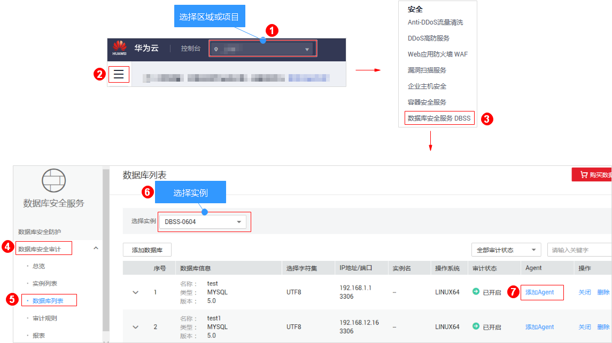
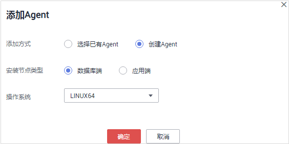
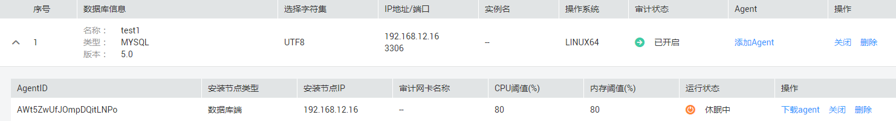
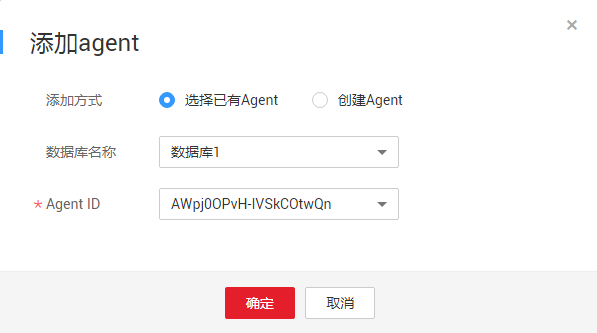
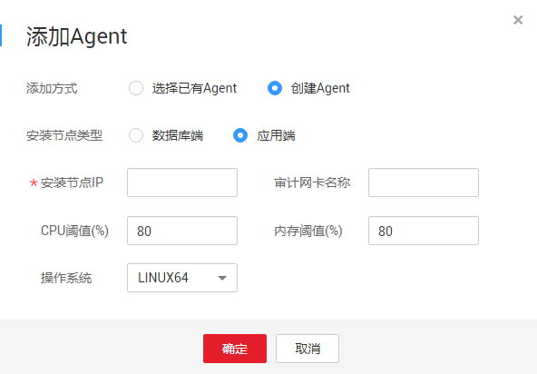
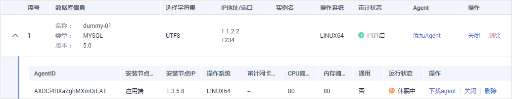

# 步骤二：添加Agent

添加的数据库开启审计功能后，您还需要为添加的数据库选择添加Agent的方式。数据库安全审计支持对华为云上的ECS/BMS自建数据库和RDS关系型数据库进行审计，请根据您在华为云上实际部署的数据库选择Agent添加方式。

完成添加Agent后，您还需要根据Agent的添加方式在数据库端或应用端安装Agent，将添加的数据库连接到数据库安全审计实例，才能使用数据库安全审计功能。

## 前提条件

-   已成功购买数据库安全审计实例，且实例的状态为“运行中“。
-   已成功添加数据库并开启审计功能。

## 常见场景

请您根据数据库类型以及数据库部署场景，为待审计的数据库添加Agent。数据库常见的部署场景说明如下：

-   ECS/BMS自建数据库的常见部署场景如[图1](#zh-cn_topic_0174227115_fig0617131314411)和[图2](#zh-cn_topic_0174227115_fig1131385013914)所示。

    **图 1**  一个应用端连接多个ECS/BMS自建数据库  
    

    **图 2**  多个应用端连接同一个ECS/BMS自建数据库  
    

-   RDS关系型数据库的常见部署场景如[图3](#zh-cn_topic_0174227115_fig76418538416)和[图4](#zh-cn_topic_0174227115_fig766123541110)所示。

    **图 3**  一个应用端连接多个RDS  
    

    **图 4**  多个应用端连接同一个RDS  
    

添加Agent方式的详细说明如[表1](#table218115952118)所示。

> **注意：**   
>当您的应用和数据库（ECS/BMS自建数据库）都部署在同一个节点上时，Agent需在数据库端添加。  

**表 1**  添加Agent方式说明

<table><thead align="left"><tr id="row1528919594215"><th class="cellrowborder" valign="top" width="16.328367163283673%" id="mcps1.2.5.1.1">
使用场景

</th>
<th class="cellrowborder" valign="top" width="15.308469153084694%" id="mcps1.2.5.1.2">
Agent安装节点

</th>
<th class="cellrowborder" valign="top" width="29.587041295870414%" id="mcps1.2.5.1.3">
审计功能说明

</th>
<th class="cellrowborder" valign="top" width="38.77612238776123%" id="mcps1.2.5.1.4">
注意事项

</th>
</tr>
</thead>
<tbody><tr id="row1329085922110"><td class="cellrowborder" valign="top" width="16.328367163283673%" headers="mcps1.2.5.1.1 ">
ECS/BMS自建数据库

</td>
<td class="cellrowborder" valign="top" width="15.308469153084694%" headers="mcps1.2.5.1.2 ">
数据库端

</td>
<td class="cellrowborder" valign="top" width="29.587041295870414%" headers="mcps1.2.5.1.3 ">
可以审计所有访问该数据库的应用端的所有访问记录。

</td>
<td class="cellrowborder" valign="top" width="38.77612238776123%" headers="mcps1.2.5.1.4 "><ul id="ul1629035972114"><li>在数据库端添加Agent。</li><li>当某个应用端连接多个ECS/BMS自建数据库时，所有连接该应用端的数据库都需要添加Agent。</li></ul>
</td>
</tr>
<tr id="row429015919219"><td class="cellrowborder" valign="top" width="16.328367163283673%" headers="mcps1.2.5.1.1 ">
RDS关系型数据库

</td>
<td class="cellrowborder" valign="top" width="15.308469153084694%" headers="mcps1.2.5.1.2 ">
应用端

（应用端部署在云上）

</td>
<td class="cellrowborder" valign="top" width="29.587041295870414%" headers="mcps1.2.5.1.3 ">
可以审计该应用端与其连接的所有数据库的访问记录。

</td>
<td class="cellrowborder" valign="top" width="38.77612238776123%" headers="mcps1.2.5.1.4 "><ul id="ul1429005916219"><li>在应用端添加Agent。</li><li>当某个应用端连接了多个RDS时，所有连接该应用端的RDS都需要添加Agent。某个数据库选择“安装节点类型”后，其他数据库选择“选择已有Agent”添加方式。</li><li>当多个应用端连接同一个RDS时，所有连接该RDS的应用端都需要添加Agent。</li></ul>
</td>
</tr>
<tr id="row01451041229"><td class="cellrowborder" valign="top" width="16.328367163283673%" headers="mcps1.2.5.1.1 ">
RDS关系型数据库

</td>
<td class="cellrowborder" valign="top" width="15.308469153084694%" headers="mcps1.2.5.1.2 ">
代理端（应用端部署在云下）

</td>
<td class="cellrowborder" valign="top" width="29.587041295870414%" headers="mcps1.2.5.1.3 ">
只能审计代理端与后端数据库之间的访问记录，无法审计应用端与后端数据库的访问记录。

</td>
<td class="cellrowborder" valign="top" width="38.77612238776123%" headers="mcps1.2.5.1.4 "><ul id="ul2118820252"><li>在应用端添加Agent。</li><li>“安装节点IP”需要配置为代理端的IP地址。</li></ul>
</td>
</tr>
</tbody>
</table>

## 添加Agent（ECS/BMS自建数据库）

1.  [登录管理控制台](https://console.huaweicloud.com/)。
2.  进入添加Agent入口，如[图5](#fig4155162273613)所示。

    **图 5**  进入添加Agent入口  
    

3.  在弹出的“添加Agent“对话框中，选择添加方式，如[图6](#fig12967192134812)所示，相关参数说明如[表2](#table1996772134818)所示。

    **图 6**  在数据库端添加Agent  
    

    **表 2**  添加Agent参数说明（ECS/BMS自建数据库）

    
    <table><thead align="left"><tr id="row17968122104812"><th class="cellrowborder" valign="top" width="21%" id="mcps1.2.4.1.1">
参数名称

    </th>
    <th class="cellrowborder" valign="top" width="61%" id="mcps1.2.4.1.2">
说明

    </th>
    <th class="cellrowborder" valign="top" width="18%" id="mcps1.2.4.1.3">
取值样例

    </th>
    </tr>
    </thead>
    <tbody><tr id="row14968162144818"><td class="cellrowborder" valign="top" width="21%" headers="mcps1.2.4.1.1 ">
添加方式

    </td>
    <td class="cellrowborder" valign="top" width="61%" headers="mcps1.2.4.1.2 ">
您可以选择Agent的添加方式。<ul id="ul169686224815"><li>选择已有Agent
当某个应用端连接了多个数据库时，如果该应用端的一个数据库已经在应用端添加了Agent。其他数据库在添加Agent时，只需要选择“选择已有Agent”添加方式。

    </li><li>创建Agent
如果待添加Agent的数据库需要创建Agent，请创建新的Agent。

    </li></ul>
    

    </td>
    <td class="cellrowborder" valign="top" width="18%" headers="mcps1.2.4.1.3 ">
创建Agent

    </td>
    </tr>
    <tr id="row396917274816"><td class="cellrowborder" valign="top" width="21%" headers="mcps1.2.4.1.1 ">
数据库名称

    </td>
    <td class="cellrowborder" valign="top" width="61%" headers="mcps1.2.4.1.2 ">
可选参数。当“添加方式”选择“选择已有Agent”时，可以选择实例下已添加Agent的数据库。

    </td>
    <td class="cellrowborder" valign="top" width="18%" headers="mcps1.2.4.1.3 ">
test1

    </td>
    </tr>
    <tr id="row1096972114813"><td class="cellrowborder" valign="top" width="21%" headers="mcps1.2.4.1.1 ">
Agent ID

    </td>
    <td class="cellrowborder" valign="top" width="61%" headers="mcps1.2.4.1.2 ">
当“添加方式”选择“选择已有Agent”时，需配置该参数。

    
您可以选择实例下已添加的Agent ID，Agent ID由系统自动生成。

    </td>
    <td class="cellrowborder" valign="top" width="18%" headers="mcps1.2.4.1.3 ">
-

    </td>
    </tr>
    <tr id="row109705234815"><td class="cellrowborder" valign="top" width="21%" headers="mcps1.2.4.1.1 ">
安装节点类型

    </td>
    <td class="cellrowborder" valign="top" width="61%" headers="mcps1.2.4.1.2 ">
当“添加方式”选择“创建Agent”时，需配置该参数。

    
审计ECS/BMS自建数据库，选择“数据库端”。

    </td>
    <td class="cellrowborder" valign="top" width="18%" headers="mcps1.2.4.1.3 ">
数据库端

    </td>
    </tr>
    <tr id="row16974182564811"><td class="cellrowborder" valign="top" width="21%" headers="mcps1.2.4.1.1 ">
操作系统

    </td>
    <td class="cellrowborder" valign="top" width="61%" headers="mcps1.2.4.1.2 ">
指待审计的数据库的操作系统。

    
可以选择“LINUX64”或“WINDOWS64”。

    </td>
    <td class="cellrowborder" valign="top" width="18%" headers="mcps1.2.4.1.3 ">
LINUX64

    </td>
    </tr>
    </tbody>
    </table>

4.  单击“确定“，Agent添加成功。
5.  单击数据库左侧的展开该数据库的详细信息，查看添加的Agent信息，如[图7](#fig18975172124811)所示。

    **图 7**  Agent添加完成  
    

    > **说明：**   
    >Agent添加完成后，请您确认添加的Agent信息正确。如果Agent添加不正确，请您在Agent所在行单击“删除“，删除Agent后，再重新添加Agent。  

## 添加Agent（RDS关系型数据库）

当某个应用端连接了多个RDS时， 请按以下方式添加Agent：

-   连接该应用端所有的RDS都需要添加Agent。
-   如果连接该应用端的某个数据库已在应用端添加了Agent。其他数据库在添加Agent时，请选择“选择已有Agent“添加方式。

1.  [登录管理控制台](https://console.huaweicloud.com/)。
2.  进入添加Agent入口，如[图8](#zh-cn_topic_0144723368_fig4155162273613)所示。

    **图 8**  进入添加Agent入口  
    

3.  在弹出的“添加Agent“对话框中，选择添加方式，如[图9](#zh-cn_topic_0144723368_fig746421985110)和[图10](#fig2692155012314)所示，相关参数说明如[表3](#table146922503232)所示。

    -   “添加方式“选择“选择已有Agent“

        在什么场景下需要选择“选择已有Agent“添加方式的详细介绍，请参见[在什么场景下需要选择“选择已有Agent”添加方式？](https://support.huaweicloud.com/dbss_faq/dbss_01_0286.html)。

        > **说明：**   
        >选择“选择已有Agent“添加方式，如果您已在应用端安装了Agent，该数据库添加Agent后，数据库安全审计即可对该数据库进行审计。  

        **图 9**  选择已有Agent  
        

    -   “添加方式“选择“创建Agent“

        如果待添加Agent的数据库需要创建Agent，请创建新的Agent。

        安装节点类型选择“应用端“。

        **图 10**  在应用端添加Agent  
        

    **表 3**  添加Agent参数说明（RDS关系型数据库）

    
    <table><thead align="left"><tr id="row369365019232"><th class="cellrowborder" valign="top" width="21%" id="mcps1.2.4.1.1">
参数名称

    </th>
    <th class="cellrowborder" valign="top" width="61%" id="mcps1.2.4.1.2">
说明

    </th>
    <th class="cellrowborder" valign="top" width="18%" id="mcps1.2.4.1.3">
取值样例

    </th>
    </tr>
    </thead>
    <tbody><tr id="row769315010235"><td class="cellrowborder" valign="top" width="21%" headers="mcps1.2.4.1.1 ">
添加方式

    </td>
    <td class="cellrowborder" valign="top" width="61%" headers="mcps1.2.4.1.2 ">
您可以选择Agent的添加方式。<ul id="zh-cn_topic_0144723368_ul169686224815"><li>选择已有Agent
当某个应用端连接了多个数据库时，如果该应用端的一个数据库已经在应用端添加了Agent。其他数据库在添加Agent时，只需要选择“选择已有Agent”添加方式。

    </li><li>创建Agent
如果待添加Agent的数据库需要创建Agent，请创建新的Agent。

    </li></ul>
    

    </td>
    <td class="cellrowborder" valign="top" width="18%" headers="mcps1.2.4.1.3 ">
创建Agent

    </td>
    </tr>
    <tr id="row16693115019236"><td class="cellrowborder" valign="top" width="21%" headers="mcps1.2.4.1.1 ">
数据库名称

    </td>
    <td class="cellrowborder" valign="top" width="61%" headers="mcps1.2.4.1.2 ">
可选参数。当“添加方式”选择“选择已有Agent”时，可以选择实例下已添加Agent的数据库。

    </td>
    <td class="cellrowborder" valign="top" width="18%" headers="mcps1.2.4.1.3 ">
test1

    </td>
    </tr>
    <tr id="row6693115010235"><td class="cellrowborder" valign="top" width="21%" headers="mcps1.2.4.1.1 ">
Agent ID

    </td>
    <td class="cellrowborder" valign="top" width="61%" headers="mcps1.2.4.1.2 ">
当“添加方式”选择“选择已有Agent”时，需配置该参数。

    
您可以选择实例下已添加的Agent ID，Agent ID由系统自动生成。

    </td>
    <td class="cellrowborder" valign="top" width="18%" headers="mcps1.2.4.1.3 ">
-

    </td>
    </tr>
    <tr id="row12694175032314"><td class="cellrowborder" valign="top" width="21%" headers="mcps1.2.4.1.1 ">
安装节点类型

    </td>
    <td class="cellrowborder" valign="top" width="61%" headers="mcps1.2.4.1.2 ">
当“添加方式”选择“创建Agent”时，需配置该参数。

    
审计RDS关系型数据库，需要选择“应用端”。

    </td>
    <td class="cellrowborder" valign="top" width="18%" headers="mcps1.2.4.1.3 ">
应用端

    </td>
    </tr>
    <tr id="row14693142715371"><td class="cellrowborder" valign="top" width="21%" headers="mcps1.2.4.1.1 ">
安装节点IP

    </td>
    <td class="cellrowborder" valign="top" width="61%" headers="mcps1.2.4.1.2 ">
“安装节点类型”选择“应用端”时，需配置该参数。

    
IP地址支持IPv4（例如，192.168.1.1）和IPv6（例如，1050:0:0:0:5:600:300c:326b）格式。

    
 须知： 

当审计RDS关系型数据库且应用端在云下时，代理端将作为应用端，此时，“安装节点IP”需要配置为代理端的IP地址。

    

    </td>
    <td class="cellrowborder" valign="top" width="18%" headers="mcps1.2.4.1.3 ">
192.168.1.1

    </td>
    </tr>
    <tr id="row06233118374"><td class="cellrowborder" valign="top" width="21%" headers="mcps1.2.4.1.1 ">
审计网卡名称

    </td>
    <td class="cellrowborder" valign="top" width="61%" headers="mcps1.2.4.1.2 ">
可选参数。“安装节点类型”选择“应用端”时，可以配置该参数。

    
指待审计的应用端节点的网卡名称。

    </td>
    <td class="cellrowborder" valign="top" width="18%" headers="mcps1.2.4.1.3 ">
-

    </td>
    </tr>
    <tr id="row246482404017"><td class="cellrowborder" valign="top" width="21%" headers="mcps1.2.4.1.1 ">
CPU阈值(%)

    </td>
    <td class="cellrowborder" valign="top" width="61%" headers="mcps1.2.4.1.2 ">
可选参数。“安装节点类型”选择“应用端”时，可以配置该参数。

    
指待审计的应用端节点的CPU阈值，缺省值为“80”。

    </td>
    <td class="cellrowborder" valign="top" width="18%" headers="mcps1.2.4.1.3 ">
80

    </td>
    </tr>
    <tr id="row14911327164010"><td class="cellrowborder" valign="top" width="21%" headers="mcps1.2.4.1.1 ">
内存阈值(%)

    </td>
    <td class="cellrowborder" valign="top" width="61%" headers="mcps1.2.4.1.2 ">
可选参数。“安装节点类型”选择“应用端”时，可以配置该参数。

    
指待审计的应用端节点的内存阈值，缺省值为“80”。

    </td>
    <td class="cellrowborder" valign="top" width="18%" headers="mcps1.2.4.1.3 ">
80

    </td>
    </tr>
    <tr id="row19648105334818"><td class="cellrowborder" valign="top" width="21%" headers="mcps1.2.4.1.1 ">
操作系统

    </td>
    <td class="cellrowborder" valign="top" width="61%" headers="mcps1.2.4.1.2 ">
可选参数。“安装节点类型”选择“应用端”时，可以配置该参数。

    
指待审计的应用端节点的操作系统，可以选择“LINUX64”或“WINDOWS64”。

    </td>
    <td class="cellrowborder" valign="top" width="18%" headers="mcps1.2.4.1.3 ">
LINUX64

    </td>
    </tr>
    </tbody>
    </table>

4.  单击“确定“，Agent添加成功。
5.  单击数据库左侧的展开该数据库的详细信息，查看添加的Agent信息，如[图11](#fig1470611221310)所示。

    **图 11**  Agent已添加完成  
    

    > **说明：**   
    >Agent添加完成后，请您确认添加的Agent信息正确。如果Agent添加不正确，请您在Agent所在行单击“删除“，删除Agent后，再重新添加Agent。  

## 后续处理

Agent添加完成后，您还需要根据Agent的添加方式在数据库端或应用端安装Agent，将添加的数据库连接到数据库安全审计实例，数据库安全审计才能对添加的数据库进行审计。有关安装Agent的详细操作，请参见[安装Agent](安装Agent（Linux操作系统）.md)。

