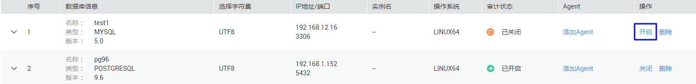

# 步骤五：开启数据库安全审计

数据库安全审计默认提供一条“全审计规则“的审计范围，可以对成功连接数据库安全审计实例的所有数据库进行安全审计。开启数据库安全审计后，您可以查看被添加的数据库的审计结果。详细操作，请参见[查看审计结果](查看审计总览信息.md)。

## 前提条件

-   已成功添加并安装Agent，且Agent的运行状态为“正在运行“。
-   数据库安全审计实例已成功添加安全组规则。

## 开启审计

1.  [登录管理控制台](https://console.huaweicloud.com/?locale=zh-cn)。
2.  在页面上方选择“区域“后，单击，选择“安全  \>  数据库安全服务“，进入数据库安全审计“总览“界面。
3.  在左侧导航栏中，选择“数据库列表“，进入“数据库列表“界面。

    **图 1**  进入“数据库列表“界面  
    

4.  在选择实例下拉框中，选择需要开启审计的数据库安全审计实例。
5.  在待开启审计所在行的“操作“列，单击“开启“，如[图2](#fig8199151313516)所示，开启审计功能。

    审计功能开启后，该数据库的“审计状态“为“已开启“。

    **图 2**  开启数据库审计功能  
    

## 验证审计效果

1.  开启审计后，在数据库上执行一条SQL语句（例如“show databases“）。
2.  [登录管理控制台](https://console.huaweicloud.com/?locale=zh-cn)。
3.  验证Agent与数据库安全审计实例的网络通信正常。
4.  进入SQL语句列表入口，如[图3](#fig1489915095118)所示。

    **图 3**  进入SQL语句列表入口  
    

5.  在“时间“所在行右侧，单击，选择开始时间和结束时间，单击“提交“，SQL语句列表将显示[1](#li0294761612)中输入的SQL语句，如[图4](#fig8994029155516)所示。

    **图 4**  查看SQL语句  
    

    -   如果SQL语句列表中未显示输入的SQL语句，说明Agent与数据库安全审计实例之间网络通信异常，请参照[如何处理Agent与数据库安全审计实例之间通信异常？](https://support.huaweicloud.com/dbss_faq/dbss_01_0246.html)处理。

