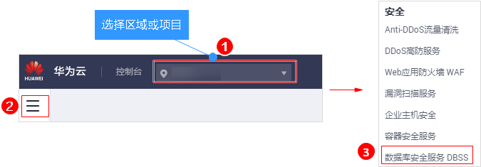
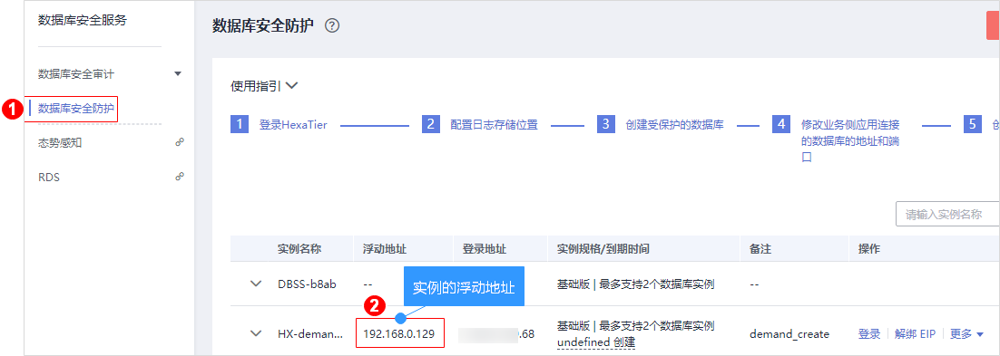
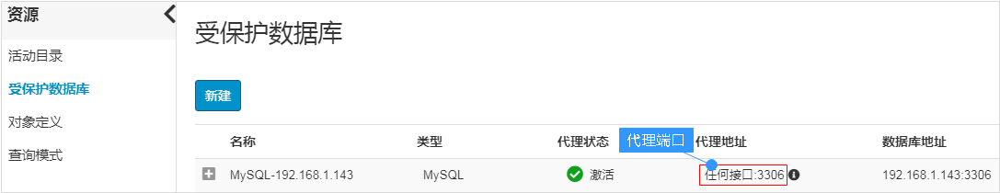

# 步骤四：修改业务侧配置文件<a name="dbss_01_0271"></a>

为了确保受保护的数据库安全防护策略生效，您需要手动将业务侧配置文件中数据库的信息（IP地址和端口），分别修改为登录HexaTier的数据库安全防护实例的浮动地址和创建受保护的数据库时设置的代理端口。

> **须知：** 
>每一个添加防护的数据库都需要您修改业务侧配置文件对应的数据库信息（IP地址和端口）。

## 操作步骤<a name="section151731291676"></a>

1.  获取数据库安全防护实例的浮动地址。
    1.  [登录管理控制台](https://console.huaweicloud.com/?locale=zh-cn)。
    2.  在页面上方选择“区域“后，单击，选择“安全  \>  数据库安全服务“。

        **图 1**  数据库安全服务<a name="fig1545113269121"></a>  
        

    3.  进入“数据库安全防护“界面，获取数据库安全防护实例的浮动地址，如[图2](#zh-cn_topic_0111166372_fig4989100164918)所示。

        **图 2**  数据库安全防护实例浮动地址<a name="zh-cn_topic_0111166372_fig4989100164918"></a>  
        

2.  获取代理端口。
    1.  登录HexaTier后，在HexaTier主菜单上，单击“资源“。
    2.  在左侧导航树中，单击“受保护数据库“，进入受保护数据库列表页面。
    3.  在创建的受保护数据库所在行，获取代理端口，如[图3](#fig11319142553914)所示。

        **图 3**  代理端口<a name="fig11319142553914"></a>  
        

3.  修改业务侧配置文件。

    以配置业务侧应用连接的MySQL数据库为例说明。

    1.  根据业务实际情况，将业务侧配置文件中数据库的信息（IP地址和端口），分别修改为[实例的浮动地址](#zh-cn_topic_0111166372_fig4989100164918)和[代理端口](#fig11319142553914)。

        以JDBC编程语言为例，配置示例如下：

        ```
        data.datasource.url=jdbc:mysql://实例的浮动地址:代理端口/test
        ```

    2.  保存配置文件。
    3.  重启应用程序，有热加载请跳过此步骤。

        配置完成后，您可以登录HexaTier，选择“仪表盘  \>  受保护的数据库拓扑图“，查看受保护的数据库是否连接成功。

        ：代表业务侧与DBSS连接不成功或未连接。连接不成功时，您可以参照[数据库安全防护无法连接防护数据库](https://support.huaweicloud.com/dbss_faq/dbss_01_0257.html)进行排查。

        ：代表受保护的数据库连接成功。


