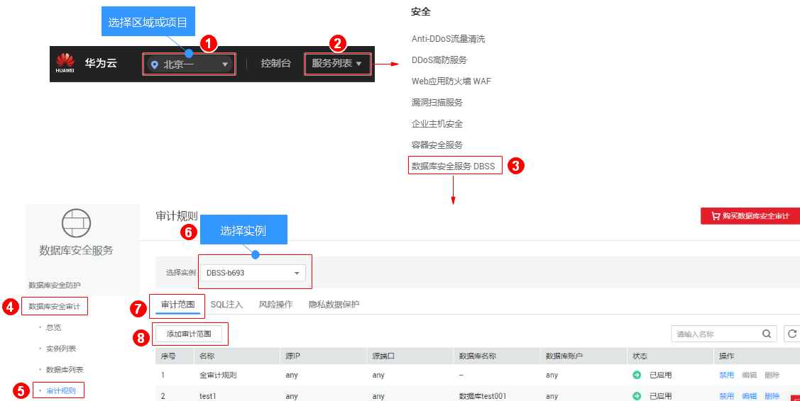
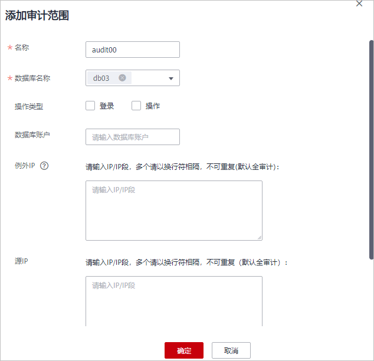

# 添加审计范围

数据库安全审计默认提供一条“全审计规则“的审计范围，可以对成功连接数据库安全审计的所有数据库进行安全审计。您也可以通过添加审计范围，设置需要审计的数据库范围。

## 前提条件

-   已成功购买数据库安全审计实例，且实例的状态为“运行中“。
-   已成功添加数据库并开启审计功能。

## 操作步骤

1.  [登录管理控制台](https://console.huaweicloud.com/)。
2.  进入添加审计范围入口，如[图1](#fig61991836131419)所示。

    **图 1**  进入添加审计范围入口  
    

3.  在弹出的对话框中，设置审计范围，如[图2](#fig97457713117)所示，相关参数说明如[表1](#table474657203117)所示。

    **图 2** “添加审计范围“对话框  
    

    **表 1**  审计范围参数说明

    
    <table><thead align="left"><tr id="row274619703110"><th class="cellrowborder" valign="top" width="21.02%" id="mcps1.2.4.1.1">
参数名称

    </th>
    <th class="cellrowborder" valign="top" width="60.980000000000004%" id="mcps1.2.4.1.2">
说明

    </th>
    <th class="cellrowborder" valign="top" width="18%" id="mcps1.2.4.1.3">
取值样例

    </th>
    </tr>
    </thead>
    <tbody><tr id="row57471572315"><td class="cellrowborder" valign="top" width="21.02%" headers="mcps1.2.4.1.1 ">
名称

    </td>
    <td class="cellrowborder" valign="top" width="60.980000000000004%" headers="mcps1.2.4.1.2 ">
您可以自定义审计范围的名称。

    </td>
    <td class="cellrowborder" valign="top" width="18%" headers="mcps1.2.4.1.3 ">
audit00

    </td>
    </tr>
    <tr id="row10747976313"><td class="cellrowborder" valign="top" width="21.02%" headers="mcps1.2.4.1.1 ">
数据库名称

    </td>
    <td class="cellrowborder" valign="top" width="60.980000000000004%" headers="mcps1.2.4.1.2 ">
选择待添加审计范围的数据库。

    </td>
    <td class="cellrowborder" valign="top" width="18%" headers="mcps1.2.4.1.3 ">
test1

    </td>
    </tr>
    <tr id="row674711712315"><td class="cellrowborder" valign="top" width="21.02%" headers="mcps1.2.4.1.1 ">
数据库账户

    </td>
    <td class="cellrowborder" valign="top" width="60.980000000000004%" headers="mcps1.2.4.1.2 ">
可选参数。输入数据库的用户名。

    </td>
    <td class="cellrowborder" valign="top" width="18%" headers="mcps1.2.4.1.3 ">
-

    </td>
    </tr>
    <tr id="row57476763110"><td class="cellrowborder" valign="top" width="21.02%" headers="mcps1.2.4.1.1 ">
源IP

    </td>
    <td class="cellrowborder" valign="top" width="60.980000000000004%" headers="mcps1.2.4.1.2 ">
可选参数。输入待审计数据库的IP地址或IP地址段。

    
IP地址支持IPv4（例如，192.168.1.1）和IPv6（例如，1050:0:0:0:5:600:300c:326b）格式。

    </td>
    <td class="cellrowborder" valign="top" width="18%" headers="mcps1.2.4.1.3 ">
-

    </td>
    </tr>
    <tr id="row57473714311"><td class="cellrowborder" valign="top" width="21.02%" headers="mcps1.2.4.1.1 ">
源端口

    </td>
    <td class="cellrowborder" valign="top" width="60.980000000000004%" headers="mcps1.2.4.1.2 ">
可选参数。输入待审计数据库的端口。

    </td>
    <td class="cellrowborder" valign="top" width="18%" headers="mcps1.2.4.1.3 ">
-

    </td>
    </tr>
    </tbody>
    </table>

4.  单击“确定“。

    添加成功，审计范围列表新增一条状态为“已启用“的审计范围。

## 相关操作

除了添加数据库安全审计的审计范围，您还可以通过启用或禁用SQL注入检测，以及添加风险操作，设置数据库安全审计的审计规则。

