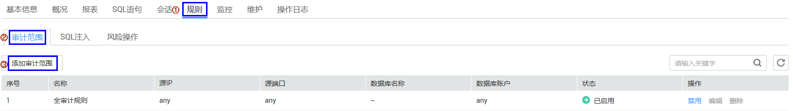

# 添加审计范围

数据库端或应用端成功安装Agent后，需要通过添加数据库的审计范围，设置数据库安全审计的对象范围。

## 前提条件

-   已获取管理控制台的登录账号与密码。
-   已成功购买数据库安全审计实例，且实例的状态为“运行中“。
-   数据库端或应用端已成功安装Agent。

## 操作步骤

1.  登录管理控制台。
2.  单击管理控制台左上角的，选择区域或项目。
3.  单击页面上方的“服务列表“，选择“安全  \>  数据库安全服务 DBSS“。
4.  在左侧导航树中，选择“数据库安全服务  \>  数据库安全审计“，进入数据库安全审计实例列表界面。
5.  在数据库安全审计实例列表中，单击需要添加审计范围的实例名称，如[图1](#fig99553501795)所示。

    **图 1**  数据库安全审计实例列表  
    

6.  进入添加审计范围页面，操作步骤如[图2](#fig263412217207)所示。

    **图 2**  进入添加审计范围页面  
    

7.  在弹出的对话框中，设置审计范围，如[图3](#fig6101165820247)所示，相关参数说明如[表1](#table4295843716304)所示。

    **图 3** “添加审计范围“对话框  
    

    **表 1**  审计范围参数说明

    
    <table><thead align="left"><tr id="row4338993216304"><th class="cellrowborder" valign="top" width="21.02%" id="mcps1.2.4.1.1">
参数名称

    </th>
    <th class="cellrowborder" valign="top" width="60.980000000000004%" id="mcps1.2.4.1.2">
说明

    </th>
    <th class="cellrowborder" valign="top" width="18%" id="mcps1.2.4.1.3">
取值样例

    </th>
    </tr>
    </thead>
    <tbody><tr id="row8736194992614"><td class="cellrowborder" valign="top" width="21.02%" headers="mcps1.2.4.1.1 ">
名称

    </td>
    <td class="cellrowborder" valign="top" width="60.980000000000004%" headers="mcps1.2.4.1.2 ">
您可以自定义审计范围的名称。

    </td>
    <td class="cellrowborder" valign="top" width="18%" headers="mcps1.2.4.1.3 ">
test00

    </td>
    </tr>
    <tr id="row3896937416304"><td class="cellrowborder" valign="top" width="21.02%" headers="mcps1.2.4.1.1 ">
数据库名称

    </td>
    <td class="cellrowborder" valign="top" width="60.980000000000004%" headers="mcps1.2.4.1.2 ">
选择添加审计范围的数据库。

    </td>
    <td class="cellrowborder" valign="top" width="18%" headers="mcps1.2.4.1.3 ">
Mysql148

    </td>
    </tr>
    <tr id="row1332204111319"><td class="cellrowborder" valign="top" width="21.02%" headers="mcps1.2.4.1.1 ">
数据库账户

    </td>
    <td class="cellrowborder" valign="top" width="60.980000000000004%" headers="mcps1.2.4.1.2 ">
可选参数。输入数据库的用户名。

    </td>
    <td class="cellrowborder" valign="top" width="18%" headers="mcps1.2.4.1.3 ">
mysql

    </td>
    </tr>
    <tr id="row0860165713317"><td class="cellrowborder" valign="top" width="21.02%" headers="mcps1.2.4.1.1 ">
源IP

    </td>
    <td class="cellrowborder" valign="top" width="60.980000000000004%" headers="mcps1.2.4.1.2 ">
输入审计的IP地址或IP地址段。

    </td>
    <td class="cellrowborder" valign="top" width="18%" headers="mcps1.2.4.1.3 ">
192.168.0.0

    </td>
    </tr>
    <tr id="row1319658616304"><td class="cellrowborder" valign="top" width="21.02%" headers="mcps1.2.4.1.1 ">
源端口

    </td>
    <td class="cellrowborder" valign="top" width="60.980000000000004%" headers="mcps1.2.4.1.2 ">
输入审计数据库的端口。

    </td>
    <td class="cellrowborder" valign="top" width="18%" headers="mcps1.2.4.1.3 ">
3306

    </td>
    </tr>
    </tbody>
    </table>

8.  单击“确定“。

    审计范围列表显示新增的审计范围。

