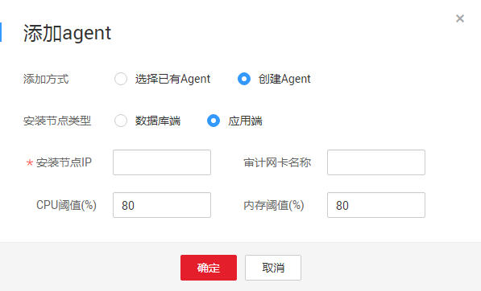

# 添加并安装Agent<a name="ZH-CN_TOPIC_0144723368"></a>

数据库添加完成后，您还需要为所添加的数据库部署Agent，数据库安全审计才能对您的数据库进行审计。

## 前提条件<a name="section070891116319"></a>

-   已获取管理控制台的登录账号与密码。
-   已成功购买数据库安全审计实例，且实例的状态为“运行中“。
-   已成功添加数据库。

## 添加并下载Agent<a name="section1568164924617"></a>

1.  登录管理控制台。
2.  单击管理控制台左上角的，选择区域或项目。
3.  单击管理控制台上方的“服务列表“，选择“安全  \>  数据库安全服务 DBSS“，进入数据库安全防护实例列表界面。
4.  在左侧导航树中，选择“数据库安全服务  \>  数据库安全审计“，进入数据库安全审计实例列表界面。
5.  在数据库安全审计实例列表中，单击需要添加并下载Agent的实例名称，如[图1](#fig99553501795)所示。

    **图 1**  数据库安全审计实例列表<a name="fig99553501795"></a>  
    

6.  在“实例详情“界面，选择“维护  \>  数据库管理“，进入数据库列表页面。
7.  在需要添加Agent的数据库所在行的“Agent“列，单击“添加Agent“，如[图2](#fig2627303556)所示，

    **图 2**  添加Agent<a name="fig2627303556"></a>  
    

8.  在弹出的“添加Agent“对话框中，选择添加方式，如[图3](#fig115454156482)、[图4](#fig1629249134810)和[图5](#fig20103162534910)所示，相关参数说明如[表1](#table4295843716304)所示。

    **图 3**  选择已有Agent<a name="fig115454156482"></a>  
    

    **图 4**  在数据库端添加<a name="fig1629249134810"></a>  
    

    **图 5**  在应用端添加<a name="fig20103162534910"></a>  
    

    **表 1**  添加Agent参数说明

    <a name="table4295843716304"></a>
    <table><thead align="left"><tr id="row4338993216304"><th class="cellrowborder" valign="top" width="21%" id="mcps1.2.4.1.1"><p id="p2492361616304"><a name="p2492361616304"></a><a name="p2492361616304"></a>参数名称</p>
    </th>
    <th class="cellrowborder" valign="top" width="61%" id="mcps1.2.4.1.2"><p id="p554697916304"><a name="p554697916304"></a><a name="p554697916304"></a>说明</p>
    </th>
    <th class="cellrowborder" valign="top" width="18%" id="mcps1.2.4.1.3"><p id="p4665219216304"><a name="p4665219216304"></a><a name="p4665219216304"></a>取值样例</p>
    </th>
    </tr>
    </thead>
    <tbody><tr id="row3896937416304"><td class="cellrowborder" valign="top" width="21%" headers="mcps1.2.4.1.1 "><p id="p240275716304"><a name="p240275716304"></a><a name="p240275716304"></a>添加方式</p>
    </td>
    <td class="cellrowborder" valign="top" width="61%" headers="mcps1.2.4.1.2 "><p id="p6040559116304"><a name="p6040559116304"></a><a name="p6040559116304"></a>您可以选择Agent的添加方式。</p>
    <a name="ul17676442173018"></a><a name="ul17676442173018"></a><ul id="ul17676442173018"><li>选择已有Agent<p id="p1467616426301"><a name="p1467616426301"></a><a name="p1467616426301"></a>如果数据库已经添加了Agent，可以选择已添加的Agent。</p>
    </li><li>创建Agent<p id="p13676154214304"><a name="p13676154214304"></a><a name="p13676154214304"></a>如果数据库未添加Agent，需要根据审计的数据库类型创建Agent。</p>
    </li></ul>
    </td>
    <td class="cellrowborder" valign="top" width="18%" headers="mcps1.2.4.1.3 "><p id="p5366207016304"><a name="p5366207016304"></a><a name="p5366207016304"></a>选择已有Agent</p>
    </td>
    </tr>
    <tr id="row1332204111319"><td class="cellrowborder" valign="top" width="21%" headers="mcps1.2.4.1.1 "><p id="p33321041237"><a name="p33321041237"></a><a name="p33321041237"></a>数据库名称</p>
    </td>
    <td class="cellrowborder" valign="top" width="61%" headers="mcps1.2.4.1.2 "><p id="p159011597313"><a name="p159011597313"></a><a name="p159011597313"></a>可选参数。当<span class="parmname" id="parmname139075910312"><a name="parmname139075910312"></a><a name="parmname139075910312"></a>“添加方式”</span>选择<span class="parmvalue" id="parmvalue2902599314"><a name="parmvalue2902599314"></a><a name="parmvalue2902599314"></a>“选择已有Agent”</span>时，可以配置该参数。</p>
    <p id="p17742172011497"><a name="p17742172011497"></a><a name="p17742172011497"></a>指已添加Agent的数据库。</p>
    </td>
    <td class="cellrowborder" valign="top" width="18%" headers="mcps1.2.4.1.3 "><p id="p2332154118311"><a name="p2332154118311"></a><a name="p2332154118311"></a>test</p>
    </td>
    </tr>
    <tr id="row0860165713317"><td class="cellrowborder" valign="top" width="21%" headers="mcps1.2.4.1.1 "><p id="p12331342414"><a name="p12331342414"></a><a name="p12331342414"></a>Agent ID</p>
    </td>
    <td class="cellrowborder" valign="top" width="61%" headers="mcps1.2.4.1.2 "><p id="p97223843214"><a name="p97223843214"></a><a name="p97223843214"></a>当<span class="parmname" id="parmname1372211811323"><a name="parmname1372211811323"></a><a name="parmname1372211811323"></a>“添加方式”</span>选择<span class="parmvalue" id="parmvalue17722784322"><a name="parmvalue17722784322"></a><a name="parmvalue17722784322"></a>“选择已有Agent”</span>时，需配置该参数。</p>
    <p id="p17731122884920"><a name="p17731122884920"></a><a name="p17731122884920"></a>您可以选择待添加的Agent ID。</p>
    </td>
    <td class="cellrowborder" valign="top" width="18%" headers="mcps1.2.4.1.3 "><p id="p198613573313"><a name="p198613573313"></a><a name="p198613573313"></a>-</p>
    </td>
    </tr>
    <tr id="row1319658616304"><td class="cellrowborder" valign="top" width="21%" headers="mcps1.2.4.1.1 "><p id="p6229055916304"><a name="p6229055916304"></a><a name="p6229055916304"></a>安装节点类型</p>
    </td>
    <td class="cellrowborder" valign="top" width="61%" headers="mcps1.2.4.1.2 "><p id="p177973010322"><a name="p177973010322"></a><a name="p177973010322"></a>当<span class="parmname" id="parmname177943012320"><a name="parmname177943012320"></a><a name="parmname177943012320"></a>“添加方式”</span>选择<span class="parmvalue" id="parmvalue14791230113216"><a name="parmvalue14791230113216"></a><a name="parmvalue14791230113216"></a>“创建Agent”</span>时，需配置该参数。</p>
    <p id="p289156173520"><a name="p289156173520"></a><a name="p289156173520"></a>您可以根据实际使用需求，选择不同的安装Agent节点，相关说明如下：</p>
    <a name="ul335412592216"></a><a name="ul335412592216"></a><ul id="ul335412592216"><li>数据库端<p id="p1535417591923"><a name="p1535417591923"></a><a name="p1535417591923"></a>当审计ECS/BMS的自建数据库时需要选择。</p>
    </li><li>应用端<p id="p193542591029"><a name="p193542591029"></a><a name="p193542591029"></a>当审计RDS时需要选择。</p>
    </li></ul>
    </td>
    <td class="cellrowborder" valign="top" width="18%" headers="mcps1.2.4.1.3 "><p id="p18243907443"><a name="p18243907443"></a><a name="p18243907443"></a>数据库端</p>
    </td>
    </tr>
    <tr id="row16837105815489"><td class="cellrowborder" valign="top" width="21%" headers="mcps1.2.4.1.1 "><p id="p11838165817485"><a name="p11838165817485"></a><a name="p11838165817485"></a>安装节点IP</p>
    </td>
    <td class="cellrowborder" valign="top" width="61%" headers="mcps1.2.4.1.2 "><p id="p3800540183216"><a name="p3800540183216"></a><a name="p3800540183216"></a>当<span class="parmname" id="parmname1280014012323"><a name="parmname1280014012323"></a><a name="parmname1280014012323"></a>“安装节点类型”</span>选择<span class="parmvalue" id="parmvalue180034053216"><a name="parmvalue180034053216"></a><a name="parmvalue180034053216"></a>“应用端”</span>时，需配置该参数。</p>
    <p id="p17836615185010"><a name="p17836615185010"></a><a name="p17836615185010"></a>指安装Agent的服务器的IP地址。</p>
    </td>
    <td class="cellrowborder" valign="top" width="18%" headers="mcps1.2.4.1.3 "><p id="p12838105816489"><a name="p12838105816489"></a><a name="p12838105816489"></a>192.168.1.1</p>
    </td>
    </tr>
    <tr id="row879719219418"><td class="cellrowborder" valign="top" width="21%" headers="mcps1.2.4.1.1 "><p id="p16797162110411"><a name="p16797162110411"></a><a name="p16797162110411"></a>审计网卡名称</p>
    </td>
    <td class="cellrowborder" valign="top" width="61%" headers="mcps1.2.4.1.2 "><p id="p1548144183511"><a name="p1548144183511"></a><a name="p1548144183511"></a>可选参数。当<span class="parmname" id="parmname174812412350"><a name="parmname174812412350"></a><a name="parmname174812412350"></a>“安装节点类型”</span>选择<span class="parmvalue" id="parmvalue134818416351"><a name="parmvalue134818416351"></a><a name="parmvalue134818416351"></a>“应用端”</span>时，可以配置该参数。</p>
    <p id="p8797142114417"><a name="p8797142114417"></a><a name="p8797142114417"></a>指待审计的应用端服务器的网卡名称。</p>
    </td>
    <td class="cellrowborder" valign="top" width="18%" headers="mcps1.2.4.1.3 "><p id="p6797421548"><a name="p6797421548"></a><a name="p6797421548"></a>-</p>
    </td>
    </tr>
    <tr id="row2550998316304"><td class="cellrowborder" valign="top" width="21%" headers="mcps1.2.4.1.1 "><p id="p5304271416304"><a name="p5304271416304"></a><a name="p5304271416304"></a>CPU阈值(%)</p>
    </td>
    <td class="cellrowborder" valign="top" width="61%" headers="mcps1.2.4.1.2 "><p id="p143111139123517"><a name="p143111139123517"></a><a name="p143111139123517"></a>可选参数。当<span class="parmname" id="parmname331163993516"><a name="parmname331163993516"></a><a name="parmname331163993516"></a>“安装节点类型”</span>选择<span class="parmvalue" id="parmvalue031133911358"><a name="parmvalue031133911358"></a><a name="parmvalue031133911358"></a>“应用端”</span>时，可以配置该参数。</p>
    <p id="p18798159172320"><a name="p18798159172320"></a><a name="p18798159172320"></a>指待审计的应用端服务器的CPU阈值，缺省值为<span class="parmvalue" id="parmvalue187881122184714"><a name="parmvalue187881122184714"></a><a name="parmvalue187881122184714"></a>“80”</span>。</p>
    </td>
    <td class="cellrowborder" valign="top" width="18%" headers="mcps1.2.4.1.3 "><p id="p64106164142025"><a name="p64106164142025"></a><a name="p64106164142025"></a>80</p>
    </td>
    </tr>
    <tr id="row2795329327"><td class="cellrowborder" valign="top" width="21%" headers="mcps1.2.4.1.1 "><p id="p7202114183810"><a name="p7202114183810"></a><a name="p7202114183810"></a>内存阈值(%)</p>
    </td>
    <td class="cellrowborder" valign="top" width="61%" headers="mcps1.2.4.1.2 "><p id="p204904493354"><a name="p204904493354"></a><a name="p204904493354"></a>可选参数。当<span class="parmname" id="parmname5190310164511"><a name="parmname5190310164511"></a><a name="parmname5190310164511"></a>“安装节点类型”</span>选择<span class="parmvalue" id="parmvalue141901010124511"><a name="parmvalue141901010124511"></a><a name="parmvalue141901010124511"></a>“应用端”</span>时，可以配置该参数。</p>
    <p id="p9974758172412"><a name="p9974758172412"></a><a name="p9974758172412"></a>指待审计的应用端服务器的内存阈值，缺省值为<span class="parmvalue" id="parmvalue1842142834719"><a name="parmvalue1842142834719"></a><a name="parmvalue1842142834719"></a>“80”</span>。</p>
    </td>
    <td class="cellrowborder" valign="top" width="18%" headers="mcps1.2.4.1.3 "><p id="p13797152919215"><a name="p13797152919215"></a><a name="p13797152919215"></a>80</p>
    </td>
    </tr>
    </tbody>
    </table>

9.  单击“确定“，Agent添加成功。
10. 单击展开该数据库的详细信息，在需要下载Agent的数据库所在行的“操作“列，单击“下载Agent“，如[图6](#fig1470611221310)所示。将Agent安装包下载到本地。

    **图 6**  下载Agent<a name="fig1470611221310"></a>  
    


## 安装Agent<a name="section16540958125719"></a>

请参照以下操作步骤在数据库端或应用端的服务器上安装Agent。

1.  将下载的Agent安装包“xxx.tar“上传到待安装Agent的服务器（例如使用WinSCP工具）。
2.  使用跨平台远程访问工具（例如PuTTY）以**root**用户通过SSH方式，登录该服务器。
3.  执行以下命令，进入Agent安装包“xxx.tar“所在目录。

    **cd** _Agent安装包所在目录_

4.  执行以下命令，解压缩“xxx.tar“安装包。

    **tar** **-xvf** _xxx.tar_

5.  执行以下命令，进入“install.sh“脚本所在目录。

    **cd** _install.sh脚本所在目录_

6.  执行以下命令，安装Agent。

    **sh** **install.sh**

    如果界面回显以下信息，说明安装成功。

    ```
    start agent
    starting audit agent
    audit agent started
    start success
    install dbss audit agent done!
    ```


