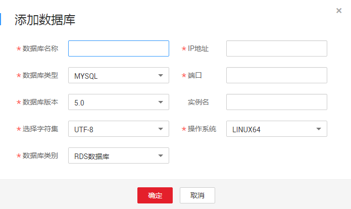

# 添加数据库

成功购买数据库安全审计实例后，您需要将待审计的数据库添加到数据库安全审计实例中。

## 前提条件

-   已获取管理控制台的登录账号与密码。
-   已成功购买数据库安全审计实例，且实例的状态为“运行中“。

## 添加审计数据库

1.  登录管理控制台。
2.  单击管理控制台左上角的，选择区域或项目。
3.  单击页面上方的“服务列表“，选择“安全  \>  数据库安全服务 DBSS“。
4.  在左侧导航树中，选择“数据库安全服务  \>  数据库安全审计“，进入数据库安全审计实例列表界面。
5.  在数据库安全审计实例列表中，单击需要添加数据库的实例名称，如[图1](#fig99553501795)所示。

    **图 1**  数据库安全审计实例列表  
    

6.  进入添加数据库页面，操作步骤如[图2](#fig8940123751116)所示。

    **图 2**  进入添加数据库页面  
    

7.  在弹出的对话框中，设置数据库的信息，如[图3](#fig1433184615414)所示，相关参数说明如[表1](#table4295843716304)所示。

    **图 3** “添加数据库“对话框  
    

    **表 1**  数据库参数说明

    
    <table><thead align="left"><tr id="row4338993216304"><th class="cellrowborder" valign="top" width="21%" id="mcps1.2.4.1.1">
参数名称

    </th>
    <th class="cellrowborder" valign="top" width="61%" id="mcps1.2.4.1.2">
说明

    </th>
    <th class="cellrowborder" valign="top" width="18%" id="mcps1.2.4.1.3">
取值样例

    </th>
    </tr>
    </thead>
    <tbody><tr id="row3896937416304"><td class="cellrowborder" valign="top" width="21%" headers="mcps1.2.4.1.1 ">
数据库名称

    </td>
    <td class="cellrowborder" valign="top" width="61%" headers="mcps1.2.4.1.2 ">
您可以自定义添加的数据库的名称。

    </td>
    <td class="cellrowborder" valign="top" width="18%" headers="mcps1.2.4.1.3 ">
MySQL-5d37

    </td>
    </tr>
    <tr id="row1332204111319"><td class="cellrowborder" valign="top" width="21%" headers="mcps1.2.4.1.1 ">
IP地址

    </td>
    <td class="cellrowborder" valign="top" width="61%" headers="mcps1.2.4.1.2 ">
添加的数据库的IP地址。

    </td>
    <td class="cellrowborder" valign="top" width="18%" headers="mcps1.2.4.1.3 ">
192.168.0.0

    </td>
    </tr>
    <tr id="row0860165713317"><td class="cellrowborder" valign="top" width="21%" headers="mcps1.2.4.1.1 ">
数据库类型

    </td>
    <td class="cellrowborder" valign="top" width="61%" headers="mcps1.2.4.1.2 ">
当前仅支持“MYSQL”数据库。

    </td>
    <td class="cellrowborder" valign="top" width="18%" headers="mcps1.2.4.1.3 ">
MYSQL

    </td>
    </tr>
    <tr id="row1319658616304"><td class="cellrowborder" valign="top" width="21%" headers="mcps1.2.4.1.1 ">
端口

    </td>
    <td class="cellrowborder" valign="top" width="61%" headers="mcps1.2.4.1.2 ">
添加的数据库的端口。

    </td>
    <td class="cellrowborder" valign="top" width="18%" headers="mcps1.2.4.1.3 ">
3306

    </td>
    </tr>
    <tr id="row16837105815489"><td class="cellrowborder" valign="top" width="21%" headers="mcps1.2.4.1.1 ">
数据库版本

    </td>
    <td class="cellrowborder" valign="top" width="61%" headers="mcps1.2.4.1.2 ">
指支持的MySQL数据库版本，您可以选择以下版本：

    <ul id="ul177551201424"><li>5.0</li><li>5.1</li><li>5.5</li><li>5.6</li><li>5.7</li><li>8.0</li></ul>
    </td>
    <td class="cellrowborder" valign="top" width="18%" headers="mcps1.2.4.1.3 ">
5.0

    </td>
    </tr>
    <tr id="row879719219418"><td class="cellrowborder" valign="top" width="21%" headers="mcps1.2.4.1.1 ">
实例名

    </td>
    <td class="cellrowborder" valign="top" width="61%" headers="mcps1.2.4.1.2 ">
可选参数。您可以自定义数据库的实例名称。

    </td>
    <td class="cellrowborder" valign="top" width="18%" headers="mcps1.2.4.1.3 ">
-

    </td>
    </tr>
    <tr id="row2550998316304"><td class="cellrowborder" valign="top" width="21%" headers="mcps1.2.4.1.1 ">
选择字符集

    </td>
    <td class="cellrowborder" valign="top" width="61%" headers="mcps1.2.4.1.2 ">
支持的MySQL数据库字符集的编码格式，当前支持UTF-8编码格式。

    </td>
    <td class="cellrowborder" valign="top" width="18%" headers="mcps1.2.4.1.3 ">
UTF-8

    </td>
    </tr>
    <tr id="row2795329327"><td class="cellrowborder" valign="top" width="21%" headers="mcps1.2.4.1.1 ">
操作系统

    </td>
    <td class="cellrowborder" valign="top" width="61%" headers="mcps1.2.4.1.2 ">
添加的数据库运行的操作系统，当前支持LINUX64。

    </td>
    <td class="cellrowborder" valign="top" width="18%" headers="mcps1.2.4.1.3 ">
LINUX64

    </td>
    </tr>
    </tbody>
    </table>

8.  单击“确定“。

    数据库列表中将新增一条“审计状态“为“已关闭“的数据库。

