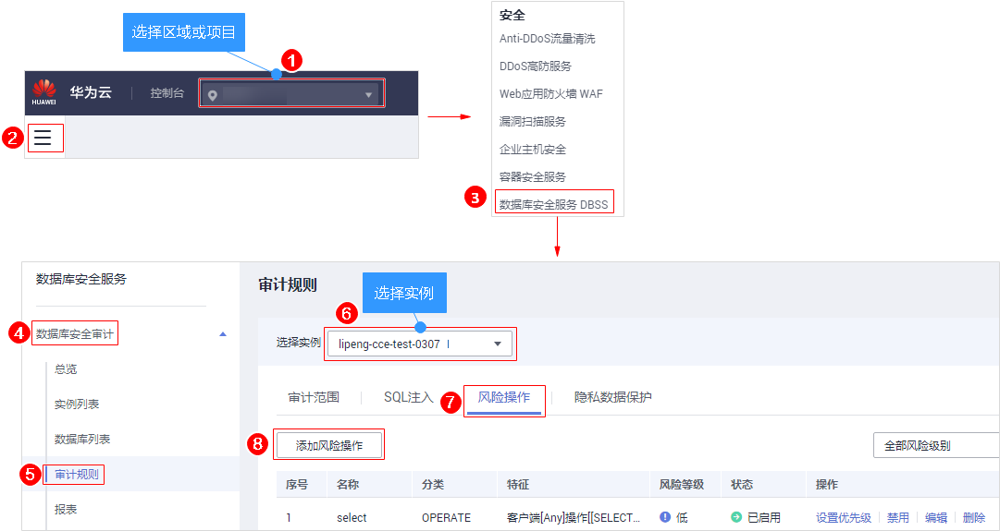

# 添加风险操作

添加的数据库开启审计功能后，您可以通过添加风险操作，设置被添加的数据库需要审计的风险操作。

> **须知：**   
>一条审计数据只能命中风险操作中的一个规则。  

## 前提条件

-   已成功购买数据库安全审计实例，且实例的状态为“运行中“。
-   已成功添加数据库并开启审计功能。

## 操作步骤

1.  [登录管理控制台](https://console.huaweicloud.com/?locale=zh-cn)。
2.  进入添加风险操作入口，如[图1](#fig61991836131419)所示。

    **图 1**  进入添加风险操作入口  
    

3.  在“添加风险操作“界面，设置基本信息和客户端IP地址，如[图2](#fig161016109141)所示，相关参数说明如[表1](#table4295843716304)所示。

    **图 2**  设置基本信息和客户端IP地址  
    

    **表 1**  风险操作参数说明

    
    <table><thead align="left"><tr id="row4338993216304"><th class="cellrowborder" valign="top" width="21%" id="mcps1.2.4.1.1">
参数名称

    </th>
    <th class="cellrowborder" valign="top" width="61%" id="mcps1.2.4.1.2">
说明

    </th>
    <th class="cellrowborder" valign="top" width="18%" id="mcps1.2.4.1.3">
取值样例

    </th>
    </tr>
    </thead>
    <tbody><tr id="row8736194992614"><td class="cellrowborder" valign="top" width="21%" headers="mcps1.2.4.1.1 ">
风险操作名称

    </td>
    <td class="cellrowborder" valign="top" width="61%" headers="mcps1.2.4.1.2 ">
您可以自定义风险操作的名称。

    </td>
    <td class="cellrowborder" valign="top" width="18%" headers="mcps1.2.4.1.3 ">
test

    </td>
    </tr>
    <tr id="row3896937416304"><td class="cellrowborder" valign="top" width="21%" headers="mcps1.2.4.1.1 ">
风险级别

    </td>
    <td class="cellrowborder" valign="top" width="61%" headers="mcps1.2.4.1.2 ">
选择风险操作的级别，可以选择以下级别：

    <ul id="ul155751241152314"><li>高</li><li>中</li><li>低</li><li>无风险</li></ul>
    </td>
    <td class="cellrowborder" valign="top" width="18%" headers="mcps1.2.4.1.3 ">
高

    </td>
    </tr>
    <tr id="row1332204111319"><td class="cellrowborder" valign="top" width="21%" headers="mcps1.2.4.1.1 ">
状态

    </td>
    <td class="cellrowborder" valign="top" width="61%" headers="mcps1.2.4.1.2 ">
开启或关闭风险操作。

    <ul id="ul934875119443"><li>：开启</li><li>：关闭</li></ul>
    </td>
    <td class="cellrowborder" valign="top" width="18%" headers="mcps1.2.4.1.3 ">

    </td>
    </tr>
    <tr id="row0860165713317"><td class="cellrowborder" valign="top" width="21%" headers="mcps1.2.4.1.1 ">
应用到数据库

    </td>
    <td class="cellrowborder" valign="top" width="61%" headers="mcps1.2.4.1.2 ">
选择应用该风险操作的数据库。

    </td>
    <td class="cellrowborder" valign="top" width="18%" headers="mcps1.2.4.1.3 ">
-

    </td>
    </tr>
    <tr id="row1319658616304"><td class="cellrowborder" valign="top" width="21%" headers="mcps1.2.4.1.1 ">
客户端IP/IP段

    </td>
    <td class="cellrowborder" valign="top" width="61%" headers="mcps1.2.4.1.2 ">
输入客户端的IP地址或IP地址段。

    
IP地址支持IPv4（例如，192.168.1.1）和IPv6（例如，1050:0:0:0:5:600:300c:326b）格式。

    </td>
    <td class="cellrowborder" valign="top" width="18%" headers="mcps1.2.4.1.3 ">
192.168.0.0

    </td>
    </tr>
    </tbody>
    </table>

4.  设置操作类型、操作对象、执行结果，如[图3](#fig18318125817371)所示，相关参数说明如[表2](#table1588718356449)所示。

    **图 3**  设置操作类型、操作对象和执行结果  
    

    **表 2**  参数说明

    
    <table><thead align="left"><tr id="row689253515446"><th class="cellrowborder" valign="top" width="21%" id="mcps1.2.4.1.1">
参数名称

    </th>
    <th class="cellrowborder" valign="top" width="61%" id="mcps1.2.4.1.2">
说明

    </th>
    <th class="cellrowborder" valign="top" width="18%" id="mcps1.2.4.1.3">
取值样例

    </th>
    </tr>
    </thead>
    <tbody><tr id="row48961135134415"><td class="cellrowborder" valign="top" width="21%" headers="mcps1.2.4.1.1 ">
操作类型

    </td>
    <td class="cellrowborder" valign="top" width="61%" headers="mcps1.2.4.1.2 ">
风险操作的类型，包括“登录”和“操作”。

    
当选择“操作”时，可以选择“全部操作”，或选择“数据定义”、“数据操作”或“数据控制”的操作。

    </td>
    <td class="cellrowborder" valign="top" width="18%" headers="mcps1.2.4.1.3 ">
登录

    </td>
    </tr>
    <tr id="row11901133564410"><td class="cellrowborder" valign="top" width="21%" headers="mcps1.2.4.1.1 ">
操作对象

    </td>
    <td class="cellrowborder" valign="top" width="61%" headers="mcps1.2.4.1.2 ">
单击“添加操作对象”后，输入schema、目标表和字段信息。单击“确定”，添加操作对象。

    </td>
    <td class="cellrowborder" valign="top" width="18%" headers="mcps1.2.4.1.3 ">
-

    </td>
    </tr>
    <tr id="row791153564413"><td class="cellrowborder" valign="top" width="21%" headers="mcps1.2.4.1.1 ">
执行结果

    </td>
    <td class="cellrowborder" valign="top" width="61%" headers="mcps1.2.4.1.2 ">
设置“影响行数”和“执行时长”的执行条件后，输入行数和时长值，执行条件包括：

    <ul id="ul1891243517447"><li>大于</li><li>小于</li><li>等于</li><li>大于等于</li><li>小于等于</li></ul>
    </td>
    <td class="cellrowborder" valign="top" width="18%" headers="mcps1.2.4.1.3 ">
-

    </td>
    </tr>
    </tbody>
    </table>

5.  单击“保存“。

## 相关操作

-   [如何对所有数据库设置数据库安全审计规则？](https://support.huaweicloud.com/dbss_faq/dbss_01_0291.html)
-   [如何设置数据库安全审计的INSERT审计策略？](https://support.huaweicloud.com/dbss_faq/dbss_01_0292.html)

