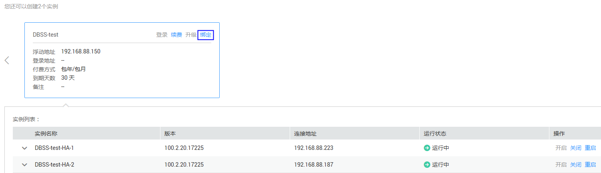
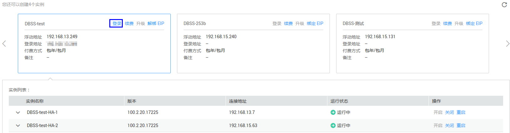

# 登录HexaTier

用户需要登录HexaTier对开启的实例进行配置，本章节介绍登录HexaTier的操作。

## 操作场景

用户需要登录HexaTier对开启的实例进行配置管理，实现对数据库的安全防护。登录HexaTier的方式说明如下：

-   实例绑定了弹性IP
    -   在数据库安全服务界面通过互联网登录到HexaTier。详细操作，请参见[在数据库安全防护界面通过互联网登录](#section59621770151056)。
    -   使用实例同一虚拟私有云中的弹性云服务器登录HexaTier。详细操作，请参见[使用同一虚拟私有云中的弹性云服务器登录](#section4560884124237)。

-   实例未绑定弹性IP

    只能使用实例同一虚拟私有云中的弹性云服务器登录HexaTier。详细操作，请参见[使用同一虚拟私有云中的弹性云服务器登录](#section4560884124237)。

## 前提条件

-   已获取管理控制台的登录账号与密码。
-   如果需要在数据库安全防护服务界面通过互联网登录，实例必须绑定了弹性IP，且实例的“状态“为“运行中“。绑定弹性IP的详细操作，请参见[绑定弹性IP](#section5268174317505)。
-   已获取登录HexaTier的密码。

    > **说明：**   
    >首次登录HexaTier，登录用户名为**admin**，默认密码为购买数据库安全防护时设置的HexaTier的登录密码。为了确保密码安全性，请您定期修改用户密码。密码默认有效期90天，系统会在到期前7天提醒您修改密码。  

    HexaTier的浏览器满足[表1](#table31027251162210)要求。 

    **表 1**  支持的浏览器版本

    
    <table><thead align="left"><tr id="row19104616335"><th class="cellrowborder" valign="top" width="50%" id="mcps1.2.3.1.1">
浏览器

    </th>
    <th class="cellrowborder" valign="top" width="50%" id="mcps1.2.3.1.2">
版本

    </th>
    </tr>
    </thead>
    <tbody><tr id="row310565337"><td class="cellrowborder" valign="top" width="50%" headers="mcps1.2.3.1.1 ">
Google Chrome

    </td>
    <td class="cellrowborder" valign="top" width="50%" headers="mcps1.2.3.1.2 ">
-

    </td>
    </tr>
    <tr id="row1910156193316"><td class="cellrowborder" valign="top" width="50%" headers="mcps1.2.3.1.1 ">
Mozilla FireFox

    </td>
    <td class="cellrowborder" valign="top" width="50%" headers="mcps1.2.3.1.2 ">
30.1及以上

    </td>
    </tr>
    <tr id="row181018663319"><td class="cellrowborder" valign="top" width="50%" headers="mcps1.2.3.1.1 ">
Internet Explorer

    </td>
    <td class="cellrowborder" valign="top" width="50%" headers="mcps1.2.3.1.2 ">
11.0及以上

    </td>
    </tr>
    </tbody>
    </table>

## 绑定弹性IP

1.  登录管理控制台。
2.  单击管理控制台左上角的，选择区域或项目。
3.  单击页面上方的“服务列表“，选择“安全  \>  数据库安全服务 DBSS“。
4.  在左侧导航树中，选择“数据库安全服务  \>  数据库安全防护“，进入数据库安全防护实例列表界面。
5.  在需要绑定弹性IP的实例页面框中，单击“绑定“，如[图1](#fig7998142353918)所示。

    **图 1**  绑定弹性IP  
    

6.  在弹出的“绑定弹性IP“对话框中，选择待绑定的弹性IP，单击“确定“，如[图2](#fig1918195412442)所示。

    **图 2**  选择弹性IP  
    

## 在数据库安全防护界面通过互联网登录

1.  登录管理控制台。
2.  单击管理控制台左上角的，选择区域或项目。
3.  单击页面上方的“服务列表“，选择“安全  \>  数据库安全服务 DBSS“。
4.  在左侧导航树中，选择“数据库安全服务  \>  数据库安全防护“，进入数据库安全防护实例列表界面。
5.  在需要登录HexaTier的实例页面框中，单击“登录“，如[图3](#fig025582318449)所示，系统跳转到该实例的HexaTier登录界面。

    **图 3**  登录HexaTier  
    

6.  输入HexaTier的登录用户名**admin**和密码，单击“登录“或按“Enter“，如[图4](#fig254142319571)所示，进入HexaTier。

    **图 4**  HexaTier登录界面  
    

## 使用同一虚拟私有云中的弹性云服务器登录

1.  在待管理的实例的同一个虚拟私有云下，查看虚拟私有云中是否存在弹性云服务器。
    -   是：执行[2](#l7ab55acbe3894374a66e9e390f362f36)。
    -   否：在该虚拟机私有云下创建弹性云服务器后，执行[2](#l7ab55acbe3894374a66e9e390f362f36)。

2.  使用满足如[表2](#t505be23c06ee4bbabed5ab52f8a9539a)要求的浏览器，输入以下地址后，按“Enter“，进入HexaTier的登录界面。

    https://_弹性云服务器的私有IP_:5000

    > **注意：**   
    >如果不能访问“5000“端口，则需要在安全组中添加TCP（Transmission Control Protocol）的“5000“端口访问权限。详细操作，请参见《虚拟私有云用户指南》。  

    **表 2**  支持的浏览器版本

    
    <table><thead align="left"><tr id="zh-cn_topic_0111166411_row19104616335"><th class="cellrowborder" valign="top" width="50%" id="mcps1.2.3.1.1">
浏览器

    </th>
    <th class="cellrowborder" valign="top" width="50%" id="mcps1.2.3.1.2">
版本

    </th>
    </tr>
    </thead>
    <tbody><tr id="zh-cn_topic_0111166411_row310565337"><td class="cellrowborder" valign="top" width="50%" headers="mcps1.2.3.1.1 ">
Google Chrome

    </td>
    <td class="cellrowborder" valign="top" width="50%" headers="mcps1.2.3.1.2 ">
-

    </td>
    </tr>
    <tr id="zh-cn_topic_0111166411_row1910156193316"><td class="cellrowborder" valign="top" width="50%" headers="mcps1.2.3.1.1 ">
Mozilla FireFox

    </td>
    <td class="cellrowborder" valign="top" width="50%" headers="mcps1.2.3.1.2 ">
30.1及以上

    </td>
    </tr>
    <tr id="zh-cn_topic_0111166411_row181018663319"><td class="cellrowborder" valign="top" width="50%" headers="mcps1.2.3.1.1 ">
Internet Explorer

    </td>
    <td class="cellrowborder" valign="top" width="50%" headers="mcps1.2.3.1.2 ">
11.0及以上

    </td>
    </tr>
    </tbody>
    </table>

3.  输入HexaTier的登录用户名**admin**和密码，单击“登录“或按“Enter“，如[图5](#zh-cn_topic_0111166411_fig254142319571)所示，进入HexaTier。

    **图 5**  HexaTier登录界面  
    

