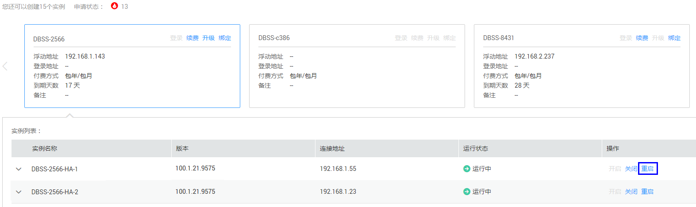
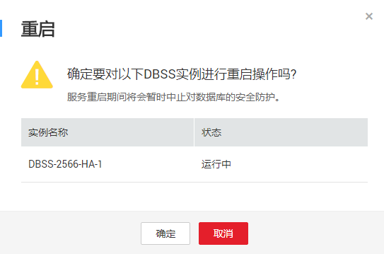
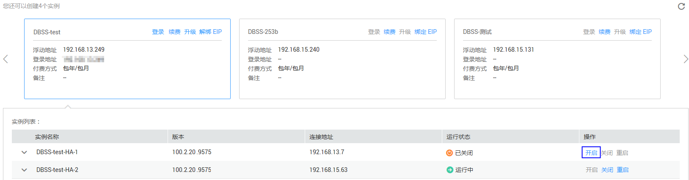
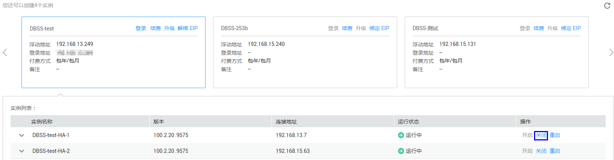
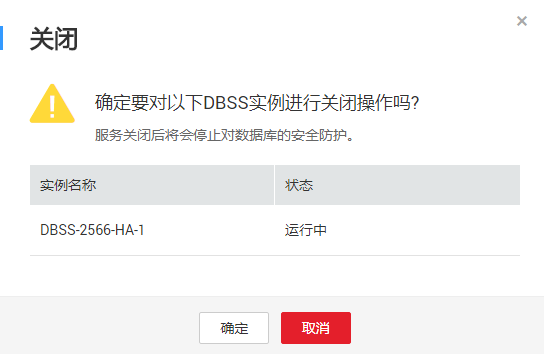

# 管理DBSS实例

用户成功购买DBSS实例后，可以查看实例信息，重启、开启或关闭实例。

## 前提条件

-   已获取管理控制台的登录帐号与密码。
-   已成功购买DBSS实例。
-   重启实例和关闭实例前，请确认实例的“运行状态“为“运行中“。
-   开启实例前，请确认实例的“运行状态“为“已关闭“。

## 查看实例信息

1.  登录管理控制台。
2.  单击页面上方的“服务列表“，选择“安全  \>  数据库安全服务 DBSS“，进入数据库安全服务界面。
3.  查看DBSS实例的信息，如[图1](#fig1325745611915)所示，相关参数说明如[表1](#table1025994517211)所示。

    > **说明：**   
    >在实例列表中，单击实例前面的，可以查看该实例的详细信息。  

    **图 1**  查看实例信息  
    

    **表 1**  实例信息参数说明

    
    <table><thead align="left"><tr id="row1626074517217"><th class="cellrowborder" valign="top" width="17%" id="mcps1.2.3.1.1">
参数名称

    </th>
    <th class="cellrowborder" valign="top" width="83%" id="mcps1.2.3.1.2">
说明

    </th>
    </tr>
    </thead>
    <tbody><tr id="row18260134511215"><td class="cellrowborder" valign="top" width="17%" headers="mcps1.2.3.1.1 ">
实例名称

    </td>
    <td class="cellrowborder" valign="top" width="83%" headers="mcps1.2.3.1.2 ">
实例的名称。

    </td>
    </tr>
    <tr id="row326014459212"><td class="cellrowborder" valign="top" width="17%" headers="mcps1.2.3.1.1 ">
版本

    </td>
    <td class="cellrowborder" valign="top" width="83%" headers="mcps1.2.3.1.2 ">
实例的服务版本。

    </td>
    </tr>
    <tr id="row12260124518212"><td class="cellrowborder" valign="top" width="17%" headers="mcps1.2.3.1.1 ">
连接地址

    </td>
    <td class="cellrowborder" valign="top" width="83%" headers="mcps1.2.3.1.2 ">
应用连接实例的私有IP地址。

    </td>
    </tr>
    <tr id="row11260124513215"><td class="cellrowborder" valign="top" width="17%" headers="mcps1.2.3.1.1 ">
运行状态

    </td>
    <td class="cellrowborder" valign="top" width="83%" headers="mcps1.2.3.1.2 ">
实例当前的运行状态，包括：

    <ul id="ul108156241253"><li>运行中</li><li>创建中</li><li>故障</li><li>已关闭</li></ul>
    </td>
    </tr>
    </tbody>
    </table>

## 重启实例

1.  登录管理控制台。
2.  单击页面上方的“服务列表“，选择“安全  \>  数据库安全服务 DBSS“，进入数据库安全服务界面。
3.  单击需要重启的DBSS实例。
4.  在需要重启的实例所在行，单击“重启“，如[图2](#fig78715132217)所示。

    **图 2**  重启实例  
    

5.  在弹出的提示对话框中，单击“确定“，如[图3](#fig97781991740)所示。

    **图 3** “重启“对话框  
    

    单击实例列表右上方的刷新界面，实例重启成功。

## 开启实例

成功购买DBSS实例后，实例自动开启。开启实例后，用户可以登录HexaTier对实例进行配置管理，实现对数据库的安全防护。

当实例关闭后，如果需要登录HexaTier，则需要开启实例。

1.  登录管理控制台。
2.  单击页面上方的“服务列表“，选择“安全  \>  数据库安全服务 DBSS“，进入数据库安全服务界面。
3.  单击需要开启的DBSS实例。
4.  在需要开启的实例所在行，单击“开启“，如[图4](#fig14477185813019)所示。

    **图 4**  开启实例  
    

5.  在弹出的提示对话框中，单击“确定“。

    开启实例成功，实例的“运行状态“为“运行中“。

## 关闭实例

关闭实例后，将不能登录HexaTier对实例进行配置管理。

1.  登录管理控制台。
2.  单击页面上方的“服务列表“，选择“安全  \>  数据库安全服务 DBSS“，进入数据库安全服务界面。
3.  单击需要关闭的DBSS实例。
4.  在需要关闭的实例所在行，单击“关闭“，如[图5](#fig17998195641819)所示。

    **图 5**  关闭实例  
    

5.  在弹出的提示对话框中，单击“确定“，如[图6](#fig3772102813313)所示。

    **图 6** “关闭“对话框  
    

    关闭实例成功，实例的“状态“为“已关闭“。

