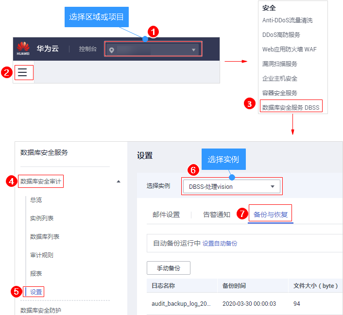
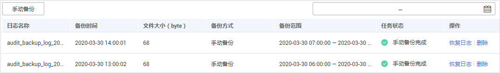

# 管理备份的审计日志

备份审计日志后，您可以查看备份的审计日志信息，或删除备份的审计日志。

## 前提条件

-   已成功购买数据库安全审计实例，且实例的状态为“运行中“。
-   已成功添加数据库并开启审计功能。
-   已成功添加并安装Agent。
-   已成功备份审计日志。

## 查看备份的日志信息

1.  [登录管理控制台](https://console.huaweicloud.com/?locale=zh-cn)。
2.  进入备份入口，如[图1](#dbss_01_0194_fig61991836131419)所示。

    **图 1**  进入备份入口  
    

3.  查看备份的审计日志信息，如[图2](#fig114613221242)所示，相关参数说明如[表1](#table964761214306)所示。

    **图 2**  查看备份审计日志信息  
    

    在列表右上方单击，选择开始时间和结束时间，可以查看指定的时间段的备份日志。

    **表 1**  审计日志参数说明

    
    <table><thead align="left"><tr id="row1365581213011"><th class="cellrowborder" valign="top" width="25.4%" id="mcps1.2.3.1.1">
参数名称

    </th>
    <th class="cellrowborder" valign="top" width="74.6%" id="mcps1.2.3.1.2">
说明

    </th>
    </tr>
    </thead>
    <tbody><tr id="row7664312163018"><td class="cellrowborder" valign="top" width="25.4%" headers="mcps1.2.3.1.1 ">
日志名称

    </td>
    <td class="cellrowborder" valign="top" width="74.6%" headers="mcps1.2.3.1.2 ">
日志的名称，由系统自动生成。

    </td>
    </tr>
    <tr id="row18114121410321"><td class="cellrowborder" valign="top" width="25.4%" headers="mcps1.2.3.1.1 ">
备份时间

    </td>
    <td class="cellrowborder" valign="top" width="74.6%" headers="mcps1.2.3.1.2 ">
执行日志备份操作的时间。

    </td>
    </tr>
    <tr id="row17352133015322"><td class="cellrowborder" valign="top" width="25.4%" headers="mcps1.2.3.1.1 ">
文件大小（byte）

    </td>
    <td class="cellrowborder" valign="top" width="74.6%" headers="mcps1.2.3.1.2 ">
日志的文件大小。

    </td>
    </tr>
    <tr id="row1167216126301"><td class="cellrowborder" valign="top" width="25.4%" headers="mcps1.2.3.1.1 ">
备份方式

    </td>
    <td class="cellrowborder" valign="top" width="74.6%" headers="mcps1.2.3.1.2 ">
日志的备份方式，包括：

    <ul id="ul115595014464"><li>手动备份</li><li>自动备份</li></ul>
    </td>
    </tr>
    <tr id="row1856318344013"><td class="cellrowborder" valign="top" width="25.4%" headers="mcps1.2.3.1.1 ">
备份范围

    </td>
    <td class="cellrowborder" valign="top" width="74.6%" headers="mcps1.2.3.1.2 ">
日志的备份时间段。

    </td>
    </tr>
    <tr id="row19376125418438"><td class="cellrowborder" valign="top" width="25.4%" headers="mcps1.2.3.1.1 ">
任务状态

    </td>
    <td class="cellrowborder" valign="top" width="74.6%" headers="mcps1.2.3.1.2 ">
日志的备份状态。

    </td>
    </tr>
    </tbody>
    </table>

    > **说明：**   
    >在需要删除的日志所在行的“操作“列，单击“删除“，在弹出的对话框中，单击“确定“，您可以删除该备份日志。  

