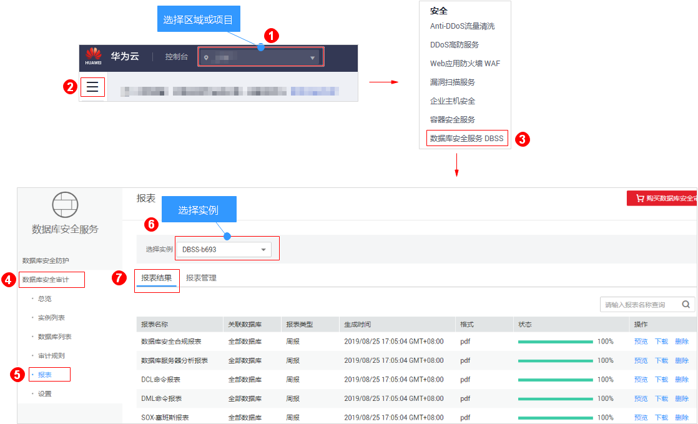
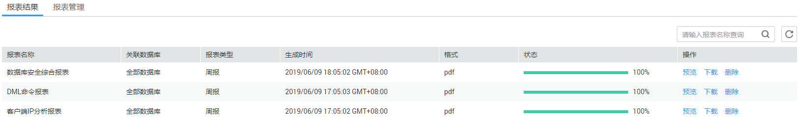
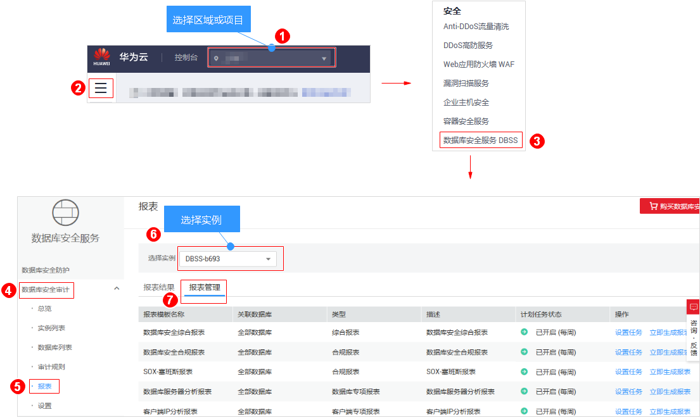

# 管理审计报表

数据库安全审计默认提供一条“全审计规则“的审计范围，可以对成功连接数据库安全审计的所有数据库进行审计。添加的数据库连接到数据库安全审计实例后，您可以查看报表模板信息和报表结果。

## 前提条件

-   已成功购买数据库安全审计实例，且实例的状态为“运行中“。
-   已成功添加数据库并开启审计功能。
-   已成功添加并安装Agent。

## 查看报表信息

1.  [登录管理控制台](https://console.huaweicloud.com/?locale=zh-cn)。
2.  进入报表结果入口，如[图1](#dbss_01_0248_fig177955528129)所示。

    **图 1**  进入报表结果入口  
    

3.  查看报表信息，如[图2](#fig13686171251816)所示，相关参数说明如[表1](#table964761214306)所示。

    **图 2**  查看报表信息  
    

    > **说明：** 
    >在列表右上方输入报表名称，可以搜索指定的报表。

    **表 1**  报表信息参数说明

    
    <table><thead align="left"><tr id="row1365581213011"><th class="cellrowborder" valign="top" width="25.4%" id="mcps1.2.3.1.1">
参数名称

    </th>
    <th class="cellrowborder" valign="top" width="74.6%" id="mcps1.2.3.1.2">
说明

    </th>
    </tr>
    </thead>
    <tbody><tr id="row7664312163018"><td class="cellrowborder" valign="top" width="25.4%" headers="mcps1.2.3.1.1 ">
报表名称

    </td>
    <td class="cellrowborder" valign="top" width="74.6%" headers="mcps1.2.3.1.2 ">
报表的名称。

    </td>
    </tr>
    <tr id="row18114121410321"><td class="cellrowborder" valign="top" width="25.4%" headers="mcps1.2.3.1.1 ">
关联数据库

    </td>
    <td class="cellrowborder" valign="top" width="74.6%" headers="mcps1.2.3.1.2 ">
报表关联的数据库。

    </td>
    </tr>
    <tr id="row17352133015322"><td class="cellrowborder" valign="top" width="25.4%" headers="mcps1.2.3.1.1 ">
报表类型

    </td>
    <td class="cellrowborder" valign="top" width="74.6%" headers="mcps1.2.3.1.2 ">
报表的类型。

    </td>
    </tr>
    <tr id="row1167216126301"><td class="cellrowborder" valign="top" width="25.4%" headers="mcps1.2.3.1.1 ">
生成时间

    </td>
    <td class="cellrowborder" valign="top" width="74.6%" headers="mcps1.2.3.1.2 ">
报表的生成时间。

    </td>
    </tr>
    <tr id="row1856318344013"><td class="cellrowborder" valign="top" width="25.4%" headers="mcps1.2.3.1.1 ">
格式

    </td>
    <td class="cellrowborder" valign="top" width="74.6%" headers="mcps1.2.3.1.2 ">
生成的报表格式。

    </td>
    </tr>
    <tr id="row19685121213016"><td class="cellrowborder" valign="top" width="25.4%" headers="mcps1.2.3.1.1 ">
状态

    </td>
    <td class="cellrowborder" valign="top" width="74.6%" headers="mcps1.2.3.1.2 ">
报表生成状态。

    </td>
    </tr>
    </tbody>
    </table>

    > **说明：** 
    >在需要删除的报表所在行的“操作“列，单击“删除“，在弹出的对话框中，单击“确定“，您可以删除该报表。删除报表后，如果查看该报表结果，需要重新手动生成报表。

## 查看报表模板信息

1.  [登录管理控制台](https://console.huaweicloud.com/?locale=zh-cn)。
2.  进入报表管理入口，如[图3](#dbss_01_0248_fig61991836131419)所示。

    **图 3**  进入报表管理入口  
    

3.  查看报表模板信息，如[图4](#fig114613221242)所示，相关参数说明如[表2](#table179131719111217)所示。

    **图 4**  查看报表模板列表  
    

    **表 2**  报表模板信息参数说明

    
    <table><thead align="left"><tr id="row1914619131213"><th class="cellrowborder" valign="top" width="25.4%" id="mcps1.2.3.1.1">
参数名称

    </th>
    <th class="cellrowborder" valign="top" width="74.6%" id="mcps1.2.3.1.2">
说明

    </th>
    </tr>
    </thead>
    <tbody><tr id="row1891401911125"><td class="cellrowborder" valign="top" width="25.4%" headers="mcps1.2.3.1.1 ">
报表模板名称

    </td>
    <td class="cellrowborder" valign="top" width="74.6%" headers="mcps1.2.3.1.2 ">
报表模板的名称。

    </td>
    </tr>
    <tr id="row99141819131211"><td class="cellrowborder" valign="top" width="25.4%" headers="mcps1.2.3.1.1 ">
关联数据库

    </td>
    <td class="cellrowborder" valign="top" width="74.6%" headers="mcps1.2.3.1.2 ">
报表模板关联的数据库。

    </td>
    </tr>
    <tr id="row1591471911127"><td class="cellrowborder" valign="top" width="25.4%" headers="mcps1.2.3.1.1 ">
类型

    </td>
    <td class="cellrowborder" valign="top" width="74.6%" headers="mcps1.2.3.1.2 ">
报表模板的类型。

    </td>
    </tr>
    <tr id="row391471914129"><td class="cellrowborder" valign="top" width="25.4%" headers="mcps1.2.3.1.1 ">
描述

    </td>
    <td class="cellrowborder" valign="top" width="74.6%" headers="mcps1.2.3.1.2 ">
报表模板的描述信息。

    </td>
    </tr>
    <tr id="row891481921215"><td class="cellrowborder" valign="top" width="25.4%" headers="mcps1.2.3.1.1 ">
计划任务状态

    </td>
    <td class="cellrowborder" valign="top" width="74.6%" headers="mcps1.2.3.1.2 ">
计划任务的执行状态。

    </td>
    </tr>
    </tbody>
    </table>

