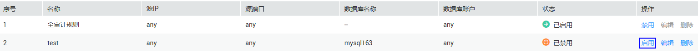
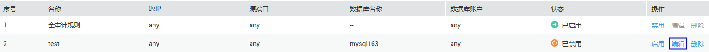
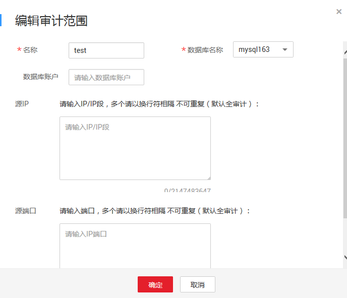
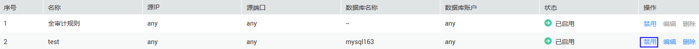
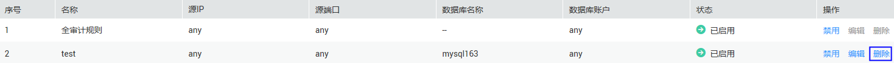

# 管理审计范围

成功添加审计范围后，您可以查看审计范围信息，启用、编辑、禁用或删除审计范围。

## 前提条件

-   已获取管理控制台的登录账号与密码。
-   已成功购买数据库安全审计实例，且实例的状态为“运行中“。
-   已成功添加审计范围。
-   启用、编辑和删除审计范围前，请确认审计范围的状态为“已禁用“。
-   禁用审计范围前，请确认审计范围的状态为“已启用“。

## 启用审计范围

1.  登录管理控制台。
2.  单击管理控制台左上角的，选择区域或项目。
3.  单击管理控制台上方的“服务列表“，选择“安全  \>  数据库安全服务 DBSS“，进入数据库安全防护实例列表界面。
4.  在左侧导航树中，选择“数据库安全服务  \>  数据库安全审计“，进入数据库安全审计实例列表界面。
5.  在数据库安全审计实例列表中，单击需要启用审计范围的实例名称，如[图1](#fig99553501795)所示。

    **图 1**  数据库安全审计实例列表  
    

6.  在“实例详情“界面，选择“规则  \>  审计范围“，进入审计范围列表页面。
7.  在需要启用的审计范围所在行的“操作“列，单击“启用“，如[图2](#fig5689154912135)所示。

    **图 2**  启用审计范围  
    

    成功启用审计范围后，审计范围的状态为“已启用“。

## 编辑审计范围

1.  登录管理控制台。
2.  单击管理控制台左上角的，选择区域或项目。
3.  单击管理控制台上方的“服务列表“，选择“安全  \>  数据库安全服务 DBSS“，进入数据库安全防护实例列表界面。
4.  在左侧导航树中，选择“数据库安全服务  \>  数据库安全审计“，进入数据库安全审计实例列表界面。
5.  在数据库安全审计实例列表中，单击需要编辑审计范围的实例名称，如[图3](#fig1316811545161)所示。

    **图 3**  数据库安全审计实例列表  
    

6.  在“实例详情“界面，选择“规则  \>  审计范围“，进入审计范围列表页面。
7.  在需要编辑的审计范围所在行的“操作“列，单击“编辑“，如[图4](#fig13182165451613)所示。

    **图 4**  编辑审计范围  
    

8.  在弹出的对话框中，设置审计范围，如[图5](#fig6101165820247)所示，相关参数说明如[表1](#table4295843716304)所示。

    **图 5** “编辑审计范围“对话框  
    

    **表 1**  审计范围参数说明

    
    <table><thead align="left"><tr id="zh-cn_topic_0145057225_row4338993216304"><th class="cellrowborder" valign="top" width="21.02%" id="mcps1.2.4.1.1">
参数名称

    </th>
    <th class="cellrowborder" valign="top" width="60.980000000000004%" id="mcps1.2.4.1.2">
说明

    </th>
    <th class="cellrowborder" valign="top" width="18%" id="mcps1.2.4.1.3">
取值样例

    </th>
    </tr>
    </thead>
    <tbody><tr id="zh-cn_topic_0145057225_row8736194992614"><td class="cellrowborder" valign="top" width="21.02%" headers="mcps1.2.4.1.1 ">
名称

    </td>
    <td class="cellrowborder" valign="top" width="60.980000000000004%" headers="mcps1.2.4.1.2 ">
您可以自定义审计范围的名称。

    </td>
    <td class="cellrowborder" valign="top" width="18%" headers="mcps1.2.4.1.3 ">
audit00

    </td>
    </tr>
    <tr id="zh-cn_topic_0145057225_row3896937416304"><td class="cellrowborder" valign="top" width="21.02%" headers="mcps1.2.4.1.1 ">
数据库名称

    </td>
    <td class="cellrowborder" valign="top" width="60.980000000000004%" headers="mcps1.2.4.1.2 ">
选择待添加审计范围的数据库。

    </td>
    <td class="cellrowborder" valign="top" width="18%" headers="mcps1.2.4.1.3 ">
test

    </td>
    </tr>
    <tr id="zh-cn_topic_0145057225_row1332204111319"><td class="cellrowborder" valign="top" width="21.02%" headers="mcps1.2.4.1.1 ">
数据库账户

    </td>
    <td class="cellrowborder" valign="top" width="60.980000000000004%" headers="mcps1.2.4.1.2 ">
可选参数。输入数据库的用户名。

    </td>
    <td class="cellrowborder" valign="top" width="18%" headers="mcps1.2.4.1.3 ">
-

    </td>
    </tr>
    <tr id="zh-cn_topic_0145057225_row0860165713317"><td class="cellrowborder" valign="top" width="21.02%" headers="mcps1.2.4.1.1 ">
源IP

    </td>
    <td class="cellrowborder" valign="top" width="60.980000000000004%" headers="mcps1.2.4.1.2 ">
可选参数。输入待审计数据库的IP地址或IP地址段。

    </td>
    <td class="cellrowborder" valign="top" width="18%" headers="mcps1.2.4.1.3 ">
-

    </td>
    </tr>
    <tr id="zh-cn_topic_0145057225_row1319658616304"><td class="cellrowborder" valign="top" width="21.02%" headers="mcps1.2.4.1.1 ">
源端口

    </td>
    <td class="cellrowborder" valign="top" width="60.980000000000004%" headers="mcps1.2.4.1.2 ">
可选参数。输入待审计数据库的端口。

    </td>
    <td class="cellrowborder" valign="top" width="18%" headers="mcps1.2.4.1.3 ">
-

    </td>
    </tr>
    </tbody>
    </table>

9.  单击“确定“。

## 禁用审计范围

禁用审计范围后，该审计范围规则将不在审计中执行。

1.  登录管理控制台。
2.  单击管理控制台左上角的，选择区域或项目。
3.  单击管理控制台上方的“服务列表“，选择“安全  \>  数据库安全服务 DBSS“，进入数据库安全防护实例列表界面。
4.  在左侧导航树中，选择“数据库安全服务  \>  数据库安全审计“，进入数据库安全审计实例列表界面。
5.  在数据库安全审计实例列表中，单击需要禁用审计范围的实例名称，如[图6](#fig5601152435819)所示。

    **图 6**  数据库安全审计实例列表  
    

6.  在“实例详情“界面，选择“规则  \>  审计范围“，进入审计范围列表页面。
7.  在需要禁用的审计范围所在行的“操作“列，单击“禁用“，如[图7](#fig7609124155819)所示。

    **图 7**  禁用审计范围  
    

8.  在弹出的对话框中，单击“确定“。

    成功禁用审计范围后，审计范围的状态为“已禁用“。

## 删除审计范围

删除审计范围后，如果需要对该审计范围进行审计，请重新添加该审计范围。

1.  登录管理控制台。
2.  单击管理控制台左上角的，选择区域或项目。
3.  单击管理控制台上方的“服务列表“，选择“安全  \>  数据库安全服务 DBSS“，进入数据库安全防护实例列表界面。
4.  在左侧导航树中，选择“数据库安全服务  \>  数据库安全审计“，进入数据库安全审计实例列表界面。
5.  在数据库安全审计实例列表中，单击需要删除审计范围的实例名称，如[图8](#fig95651514172218)所示。

    **图 8**  数据库安全审计实例列表  
    

6.  在“实例详情“界面，选择“规则  \>  审计范围“，进入审计范围列表页面。
7.  在需要删除的审计范围所在行的“操作“列，单击“删除“，如[图9](#fig757821415226)所示。

    **图 9**  删除审计范围  
    

8.  在弹出的对话框中，单击“确定“。

## 查看审计范围信息

1.  登录管理控制台。
2.  单击管理控制台左上角的，选择区域或项目。
3.  单击管理控制台上方的“服务列表“，选择“安全  \>  数据库安全服务 DBSS“，进入数据库安全防护实例列表界面。
4.  在左侧导航树中，选择“数据库安全服务  \>  数据库安全审计“，进入数据库安全审计实例列表界面。
5.  在数据库安全审计实例列表中，单击需要查看审计范围的实例名称，如[图10](#fig9310153622611)所示。

    **图 10**  数据库安全审计实例列表  
    

6.  在“实例详情“界面，选择“规则  \>  审计范围“，进入审计范围列表页面。
7.  查看审计范围信息，如[图11](#fig17324536122612)所示，相关参数说明如[表2](#table964761214306)所示。

    **图 11**  查看审计范围信息  
    

    > **说明：**   
    >输入审计范围的关键字，单击或按“Enter“，可以搜索指定的审计范围。  

    **表 2**  审计范围信息参数说明

    
    <table><thead align="left"><tr id="row1365581213011"><th class="cellrowborder" valign="top" width="25.629999999999995%" id="mcps1.2.3.1.1">
参数名称

    </th>
    <th class="cellrowborder" valign="top" width="74.37%" id="mcps1.2.3.1.2">
说明

    </th>
    </tr>
    </thead>
    <tbody><tr id="row1528102263112"><td class="cellrowborder" valign="top" width="25.629999999999995%" headers="mcps1.2.3.1.1 ">
序号

    </td>
    <td class="cellrowborder" valign="top" width="74.37%" headers="mcps1.2.3.1.2 ">
审计范围的编号。

    </td>
    </tr>
    <tr id="row7664312163018"><td class="cellrowborder" valign="top" width="25.629999999999995%" headers="mcps1.2.3.1.1 ">
名称

    </td>
    <td class="cellrowborder" valign="top" width="74.37%" headers="mcps1.2.3.1.2 ">
审计范围的名称。

    </td>
    </tr>
    <tr id="row18114121410321"><td class="cellrowborder" valign="top" width="25.629999999999995%" headers="mcps1.2.3.1.1 ">
源IP

    </td>
    <td class="cellrowborder" valign="top" width="74.37%" headers="mcps1.2.3.1.2 ">
审计的IP地址或IP地址段。

    </td>
    </tr>
    <tr id="row17352133015322"><td class="cellrowborder" valign="top" width="25.629999999999995%" headers="mcps1.2.3.1.1 ">
源端口

    </td>
    <td class="cellrowborder" valign="top" width="74.37%" headers="mcps1.2.3.1.2 ">
审计的IP地址端口。

    </td>
    </tr>
    <tr id="row1167216126301"><td class="cellrowborder" valign="top" width="25.629999999999995%" headers="mcps1.2.3.1.1 ">
数据库名称

    </td>
    <td class="cellrowborder" valign="top" width="74.37%" headers="mcps1.2.3.1.2 ">
审计范围的数据库。

    </td>
    </tr>
    <tr id="row6679161203016"><td class="cellrowborder" valign="top" width="25.629999999999995%" headers="mcps1.2.3.1.1 ">
数据库帐户

    </td>
    <td class="cellrowborder" valign="top" width="74.37%" headers="mcps1.2.3.1.2 ">
数据库的用户名。

    </td>
    </tr>
    <tr id="row19685121213016"><td class="cellrowborder" valign="top" width="25.629999999999995%" headers="mcps1.2.3.1.1 ">
状态

    </td>
    <td class="cellrowborder" valign="top" width="74.37%" headers="mcps1.2.3.1.2 ">
审计范围的状态，包括：

    <ul id="ul118072149340"><li>已启用</li><li>已禁用</li></ul>
    </td>
    </tr>
    </tbody>
    </table>

