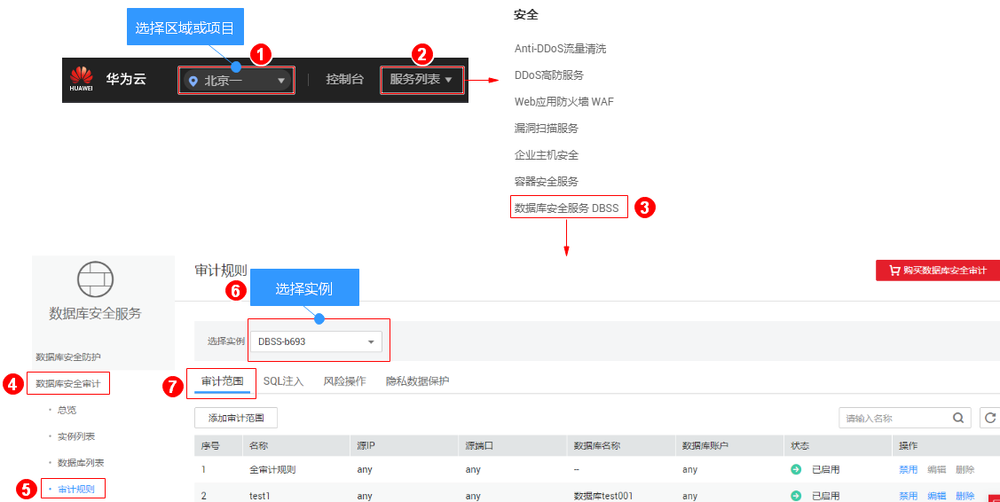

# 管理审计范围

添加审计范围后，您可以查看审计范围信息，启用、编辑、禁用或删除审计范围。

## 前提条件

-   已成功购买数据库安全审计实例，且实例的状态为“运行中“。
-   已成功添加审计范围。
-   启用、编辑和删除审计范围前，请确认审计范围的状态为“已禁用“。
-   禁用审计范围前，请确认审计范围的状态为“已启用“。

## 注意事项

数据库安全审计默认提供一条“全审计规则“的审计范围，可以审计所有连接数据库安全审计实例的数据库。该审计规则默认开启，您只能禁用或启用该审计规则。

## 查看审计范围信息

1.  [登录管理控制台](https://console.huaweicloud.com/)。
2.  进入审计范围列表入口，如[图1](#zh-cn_topic_0144723368_fig4155162273613)所示。

    **图 1**  进入审计范围列表入口  
    

3.  查看审计范围信息，如[图2](#fig17324536122612)所示，相关参数说明如[表1](#table964761214306)所示。

    **图 2**  查看审计范围信息  
    

    > **说明：**   
    >在列表右上方输入审计范围名称的关键字，可以搜索指定的审计范围。  

    **表 1**  审计范围信息参数说明

    
    <table><thead align="left"><tr id="row1365581213011"><th class="cellrowborder" valign="top" width="25.629999999999995%" id="mcps1.2.3.1.1">
参数名称

    </th>
    <th class="cellrowborder" valign="top" width="74.37%" id="mcps1.2.3.1.2">
说明

    </th>
    </tr>
    </thead>
    <tbody><tr id="row7664312163018"><td class="cellrowborder" valign="top" width="25.629999999999995%" headers="mcps1.2.3.1.1 ">
名称

    </td>
    <td class="cellrowborder" valign="top" width="74.37%" headers="mcps1.2.3.1.2 ">
审计范围的名称。

    </td>
    </tr>
    <tr id="row18114121410321"><td class="cellrowborder" valign="top" width="25.629999999999995%" headers="mcps1.2.3.1.1 ">
源IP

    </td>
    <td class="cellrowborder" valign="top" width="74.37%" headers="mcps1.2.3.1.2 ">
审计的IP地址或IP地址段。

    </td>
    </tr>
    <tr id="row17352133015322"><td class="cellrowborder" valign="top" width="25.629999999999995%" headers="mcps1.2.3.1.1 ">
源端口

    </td>
    <td class="cellrowborder" valign="top" width="74.37%" headers="mcps1.2.3.1.2 ">
审计的IP地址端口。

    </td>
    </tr>
    <tr id="row1167216126301"><td class="cellrowborder" valign="top" width="25.629999999999995%" headers="mcps1.2.3.1.1 ">
数据库名称

    </td>
    <td class="cellrowborder" valign="top" width="74.37%" headers="mcps1.2.3.1.2 ">
审计范围的数据库。

    </td>
    </tr>
    <tr id="row6679161203016"><td class="cellrowborder" valign="top" width="25.629999999999995%" headers="mcps1.2.3.1.1 ">
数据库帐户

    </td>
    <td class="cellrowborder" valign="top" width="74.37%" headers="mcps1.2.3.1.2 ">
数据库的用户名。

    </td>
    </tr>
    <tr id="row19685121213016"><td class="cellrowborder" valign="top" width="25.629999999999995%" headers="mcps1.2.3.1.1 ">
状态

    </td>
    <td class="cellrowborder" valign="top" width="74.37%" headers="mcps1.2.3.1.2 ">
审计范围的状态，包括：

    <ul id="ul118072149340"><li>已启用</li><li>已禁用</li></ul>
    </td>
    </tr>
    </tbody>
    </table>

    > **说明：**   
    >根据需要，您还可以对审计范围执行以下操作：  
    >-   启用  
    >    在需要启用的审计范围所在行的“操作“列，单击“启用“，数据库安全审计将对该审计范围的数据库进行审计。  
    >-   编辑  
    >    在需要编辑的审计范围所在行的“操作“列，单击“编辑“，在弹出的对话框中，您可以修改审计范围。  
    >-   禁用  
    >    在需要禁用的审计范围所在行的“操作“列，单击“禁用“，在弹出的对话框中，单击“确定“，可以禁用该审计范围。禁用审计范围后，该审计范围规则将不在审计中执行。  
    >-   删除  
    >    在需要删除的审计范围所在行的“操作“列，单击“删除“，在弹出的对话框中，单击“确定“，可以删除该审计范围。删除审计范围后，如果需要对该审计范围进行审计，请重新添加该审计范围。  

