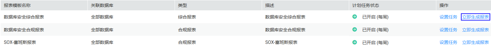
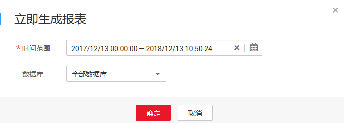
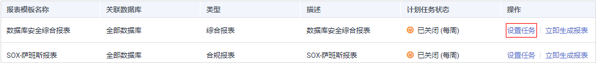
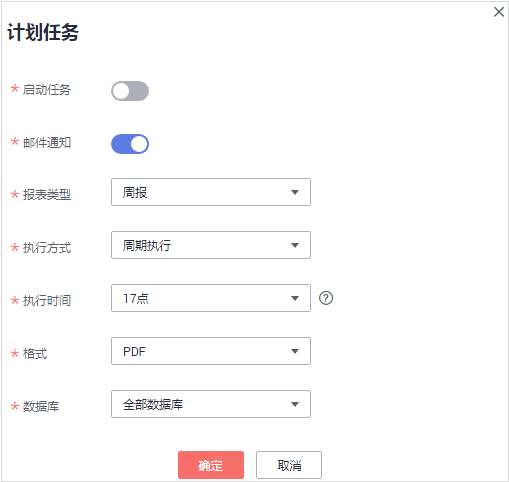

# 管理报表模板

您可以查看报表模板信息，立即生成报表，或设置报表任务或预览报表模板。

## 前提条件

-   已获取管理控制台的登录账号与密码。
-   已成功购买数据库安全审计实例，且实例的状态为“运行中“。
-   已开启数据库审计，并在数据库端或应用端成功安装Agent。
-   已成功添加数据库审计范围和风险操作。

## 立即生成报表

1.  登录管理控制台。
2.  单击管理控制台左上角的，选择区域或项目。
3.  单击页面上方的“服务列表“，选择“安全  \>  数据库安全服务 DBSS“。
4.  在左侧导航树中，选择“数据库安全服务  \>  数据库安全审计“，进入数据库安全审计实例列表界面。
5.  在需要立即生成报表的实例所在行的“操作“列，单击“查看报表“，如[图1](#fig99553501795)所示。

    **图 1**  数据库安全审计实例列表-查看报表  
    

6.  在“实例详情“界面，选择“报表  \>  报表管理“，进入报表模板列表页面。
7.  在需要立即生成报表的模板所在行的“操作“列，单击“立即生成报表“，如[图2](#fig1155923804811)所示。

    **图 2**  报表模板列表  
    

8.  在弹出的对话框中，单击，设置报表的开始时间结束时间，选择生成报表的数据库，如[图3](#fig69946404516)所示。

    **图 3** “立即生成报表“对话框  
    

9.  单击“确定“。

## 设置报表的执行任务

1.  登录管理控制台。
2.  单击管理控制台左上角的，选择区域或项目。
3.  单击页面上方的“服务列表“，选择“安全  \>  数据库安全服务 DBSS“。
4.  在左侧导航树中，选择“数据库安全服务  \>  数据库安全审计“，进入数据库安全审计实例列表界面。
5.  在需要设置报表执行任务的实例所在行的“操作“列，单击“查看报表“，如[图4](#fig55121734115316)所示。

    **图 4**  数据库安全审计实例列表-查看报表  
    

6.  在“实例详情“界面，选择“报表  \>  报表管理“，进入报表模板列表页面。
7.  在需要立即生成报表的模板所在行的“操作“列，单击“设置任务“，如[图5](#fig1251973419538)所示。

    **图 5**  设置任务  
    

8.  在弹出的对话框中，设置计划任务参数，如[图6](#fig12523143415310)所示，相关参数说明如[表1](#table29461252153613)所示。

    **图 6** “计划任务“对话框  
    

    **表 1**  计划任务参数说明

    
    <table><thead align="left"><tr id="row7948205203612"><th class="cellrowborder" valign="top" width="21%" id="mcps1.2.4.1.1">
参数名称

    </th>
    <th class="cellrowborder" valign="top" width="61%" id="mcps1.2.4.1.2">
说明

    </th>
    <th class="cellrowborder" valign="top" width="18%" id="mcps1.2.4.1.3">
取值样例

    </th>
    </tr>
    </thead>
    <tbody><tr id="row1495265210362"><td class="cellrowborder" valign="top" width="21%" headers="mcps1.2.4.1.1 ">
启动任务

    </td>
    <td class="cellrowborder" valign="top" width="61%" headers="mcps1.2.4.1.2 ">
开启或关闭计划任务。

    <ul id="ul934875119443"><li>：开启</li><li>：关闭</li></ul>
    </td>
    <td class="cellrowborder" valign="top" width="18%" headers="mcps1.2.4.1.3 ">

    </td>
    </tr>
    <tr id="row1220184918310"><td class="cellrowborder" valign="top" width="21%" headers="mcps1.2.4.1.1 ">
邮件通知

    </td>
    <td class="cellrowborder" valign="top" width="61%" headers="mcps1.2.4.1.2 ">
开启或关闭邮件通知。

    <ul id="ul64030522314"><li>：开启</li><li>：关闭</li></ul>
    </td>
    <td class="cellrowborder" valign="top" width="18%" headers="mcps1.2.4.1.3 ">

    </td>
    </tr>
    <tr id="row995917529362"><td class="cellrowborder" valign="top" width="21%" headers="mcps1.2.4.1.1 ">
执行频率

    </td>
    <td class="cellrowborder" valign="top" width="61%" headers="mcps1.2.4.1.2 ">
选择报表的执行频率，可以选择：

    <ul id="ul11951164818432"><li>日报</li><li>周报</li><li>月报</li></ul>
    </td>
    <td class="cellrowborder" valign="top" width="18%" headers="mcps1.2.4.1.3 ">
日报

    </td>
    </tr>
    <tr id="row124355156593"><td class="cellrowborder" valign="top" width="21%" headers="mcps1.2.4.1.1 ">
执行方式

    </td>
    <td class="cellrowborder" valign="top" width="61%" headers="mcps1.2.4.1.2 ">
选择报表执行的方式，可以选择：

    <ul id="ul147411493595"><li>执行一次</li><li>周期执行</li></ul>
    </td>
    <td class="cellrowborder" valign="top" width="18%" headers="mcps1.2.4.1.3 ">
执行一次

    </td>
    </tr>
    <tr id="row3960852133616"><td class="cellrowborder" valign="top" width="21%" headers="mcps1.2.4.1.1 ">
执行时间

    </td>
    <td class="cellrowborder" valign="top" width="61%" headers="mcps1.2.4.1.2 ">
选择报表执行的时间点。

    </td>
    <td class="cellrowborder" valign="top" width="18%" headers="mcps1.2.4.1.3 ">
17点

    </td>
    </tr>
    <tr id="row19470200440"><td class="cellrowborder" valign="top" width="21%" headers="mcps1.2.4.1.1 ">
格式

    </td>
    <td class="cellrowborder" valign="top" width="61%" headers="mcps1.2.4.1.2 ">
当前支持PDF格式。

    </td>
    <td class="cellrowborder" valign="top" width="18%" headers="mcps1.2.4.1.3 ">
PDF

    </td>
    </tr>
    <tr id="row1743917410440"><td class="cellrowborder" valign="top" width="21%" headers="mcps1.2.4.1.1 ">
数据库

    </td>
    <td class="cellrowborder" valign="top" width="61%" headers="mcps1.2.4.1.2 ">
选择执行报表任务的数据库。

    </td>
    <td class="cellrowborder" valign="top" width="18%" headers="mcps1.2.4.1.3 ">
-

    </td>
    </tr>
    </tbody>
    </table>

9.  单击“确定“。

## 查看报表模板信息

1.  登录管理控制台。
2.  单击管理控制台左上角的，选择区域或项目。
3.  单击页面上方的“服务列表“，选择“安全  \>  数据库安全服务 DBSS“。
4.  在左侧导航树中，选择“数据库安全服务  \>  数据库安全审计“，进入数据库安全审计实例列表界面。
5.  在需要查看报表模板的实例所在行的“操作“列，单击“查看报表“，如[图7](#fig10361222162413)所示。

    **图 7**  数据库安全审计实例列表-查看报表  
    

6.  在“实例详情“界面，选择“报表  \>  报表管理“，进入报表模板列表页面。
7.  查看报表模板信息，如[图8](#fig114613221242)所示，相关参数说明如[表2](#table964761214306)所示。

    **图 8**  查看报表模板列表  
    

    **表 2**  报表模板信息参数说明

    
    <table><thead align="left"><tr id="row1365581213011"><th class="cellrowborder" valign="top" width="25.4%" id="mcps1.2.3.1.1">
参数名称

    </th>
    <th class="cellrowborder" valign="top" width="74.6%" id="mcps1.2.3.1.2">
说明

    </th>
    </tr>
    </thead>
    <tbody><tr id="row7664312163018"><td class="cellrowborder" valign="top" width="25.4%" headers="mcps1.2.3.1.1 ">
报表模板名称

    </td>
    <td class="cellrowborder" valign="top" width="74.6%" headers="mcps1.2.3.1.2 ">
报表模板的名称。

    </td>
    </tr>
    <tr id="row18114121410321"><td class="cellrowborder" valign="top" width="25.4%" headers="mcps1.2.3.1.1 ">
关联数据库

    </td>
    <td class="cellrowborder" valign="top" width="74.6%" headers="mcps1.2.3.1.2 ">
报表模板关联的数据库。

    </td>
    </tr>
    <tr id="row17352133015322"><td class="cellrowborder" valign="top" width="25.4%" headers="mcps1.2.3.1.1 ">
类型

    </td>
    <td class="cellrowborder" valign="top" width="74.6%" headers="mcps1.2.3.1.2 ">
报表模板的类型。

    </td>
    </tr>
    <tr id="row1167216126301"><td class="cellrowborder" valign="top" width="25.4%" headers="mcps1.2.3.1.1 ">
描述

    </td>
    <td class="cellrowborder" valign="top" width="74.6%" headers="mcps1.2.3.1.2 ">
报表模板的描述信息。

    </td>
    </tr>
    <tr id="row1856318344013"><td class="cellrowborder" valign="top" width="25.4%" headers="mcps1.2.3.1.1 ">
计划任务状态

    </td>
    <td class="cellrowborder" valign="top" width="74.6%" headers="mcps1.2.3.1.2 ">
计划任务的执行状态。

    </td>
    </tr>
    </tbody>
    </table>

