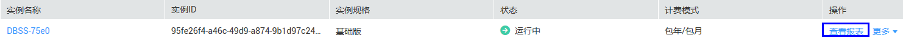
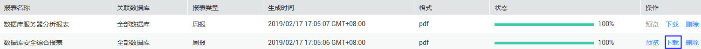

# 管理报表结果

设置数据库审计规则后，您可以查看报表信息，预览、下载或删除审计报表。

## 前提条件

-   已获取管理控制台的登录账号与密码。
-   已成功购买数据库安全审计实例，且实例的状态为“运行中“。
-   已开启数据库审计，并在数据库端或应用端成功安装Agent。
-   已成功设置审计规则。

## 预览报表结果

1.  登录管理控制台。
2.  单击管理控制台左上角的，选择区域或项目。
3.  单击管理控制台上方的“服务列表“，选择“安全  \>  数据库安全服务 DBSS“，进入数据库安全防护实例列表界面。
4.  在左侧导航树中，选择“数据库安全服务  \>  数据库安全审计“，进入数据库安全审计实例列表界面。
5.  在需要预览报表的实例所在行的“操作“列，单击“查看报表“，如[图1](#fig1111410570274)所示。

    **图 1**  数据库安全审计实例列表-查看报表  
    

6.  在“实例详情“界面，选择“报表  \>  报表结果“，进入报表列表页面。
7.  在需要预览的报表所在行的“操作“列，单击“预览“，如[图2](#fig161171357132716)所示。

    **图 2**  预览报表  
    

8.  在弹出的对话框中，预览报表结果。

## 下载报表

1.  登录管理控制台。
2.  单击管理控制台左上角的，选择区域或项目。
3.  单击管理控制台上方的“服务列表“，选择“安全  \>  数据库安全服务 DBSS“，进入数据库安全防护实例列表界面。
4.  在左侧导航树中，选择“数据库安全服务  \>  数据库安全审计“，进入数据库安全审计实例列表界面。
5.  在需要下载报表的实例所在行的“操作“列，单击“查看报表“，如[图3](#fig15126743133312)所示。

    **图 3**  数据库安全审计实例列表-查看报表  
    

6.  在“实例详情“界面，选择“报表  \>  报表结果“，进入报表列表页面。
7.  在需要下载的报表所在行的“操作“列，单击“下载“，如[图4](#fig181363432330)所示，下载并查看报表。

    **图 4**  下载报表  
    

## 删除报表

删除报表后，如果查看该报表结果，需要重新手动生成报表。

1.  登录管理控制台。
2.  单击管理控制台左上角的，选择区域或项目。
3.  单击管理控制台上方的“服务列表“，选择“安全  \>  数据库安全服务 DBSS“，进入数据库安全防护实例列表界面。
4.  在左侧导航树中，选择“数据库安全服务  \>  数据库安全审计“，进入数据库安全审计实例列表界面。
5.  在需要删除报表的实例所在行的“操作“列，单击“查看报表“，如[图5](#fig5211333113519)所示。

    **图 5**  数据库安全审计实例列表-查看报表  
    

6.  在“实例详情“界面，选择“报表  \>  报表结果“，进入报表列表页面。
7.  在需要删除的报表所在行的“操作“列，单击“删除“，如[图6](#fig1122211335353)所示。

    **图 6**  删除报表  
    

8.  在弹出的对话框中，单击“确定“。

## 查看报表信息

1.  登录管理控制台。
2.  单击管理控制台左上角的，选择区域或项目。
3.  单击管理控制台上方的“服务列表“，选择“安全  \>  数据库安全服务 DBSS“，进入数据库安全防护实例列表界面。
4.  在左侧导航树中，选择“数据库安全服务  \>  数据库安全审计“，进入数据库安全审计实例列表界面。
5.  在需要查看报表的实例所在行的“操作“列，单击“查看报表“，如[图7](#fig566611261818)所示。

    **图 7**  数据库安全审计实例列表-查看报表  
    

6.  在“实例详情“界面，选择“报表  \>  报表结果“，进入报表列表页面。
7.  查看报表信息，如[图8](#fig13686171251816)所示，相关参数说明如[表1](#table964761214306)所示。

    **图 8**  查看报表信息  
    

    > **说明：**   
    >输入报表名称，单击或按“Enter“，可以搜索指定的报表。  

    **表 1**  报表信息参数说明

    
    <table><thead align="left"><tr id="row1365581213011"><th class="cellrowborder" valign="top" width="25.4%" id="mcps1.2.3.1.1">
参数名称

    </th>
    <th class="cellrowborder" valign="top" width="74.6%" id="mcps1.2.3.1.2">
说明

    </th>
    </tr>
    </thead>
    <tbody><tr id="row7664312163018"><td class="cellrowborder" valign="top" width="25.4%" headers="mcps1.2.3.1.1 ">
报表名称

    </td>
    <td class="cellrowborder" valign="top" width="74.6%" headers="mcps1.2.3.1.2 ">
报表的名称。

    </td>
    </tr>
    <tr id="row18114121410321"><td class="cellrowborder" valign="top" width="25.4%" headers="mcps1.2.3.1.1 ">
关联数据库

    </td>
    <td class="cellrowborder" valign="top" width="74.6%" headers="mcps1.2.3.1.2 ">
报表关联的数据库。

    </td>
    </tr>
    <tr id="row17352133015322"><td class="cellrowborder" valign="top" width="25.4%" headers="mcps1.2.3.1.1 ">
报表类型

    </td>
    <td class="cellrowborder" valign="top" width="74.6%" headers="mcps1.2.3.1.2 ">
报表的类型。

    </td>
    </tr>
    <tr id="row1167216126301"><td class="cellrowborder" valign="top" width="25.4%" headers="mcps1.2.3.1.1 ">
生成时间

    </td>
    <td class="cellrowborder" valign="top" width="74.6%" headers="mcps1.2.3.1.2 ">
报表的生成时间。

    </td>
    </tr>
    <tr id="row1856318344013"><td class="cellrowborder" valign="top" width="25.4%" headers="mcps1.2.3.1.1 ">
格式

    </td>
    <td class="cellrowborder" valign="top" width="74.6%" headers="mcps1.2.3.1.2 ">
生成的报表格式。

    </td>
    </tr>
    <tr id="row19685121213016"><td class="cellrowborder" valign="top" width="25.4%" headers="mcps1.2.3.1.1 ">
状态

    </td>
    <td class="cellrowborder" valign="top" width="74.6%" headers="mcps1.2.3.1.2 ">
报表生成状态。

    </td>
    </tr>
    </tbody>
    </table>

