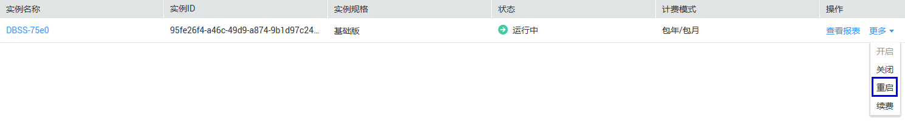
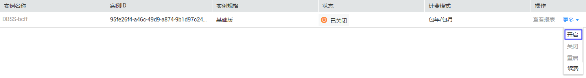
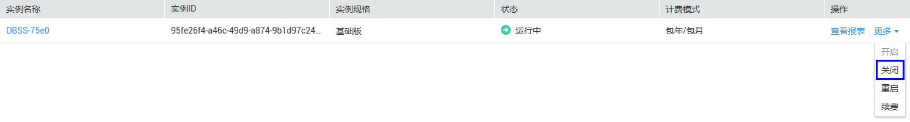
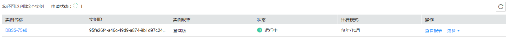

# 管理数据库安全审计实例

成功购买数据库安全审计实例后，您可以查看实例信息，开启、重启或关闭实例。

## 前提条件

-   重启实例和关闭实例前，请确认实例的状态为“运行中“。
-   开启实例前，请确认实例的状态为“已关闭“。

## 重启实例

1.  登录管理控制台。
2.  单击管理控制台左上角的，选择区域或项目。
3.  单击管理控制台上方的“服务列表“，选择“安全  \>  数据库安全服务 DBSS“，进入数据库安全防护实例列表界面。
4.  在左侧导航树中，选择“数据库安全服务  \>  数据库安全审计“，进入数据库安全审计实例列表界面。
5.  在需要重启的实例所在行的“操作“列，选择“更多  \>  重启“，如[图1](#fig1976352111211)所示。

    **图 1**  重启实例  
    

6.  在弹出的对话框中，单击“确定“。

## 开启实例

1.  登录管理控制台。
2.  单击管理控制台左上角的，选择区域或项目。
3.  单击管理控制台上方的“服务列表“，选择“安全  \>  数据库安全服务 DBSS“，进入数据库安全防护实例列表界面。
4.  在左侧导航树中，选择“数据库安全服务  \>  数据库安全审计“，进入数据库安全审计实例列表界面。
5.  在需要开启的实例所在行的“操作“列，选择“更多  \>  开启“，如[图2](#fig4604549865)所示。

    **图 2**  开启实例  
    

6.  在弹出的对话框中，单击“确定“。

    开启实例成功，实例的“状态“为“运行中“。

## 关闭实例

关闭实例后，系统将停止对该实例上的数据库进行安全审计。

1.  登录管理控制台。
2.  单击管理控制台左上角的，选择区域或项目。
3.  单击管理控制台上方的“服务列表“，选择“安全  \>  数据库安全服务 DBSS“，进入数据库安全防护实例列表界面。
4.  在左侧导航树中，选择“数据库安全服务  \>  数据库安全审计“，进入数据库安全审计实例列表界面。
5.  在需要关闭的实例所在行的“操作“列，选择“更多  \>  关闭“，如[图3](#fig5573194814435)所示。

    **图 3**  关闭实例  
    

6.  在弹出的对话框中，单击“确定“。

    关闭实例成功，实例的“状态“为“已关闭“。

## 查看实例信息

1.  登录管理控制台。
2.  单击管理控制台左上角的，选择区域或项目。
3.  单击管理控制台上方的“服务列表“，选择“安全  \>  数据库安全服务 DBSS“，进入数据库安全防护实例列表界面。
4.  在左侧导航树中，选择“数据库安全服务  \>  数据库安全审计“，进入数据库安全审计实例列表界面。
5.  查看数据库安全审计实例信息，如[图4](#fig89170817589)所示，相关参数说明如[表1](#table1025994517211)所示。

    **图 4**  查看实例信息  
    

    > **说明：**   
    >单击实例名称，可以查看该实例的基本信息。  

    **表 1**  实例信息参数说明

    
    <table><thead align="left"><tr id="row1626074517217"><th class="cellrowborder" valign="top" width="17%" id="mcps1.2.3.1.1">
参数名称

    </th>
    <th class="cellrowborder" valign="top" width="83%" id="mcps1.2.3.1.2">
说明

    </th>
    </tr>
    </thead>
    <tbody><tr id="row18260134511215"><td class="cellrowborder" valign="top" width="17%" headers="mcps1.2.3.1.1 ">
实例名称

    </td>
    <td class="cellrowborder" valign="top" width="83%" headers="mcps1.2.3.1.2 ">
实例的名称。

    </td>
    </tr>
    <tr id="row680118365318"><td class="cellrowborder" valign="top" width="17%" headers="mcps1.2.3.1.1 ">
实例ID

    </td>
    <td class="cellrowborder" valign="top" width="83%" headers="mcps1.2.3.1.2 ">
实例的ID，由系统自动生成。

    </td>
    </tr>
    <tr id="row326014459212"><td class="cellrowborder" valign="top" width="17%" headers="mcps1.2.3.1.1 ">
实例规格

    </td>
    <td class="cellrowborder" valign="top" width="83%" headers="mcps1.2.3.1.2 ">
实例的规格。

    </td>
    </tr>
    <tr id="row11260124513215"><td class="cellrowborder" valign="top" width="17%" headers="mcps1.2.3.1.1 ">
状态

    </td>
    <td class="cellrowborder" valign="top" width="83%" headers="mcps1.2.3.1.2 ">
实例当前的运行状态，包括：

    <ul id="ul108156241253"><li>运行中</li><li>创建中</li><li>故障</li><li>已关闭</li><li>已冻结</li></ul>
    </td>
    </tr>
    <tr id="row17586193614411"><td class="cellrowborder" valign="top" width="17%" headers="mcps1.2.3.1.1 ">
计费模式

    </td>
    <td class="cellrowborder" valign="top" width="83%" headers="mcps1.2.3.1.2 ">
实例的计费模式。

    </td>
    </tr>
    </tbody>
    </table>

